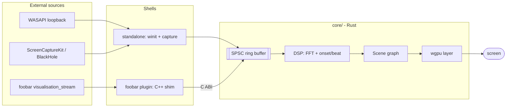
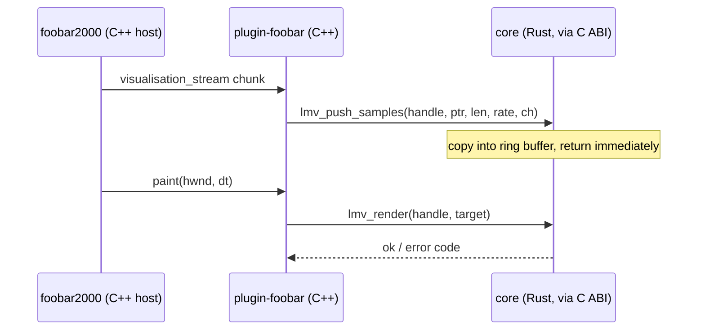
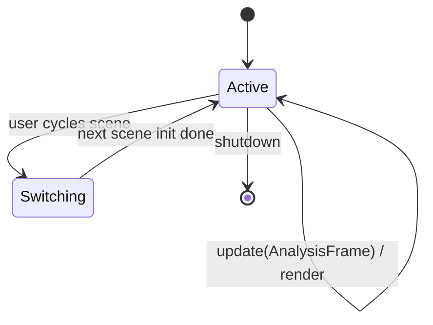

# Diagram examples — light-music-visualizer

Project-specific mermaid patterns. Copy one and adapt. Keep diagrams small (<~12 nodes) and use
`subgraph` to mark boundaries — what's inside `core/`, what's a shell, what's external.

## Component / data-flow map

The canonical picture: audio in (from either source) → ring → DSP → scenes → wgpu → screen.

## Cross-boundary sequence (plugin path)

Use a `sequenceDiagram` when the interesting thing is the order of calls across the C ABI.

## Scene lifecycle

Use `stateDiagram-v2` for things with explicit states.

