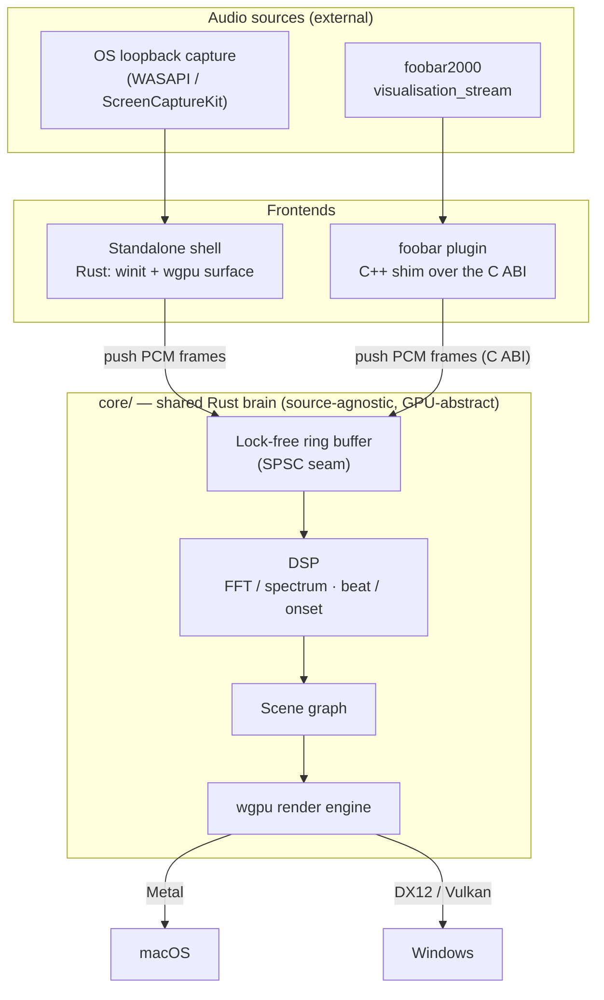

# light-music-visualizer

A lightweight, real-time music visualizer built around one **shared Rust core** that turns a
stream of PCM audio samples into GPU-rendered visuals. Two frontends consume that core:

- **Standalone app** (Windows + macOS) — pure Rust (`winit` + `wgpu`), fed by OS loopback
  audio capture.
- **foobar2000 plugin** (Windows-first) — a thin **C++ shim** over the core's **C ABI**, fed by
  foobar's own `visualisation_stream` (no loopback needed on that path).

The core is **source-agnostic**: it takes interleaved/mono PCM frames and does not care whether
they came from loopback capture or foobar. That single abstraction is what lets one visual
codebase serve both frontends.

> **Status: early / pre-alpha.** The architecture and plans are in place; the code crates are
> being scaffolded. See [`docs/plans/`](docs/plans/) for what's in flight.

## Architecture



The seam between audio and render is the **lock-free ring buffer**: audio arrives at the
device's cadence, frames render at the display's, and neither loop drives the other directly.

## Repository layout

```
core/                # Rust library crate — the shared brain: DSP + render engine + scenes.
                     #   Native Rust API (standalone) + C ABI (foobar plugin). No audio-source code.
standalone/          # Rust binary crate — winit window + wgpu surface + OS loopback capture.
plugin-foobar/       # C++ shim: foobar2000 SDK integration, links the core's C ABI. Windows-first.
docs/
├── nfr.md           # Quantified v1 non-functional requirements (the numbers behind "lightweight").
├── adrs/            # Architecture Decision Records + rejected alternatives. Append-only.
└── plans/           # Phased implementation plans (what's in flight); done/ holds completed plans.
```

(The `core/`, `standalone/`, and `plugin-foobar/` crates are being scaffolded — the paths above
are the target layout.)

## Design principles

This is real-time audio + graphics, so a few rules are non-negotiable:

- **The audio callback is sacred.** The capture / `visualisation_stream` thread never blocks,
  allocates, locks, or logs — it hands samples to the core through the ring buffer and returns.
- **The core stays source-agnostic and GPU-abstract.** No WASAPI / ScreenCaptureKit / foobar
  types in `core/`; no raw Metal/DX/Vulkan outside the wgpu layer. Swappability is the point.
- **Determinism where it's testable.** DSP math is a pure function of its input window; visual
  randomness, when wanted, is explicitly seeded.
- **The C ABI is a versioned contract.** Minimal surface — opaque handle, push-samples,
  render, resize, free. Changing its shape is an ADR-worthy event.
- **Lightweight is a feature.** Small binaries, few dependencies, low idle CPU/GPU.

## Architecture decisions

Key decisions are recorded as ADRs in [`docs/adrs/`](docs/adrs/). Start with
[ADR-0001](docs/adrs/0001-rust-core-wgpu-cabi-foobar-shim.md) — the founding decision (Rust core,
wgpu rendering, C ABI, C++ foobar shim), with the rejected alternatives (C++ core, Electron,
OpenGL) recorded.

## Platform notes

- **Loopback capture is not symmetric.** Windows has first-class WASAPI loopback; macOS needs
  ScreenCaptureKit (macOS 13+) or a virtual device (BlackHole). "Capture any app's audio" is
  Windows-first; the Mac capture path is a later phase. The foobar plugin sidesteps capture
  entirely, which is part of why plugin parity is valuable on Mac.
- **wgpu targets differ per OS** — Metal on macOS, DX12/Vulkan on Windows. Scene code writes to
  wgpu and does not branch on the backend.

## License

Licensed under either of

- Apache License, Version 2.0 ([LICENSE-APACHE](LICENSE-APACHE) or
  <http://www.apache.org/licenses/LICENSE-2.0>)
- MIT license ([LICENSE-MIT](LICENSE-MIT) or <http://opensource.org/licenses/MIT>)

at your option.

Unless you explicitly state otherwise, any contribution intentionally submitted for inclusion in
this project by you, as defined in the Apache-2.0 license, shall be dual licensed as above,
without any additional terms or conditions.
