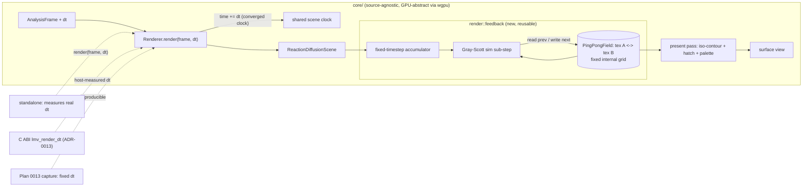

# ADR-0012 — Stateful feedback render system: ping-pong offscreen simulation with a fixed-timestep accumulator (Gray-Scott first)

> **Status:** accepted
> **Date:** 2026-07-22
> **Related plan(s):** 0014-reaction-diffusion-feedback-scene

## Context

The render engine is stateless per frame today. Every built-in scene is a pure
function of the analysis frame plus a shared scene clock: `fragment_field` is
`f(uv, time)`; `swarm` is seeded particles transformed each frame. No GPU state
survives from one frame to the next. That is by design and it is cheap.

The user wants a different visual family — reaction-diffusion / organic-simulation
looks: slowly evolving nested contours, cellular tissue, a restructuring maze with
perpendicular hatch ticks. Three reference frames a few seconds apart showed the
*topology itself* changing — regions split, merge, and grow. That is not a function
of time; it is a running simulation whose each frame depends on the **previous
frame's field**, held in a texture and evolved by a simulation shader. This is
precisely the "feedback/warp field" built-in system ADR-0002 named as a deferred
v1 follow-up. It requires the engine's first feedback path.

Two constraints bound the design. First, real-time budget: a Gray-Scott
reaction-diffusion system needs several stabilizing sub-steps per frame, so it must
stay cheap and bounded. Second, determinism (NFR §6): DSP is a pure function of its
window and visual randomness is explicitly seeded — but a feedback simulation
*accumulates* state across frames, which is new territory. It also collides with the
user's standing wish that animation look identical on every device: the engine
currently advances all animation by a fixed `SCENE_DT = 1/60` per rendered frame, so
a 60 Hz and a 144 Hz machine drift. A per-frame-stepped simulation would make that
divergence far more visible.

## Decision

We will add a stateful feedback render category to `core`: a reusable
`render::feedback` seam — a `PingPongField` holding two offscreen textures the scene
swaps each sub-step, so a simulation shader samples the previous state and writes the
next — plus a first scene, `ReactionDiffusionScene`, implementing Gray-Scott. The
simulation runs at a **fixed internal grid resolution decoupled from the surface**; a
present pass maps the evolved field to the surface. To make the simulation
frame-rate-independent (identical on any device over wall-clock time), we drive it
with a **fixed-timestep accumulator fed by a real `dt` injected at the render seam** —
never read from a wall clock inside `core` — so headless capture (Plan 0013) can feed
a fixed `dt` for reproducible frames while the core stays clock-free. Because real
`dt` now flows through the render entry point, we **converge the shared scene clock
onto it globally and retire the fixed `SCENE_DT`**, so every existing scene becomes
frame-rate-independent too. Audio drives the simulation both continuously (bass / mid
/ treb modulate feed / kill / flow) and discretely (onsets / beats stamp seeds into
the field), through the existing preset expression layer (ADR-0002 layer 2).

We rejected **warp-feedback advection** (simpler video-feedback, but it does not
reproduce the cellular / hatch structure the user showed), an **engine-managed
declarative multi-pass pipeline** (it would widen the thin `Scene` seam ADR-0002
deliberately keeps — the engine would take on simulation lifecycle; composition via a
per-scene helper gives the same reuse without the seam growth), and **per-frame
stepping** (cheapest, but it reopens the exact frame-rate divergence the user asked us
to eliminate).

## Architecture diagram

## Consequences

### Positive
- Unlocks the reaction-diffusion / organic-simulation visual family — the user's
  actual target — and, more broadly, the engine's first feedback path, which the other
  deferred feedback/warp variants can reuse through the same `PingPongField` helper.
- The global `SCENE_DT` convergence fixes the long-standing frame-rate coupling: all
  scenes now animate at the same wall-clock rate on 60 Hz and 144 Hz machines.
- Injected `dt` keeps `core` clock-free and makes headless capture reproducible (fixed
  `dt` in → deterministic frames out), so the new simulation is testable under Plan
  0013's harness.
- A fixed internal simulation grid bounds cost independent of window size and makes the
  simulation resolution-independent.

### Negative
- The engine's first stateful GPU path: two extra offscreen textures per feedback scene
  (an `Rgba16Float` grid — modest, roughly 512² × 8 B ≈ 2 MB, doubled) plus several
  simulation sub-passes per frame. A real, if small, addition to the per-frame GPU
  budget the rest of the engine avoided.
- The render entry point signature changes (`Renderer::render(&frame, dt)`), rippling to
  every caller: the standalone (measures real elapsed `dt`), the C ABI (a separate
  additive change — ADR-0013), and Plan 0013's not-yet-built capture harness (must pass
  a fixed `dt`). A cross-cutting edit.
- Determinism is now frame-rate-independent and same-device reproducible, but **not
  bit-identical across GPU vendors**: floating-point reaction-diffusion stepping differs
  slightly between drivers. "Identical on every device" holds *visually*, not
  bit-exactly — an honest limitation.
- Under a long frame stall the accumulator could demand many sub-steps; we clamp
  max sub-steps per frame, trading a momentary slowdown for stability (never a
  divergence).

### Neutral
- The `SCENE_DT` constant goes away; the scene clock becomes wall-clock-derived on the
  frontends and fixed-`dt`-derived under capture.

## Alternatives considered

### Alternative A — Warp-feedback advection
Feed the previous frame back through a domain-warp plus decay (classic video feedback).
Also stateful and cheaper, but it produces flowing smears, not the cellular Gray-Scott
structure with perpendicular hatch ticks the reference frames show. Rejected on fidelity
to the target look — it remains a cheap future variant on the same `PingPongField` seam.

### Alternative B — Engine-managed declarative multi-pass
Teach the `Renderer` to own offscreen state and pass sequencing, with scenes declaring
their passes as data. It centralizes plumbing but widens the `Scene` seam ADR-0002 keeps
deliberately thin — the engine takes on simulation lifecycle, an altitude/ISP regression.
Composition via a per-scene `PingPongField` helper delivers the same reuse without
growing the seam. Rejected.

### Alternative C — Per-frame stepping
One simulation step per rendered frame: cheapest, no accumulator, no `dt` needed. But the
simulation then evolves at frame-rate speed — a 144 Hz machine races a 60 Hz one —
reopening exactly the `SCENE_DT` divergence the user asked to eliminate. Rejected.

## Notes

The present-pass aesthetic (iso-contours + palette + hatch ticks) is shader authoring,
not an architecture decision; Plan 0013's headless capture is the tool for dialing it.
The Gray-Scott feed/kill parameter space that produces the coral / maze / mitosis
regimes is well documented (Pearson's classification) — the reference frames sit in that
space.
