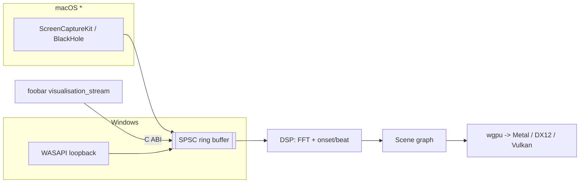

# Plan 0001 — Core + standalone MVP, then foobar parity

**Status:** in-progress (2026-07-21 — re-validated against the live-show NFRs and ADR-0002)
**Related:** [ADR-0001](../adrs/0001-rust-core-wgpu-cabi-foobar-shim.md),
[ADR-0002](../adrs/0002-layered-preset-architecture.md) (constrains Phase 5),
[NFRs](../nfr.md)

## TL;DR

Stand up the Cargo workspace + CI, get a Windows loopback → DSP → wgpu spectrum scene running
in the standalone app, add beat/onset reactivity and switchable scenes, then expose the core's
C ABI and build the foobar2000 plugin against it. macOS capture code lands last, validated by
the user on real Mac hardware. All quantitative bars come from [docs/nfr.md](../nfr.md).

## Context & problem

ADR-0001 fixes the architecture (Rust core, wgpu, C ABI, C++ foobar shim). This plan turns
that into a working v1 MVP with the four agreed features: spectrum/FFT visuals, beat/onset
reactivity, multiple switchable scenes, and foobar plugin parity. We build the standalone
Windows path end-to-end first (fastest feedback loop), then reuse the same core for the
plugin, then extend capture to macOS.

The MVP renders at a **single fixed quality** that must hit the NFR performance floor
(60 fps @ 1080p on the iGPU test box); the adaptive quality-tier system is a follow-up plan
(see roadmap in `docs/plans/README.md`), as are the confirmed v1 UX features and packaging.

## Decision

Phase in dependency order: workspace → CI → capture → DSP → render → scenes → C ABI →
foobar SDK (human) → plugin → mac capture code → mac validation (human). Each phase is one
commit with a concrete "done when". The `**Area:**` note orients the reader
(`core` / `standalone` / `plugin`); it is not the machine-readable owner tag.

## Implementation phases

### Phase 0 — Workspace scaffold
- **Owner skill:** dev
- **Area:** core
- **What:** Create the Cargo workspace: `core/` (library crate, `crate-type = ["rlib",
  "cdylib", "staticlib"]`), `standalone/` (binary crate depending on `core`), and a
  placeholder `plugin-foobar/` directory (empty for now, real work in Phase 8). Add a Rust
  `.gitignore` (`/target`), pin toolchain, set exact-version deps. Release profile per
  NFR §4: LTO on, strip symbols. Set `license = "MIT OR Apache-2.0"` in each crate's
  `Cargo.toml` (SPDX form) to match the repo's dual `LICENSE-MIT` / `LICENSE-APACHE`.
- **Files touched:** `Cargo.toml` (workspace), `core/Cargo.toml`, `core/src/lib.rs`,
  `standalone/Cargo.toml`, `standalone/src/main.rs`, `.gitignore`, `rust-toolchain.toml`.
- **Done when:** `cargo build` succeeds; `cargo run -p standalone` opens an empty window
  (winit) and exits cleanly.

### Phase 1 — CI (GitHub Actions)
- **Owner skill:** dev
- **Area:** repo
- **What:** One workflow, Windows + macOS runners: `cargo build`, `cargo test`,
  `cargo clippy --all-targets -- -D warnings`, `cargo fmt --all --check` on every push
  (NFR §7). The mac runner is what keeps the not-yet-run-locally mac target from rotting.
  GPU/audio checks are explicitly out of CI scope.
- **Files touched:** `.github/workflows/ci.yml`.
- **Done when:** The workflow is green on a pushed commit for both OS runners. (Verifying the
  run requires the user to push — dev commits locally and the user confirms the green run.)

### Phase 2 — Audio intake API + Windows loopback capture
- **Owner skill:** dev
- **Area:** standalone + core (intake API)
- **What:** Define the core's source-agnostic intake: a lock-free SPSC ring buffer and a
  `push_samples(frames, sample_rate, channels)` entry point validated once at the boundary.
  Implement WASAPI loopback capture in `standalone/` that fills the ring on the audio
  thread — zero allocation, locks, logging, or I/O in the callback (NFR §5). Ring sized for
  capacity headroom but read near the write head (NFR §3).
- **Files touched:** `core/src/audio.rs` (ring + intake), `standalone/src/capture_win.rs`.
- **Done when:** Playing audio through Windows produces a live, non-glitching sample stream
  into the core (verified with a debug meter/level readout); the callback does zero heap work.

### Phase 3 — DSP: spectrum (FFT) + beat/onset
- **Owner skill:** dev
- **Area:** core
- **What:** Windowed FFT producing a normalized spectrum (log-frequency bins), plus an
  onset-envelope + beat estimator. Pure functions of the input window — deterministic, unit
  tested against fixtures (NFR §6). Window ≤ 2048 samples, hop ≤ 512 @ 48 kHz to fit the
  60 ms latency budget (NFR §3). Expose a per-frame `AnalysisFrame { spectrum, onset, beat }`.
- **Files touched:** `core/src/dsp/fft.rs`, `core/src/dsp/onset.rs`, `core/src/dsp/mod.rs`,
  `core/tests/dsp.rs`.
- **Done when:** Unit tests pass on known signals (sine → energy in the expected single bin;
  click track → onsets on the beats); analysis of one hop completes in well under one hop
  interval (~11 ms) on the dev box.

### Phase 4 — Render engine: wgpu + first spectrum scene
- **Owner skill:** dev
- **Area:** core + standalone (window wiring)
- **What:** wgpu device/surface setup, a render-graph seam that takes an `AnalysisFrame` and
  draws, and one spectrum-bars scene. Render loop decoupled from audio via the ring buffer.
  Throttle rendering when minimized/occluded (NFR §1).
- **Files touched:** `core/src/render/mod.rs`, `core/src/render/context.rs`,
  `core/src/scenes/spectrum.rs`, `standalone/src/main.rs` (wire window → core render).
- **Done when:** The standalone shows live spectrum bars reacting to system audio at
  ≥ 60 fps @ 1080p on the dev box; beat-to-visual reaction feels immediate (< 60 ms budget,
  NFR §3 — measured roughly by eye/ear against a click track).

### Phase 5 — Scene system + beat-reactive scenes + switching
- **Owner skill:** dev
- **Area:** core + standalone (input)
- **What:** A `Scene` trait (init/update/render given `AnalysisFrame`), a registry, and 2-3
  scenes total including at least one beat/onset-driven one. Hotkey to cycle scenes in the
  standalone. Any visual randomness is explicitly seeded (NFR §6). **Keep the trait thin and
  crate-internal**: per ADR-0002 it later becomes the vocabulary the preset engine drives,
  not a public extension point — no plugin registration, no dynamic dispatch beyond what
  scene cycling needs.
- **Files touched:** `core/src/scenes/mod.rs`, `core/src/scenes/*.rs`,
  `standalone/src/main.rs` (input → scene switch).
- **Done when:** User can cycle through ≥2 scenes live; at least one visibly reacts to
  beats/onsets, not just raw spectrum; frame rate holds the Phase 4 bar on every scene.

### Phase 6 — C ABI surface
- **Owner skill:** dev
- **Area:** core (ffi)
- **What:** Minimal versioned `extern "C"` API: opaque handle create/free, `push_samples`,
  `render_into` (given a native window/surface handle or context), `resize`. A C header
  (generated or hand-written) for the C++ side. Document the contract in the module and note
  that shape changes are ADR-worthy.
- **Files touched:** `core/src/ffi.rs`, `core/include/lmv_core.h`, `core/cbindgen.toml`
  (if using cbindgen).
- **Done when:** `cargo build` emits the `cdylib`/`staticlib` + header; a tiny C smoke
  program links, creates a handle, pushes samples, and frees without leaking.

### Phase 7 — Obtain the foobar2000 SDK
- **Owner skill:** human
- **Area:** plugin
- **What:** Download the foobar2000 SDK from the official site (requires accepting its
  license), unpack it where `plugin-foobar/` can reference it, and confirm the C++ toolchain
  (MSVC) is installed. foobar2000 itself is already installed on the dev box.
- **Done when:** The SDK sources sit at an agreed path (documented in `plugin-foobar/README`
  or told to dev at the Phase 8 session) and MSVC builds a trivial program.

### Phase 8 — foobar2000 plugin (Windows)
- **Owner skill:** dev
- **Area:** plugin
- **What:** C++ shim using the foobar2000 SDK: a visualization component that pulls from
  `visualisation_stream`, forwards samples across the C ABI, and hosts the core's render
  output. Reuses the exact same scenes → parity by construction.
- **Files touched:** `plugin-foobar/` (SDK glue, `foo_lmv.cpp`, build project linking the
  core lib + header).
- **Done when:** The component loads in foobar2000 on Windows and renders the same scenes,
  reacting to the currently playing track, holding the same latency feel as the standalone.

### Phase 9 — macOS loopback capture (code)
- **Owner skill:** dev
- **Area:** standalone
- **What:** Mac capture path via ScreenCaptureKit (macOS 13+) with a documented BlackHole
  fallback. Same ring-buffer intake as Windows, same callback rules (NFR §5). Written on
  Windows; compiles via the CI mac runner.
- **Files touched:** `standalone/src/capture_mac.rs`, platform cfg wiring.
- **Done when:** CI's macOS runner builds the standalone with the mac capture path; unit
  tests pass; the code is behind `cfg(target_os = "macos")` without disturbing Windows.

### Phase 10 — macOS validation on hardware
- **Owner skill:** human
- **Area:** standalone
- **What:** Run the standalone on the user's Mac (macOS 13+): grant the screen-recording
  permission ScreenCaptureKit requires, play audio, confirm live visuals. Report anything
  broken back into a fix cycle (dev) before the plan closes.
- **Done when:** The standalone visualizes system audio on the Mac; the permission flow and
  OS-version constraints are documented in the README.

## Architecture diagram

## Risks & open questions

- **wgpu surface from a foobar-provided HWND.** Rendering the core's wgpu output into a
  window the C++ host owns (Phase 8) is the riskiest integration point — validate early,
  possibly with a spike before Phase 6 freezes the ABI.
- **The iGPU floor is unproven until tested.** The 60 fps @ 1080p bar (NFR §1) is checked on
  the dev box during this plan; the older iGPU machine validates it for real when the
  adaptive-quality plan lands. If the fixed MVP quality misses the floor there, that plan's
  priority rises.
- **Beat detection quality.** A simple onset/energy beat estimator may feel loose on some
  genres. Ship a serviceable v1; a better tempo tracker is a follow-up plan, not a v1 blocker.
- **Mac capture permissions/UX.** ScreenCaptureKit prompts for screen-recording permission,
  which is surprising for an audio tool. Document it; consider the BlackHole path as primary.

## What this plan does NOT do

- No preset engine, expression language, or Rhai scripting (ADR-0002's plan comes next).
- No line-in / audio-interface capture and no scene triggers (auto-rotate, MIDI,
  track-change detection) — those land in the live-performance plan (NFR §10).
- No adaptive quality tiers / frame-time governor (follow-up plan; MVP is fixed-quality).
- No v1 UX features — fullscreen, multi-monitor, always-on-top, settings persistence
  (confirmed v1 requirements, but their own follow-up plan).
- No preset editor / user-authored scenes (scenes are code in v1).
- No macOS foobar build (plugin is Windows-first).
- No packaging/installer/auto-update (a later plan; v1 ships as a GitHub release zip).
