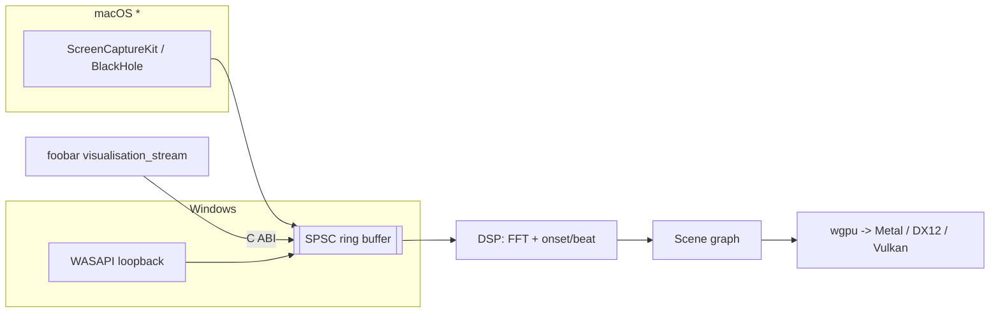

# Plan 0001 — Core + standalone MVP, then foobar parity

**Status:** draft
**Related:** [ADR-0001](../adrs/0001-rust-core-wgpu-cabi-foobar-shim.md)

## TL;DR

Stand up the Cargo workspace, get a Windows loopback → DSP → wgpu spectrum scene running in
the standalone app, add beat/onset reactivity and switchable scenes, then expose the core's
C ABI and build the foobar2000 plugin against it. macOS capture is the final, asterisked phase.

## Context & problem

ADR-0001 fixes the architecture (Rust core, wgpu, C ABI, C++ foobar shim). This plan turns
that into a working v1 with the four agreed features: spectrum/FFT visuals, beat/onset
reactivity, multiple switchable scenes, and foobar plugin parity. We build the standalone
Windows path end-to-end first (fastest feedback loop), then reuse the same core for the
plugin, then extend capture to macOS.

## Decision

Phase in dependency order: workspace → capture → DSP → render → scenes → C ABI → plugin →
mac capture. Each phase is one commit with a concrete "done when". Owners are **areas**
(`core` / `standalone` / `plugin` / `human`), not skills — this project runs the lightweight
harness with one implementer. If the project later grows a skill ecosystem, these area tags
map directly onto skill names.

## Implementation phases

### Phase 0 — Workspace scaffold
- **Owner area:** core
- **What:** Create the Cargo workspace: `core/` (library crate, `crate-type = ["rlib",
  "cdylib", "staticlib"]`), `standalone/` (binary crate depending on `core`), and a
  placeholder `plugin-foobar/` directory (empty for now, real work in Phase 6). Add a Rust
  `.gitignore` (`/target`), pin toolchain, set exact-version deps.
- **Files touched:** `Cargo.toml` (workspace), `core/Cargo.toml`, `core/src/lib.rs`,
  `standalone/Cargo.toml`, `standalone/src/main.rs`, `.gitignore`, `rust-toolchain.toml`.
- **Done when:** `cargo build` succeeds; `cargo run -p standalone` opens an empty window
  (winit) and exits cleanly.

### Phase 1 — Audio intake API + Windows loopback capture
- **Owner area:** standalone
- **What:** Define the core's source-agnostic intake: a lock-free SPSC ring buffer and a
  `push_samples(frames, sample_rate, channels)` entry point validated once at the boundary.
  Implement WASAPI loopback capture in `standalone/` that fills the ring on the audio
  thread — no allocation, no locking, no logging in the callback.
- **Files touched:** `core/src/audio.rs` (ring + intake), `standalone/src/capture_win.rs`.
- **Done when:** Playing audio through Windows produces a live, non-glitching sample stream
  into the core (verified with a debug meter/level readout); the callback does zero heap work.

### Phase 2 — DSP: spectrum (FFT) + beat/onset
- **Owner area:** core
- **What:** Windowed FFT producing a normalized spectrum (log-frequency bins), plus an
  onset-envelope + beat estimator. Pure functions of the input window — deterministic, unit
  tested against fixtures. Expose a per-frame `AnalysisFrame { spectrum, onset, beat }`.
- **Files touched:** `core/src/dsp/fft.rs`, `core/src/dsp/onset.rs`, `core/src/dsp/mod.rs`,
  `core/tests/dsp.rs`.
- **Done when:** Unit tests pass on known signals (sine → single bin; click track → onsets
  on the beats); analysis runs in real time without starving the render loop.

### Phase 3 — Render engine: wgpu + first spectrum scene
- **Owner area:** core
- **What:** wgpu device/surface setup, a render-graph seam that takes an `AnalysisFrame` and
  draws, and one spectrum-bars scene. Render loop decoupled from audio via the ring buffer.
- **Files touched:** `core/src/render/mod.rs`, `core/src/render/context.rs`,
  `core/src/scenes/spectrum.rs`, `standalone/src/main.rs` (wire window → core render).
- **Done when:** The standalone shows live spectrum bars reacting to system audio at a
  stable frame rate on Windows.

### Phase 4 — Scene system + beat-reactive scenes + switching
- **Owner area:** core
- **What:** A `Scene` trait (init/update/render given `AnalysisFrame`), a registry, and 2-3
  scenes total including at least one beat/onset-driven one. Hotkey to cycle scenes in the
  standalone. Any visual randomness is explicitly seeded.
- **Files touched:** `core/src/scenes/mod.rs`, `core/src/scenes/*.rs`,
  `standalone/src/main.rs` (input → scene switch).
- **Done when:** User can cycle through ≥2 scenes live; at least one visibly reacts to
  beats/onsets, not just raw spectrum.

### Phase 5 — C ABI surface
- **Owner area:** core
- **What:** Minimal versioned `extern "C"` API: opaque handle create/free, `push_samples`,
  `render_into` (given a native window/surface handle or context), `resize`. A C header
  (generated or hand-written) for the C++ side. Document the contract in the module and note
  that shape changes are ADR-worthy.
- **Files touched:** `core/src/ffi.rs`, `core/include/lmv_core.h`, `core/cbindgen.toml`
  (if using cbindgen).
- **Done when:** `cargo build` emits the `cdylib`/`staticlib` + header; a tiny C smoke
  program links, creates a handle, pushes samples, and frees without leaking.

### Phase 6 — foobar2000 plugin (Windows)
- **Owner area:** plugin
- **What:** C++ shim using the foobar2000 SDK: a visualization component that pulls from
  `visualisation_stream`, forwards samples across the C ABI, and hosts the core's render
  output. Reuses the exact same scenes → parity by construction.
- **Files touched:** `plugin-foobar/` (SDK glue, `foo_lmv.cpp`, build project linking the
  core lib + header).
- **Done when:** The component loads in foobar2000 on Windows and renders the same scenes,
  reacting to the currently playing track.

### Phase 7 — macOS loopback capture *(asterisked)*
- **Owner area:** standalone
- **What:** Mac capture path via ScreenCaptureKit (macOS 13+) with a documented BlackHole
  fallback for older systems. Same ring-buffer intake as Windows.
- **Files touched:** `standalone/src/capture_mac.rs`, platform cfg wiring.
- **Done when:** The standalone visualizes system audio on macOS; the capability and its
  OS-version/permission constraints are documented in the README.

## Architecture diagram

## Risks & open questions

- **wgpu surface from a foobar-provided HWND.** Rendering the core's wgpu output into a
  window the C++ host owns (Phase 6) is the riskiest integration point — validate early,
  possibly with a spike before Phase 5 freezes the ABI.
- **Beat detection quality.** A simple onset/energy beat estimator may feel loose on some
  genres. Ship a serviceable v1; a better tempo tracker is a follow-up plan, not a v1 blocker.
- **Mac capture permissions/UX.** ScreenCaptureKit prompts for screen-recording permission,
  which is surprising for an audio tool. Document it; consider the BlackHole path as primary.

## What this plan does NOT do

- No preset editor / user-authored scenes (scenes are code in v1).
- No config UI, no persistence of settings beyond a sensible default.
- No macOS foobar build (plugin is Windows-first).
- No packaging/installer/auto-update (a later plan).
