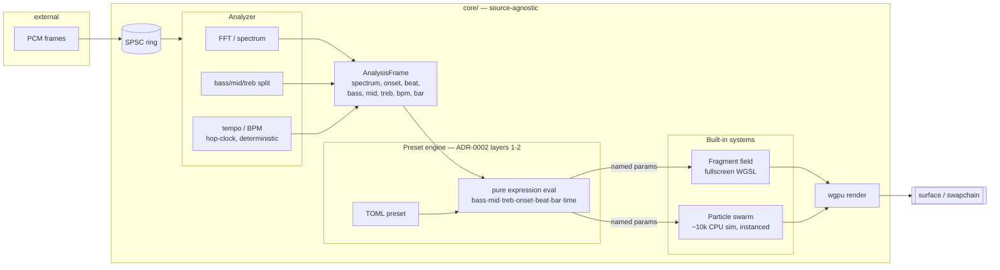

# 0003 — Generative scenes + data-driven presets

> **Status:** approved
> **Amended 2026-07-21:** added **Phase 0** (relocate the existing scenes to
> `core/src/render/scenes/` and bring them under the hot-path panic-pragma guard), folding in the
> Plan 0002 Mode 4 review gap — scenes were per-frame render code outside the pragma set. All new
> scenes in this plan already land at `core/src/render/scenes/`, so they inherit the guard's
> existing recursive `src/render/` scan.
> **Created:** 2026-07-21
> **Owner skill(s):** dev
> **Related ADRs:** [ADR-0002](../adrs/0002-layered-preset-architecture.md) — this plan
> implements its **layers 1–2** (data presets + expression language + built-in systems);
> ADR-0002 is accepted at this plan's close ceremony.

## TL;DR

We build the first tier of "generative-art" visuals: a **Shadertoy-style fragment-field
scene** and a **~10k-particle CPU swarm scene**, then make both **data-driven from TOML
presets** whose parameters are bound to a small pure **expression language** over the audio
signal (`bass`, `mid`, `treb`, `onset`, `beat`, `bar`, `time`). To feed that language we
enrich the DSP with **banded energy (bass/mid/treb)** and a **deterministic tempo/BPM**
estimate. First user-visible behavior lands in Phase 1: `cargo run -p standalone` cycles into
a flowing, audio-reactive fullscreen fragment scene — no preset engine required yet.

## Context & problem

The current three scenes (spectrum bars, pulse rings, starfield) are honest *reactivity* but
sit at the "loading-screen" tier of the genre. The engine cannot yet produce the Shadertoy /
GPU-particle-swarm look the user is targeting, because two capabilities are missing: a
fullscreen fragment-world scene driven by rich audio uniforms, and a dense particle field.
Separately, ADR-0002 committed the project to **presets, not Rust code**, as the long-term
authoring model — and the current `Scene` trait is deliberately thin so presets can drive it.

This plan does both at once, on purpose: it stands up the two new built-in systems *and* the
data/expression preset layer that drives them, so the systems are born preset-shaped rather
than retrofitted. The expression language needs `bass`/`mid`/`treb` and tempo (`bar`) as
first-class inputs, which today's `AnalysisFrame` (spectrum + onset + beat) does not provide —
hence the DSP enrichment is in scope.

The scope is deliberately cut at ADR-0002's layers 1–2. Layer 3 (Rhai orchestration),
cross-preset blending, and compute-shader particle scale are **out** (see *What this plan does
NOT do*) — each is a follow-up, and folding them in would make the plan un-reviewable in a
single `dev` session.

## Decision

Build six phases, walking-skeleton first. **Phase 0** is a hardening commit: relocate the
existing scenes under `render/` and bring them under the panic-pragma guard (closing a Plan 0002
review gap) — no new visuals, so the walking skeleton proper is still Phase 1. **Phase 1 ships a
visible fragment-field scene** driven by the *existing* analysis, so the riskiest-to-love
capability (does it actually look good?) is on screen before any preset plumbing. **Phase 2
enriches the DSP** (bands + tempo).
**Phase 3 adds the CPU particle swarm.** **Phases 4–5 build the preset layer** — a pure
expression evaluator, then wiring both built-in systems to TOML presets with hot-reload and a
handful of shipped example presets.

The fragment-field system is a **fixed built-in WGSL shader parameterized by named uniforms**,
not author-written shader source — that keeps us inside ADR-0002 (which rejected shader-centric
authoring for v1). The swarm is **CPU-simulated at ~10k** (chosen in the interview over
compute-for-thousands): no compute-shader path, no new GPU-capability ADR. We rejected building
the Rhai layer here (ADR-0002 marks it optional and it doubles the plan) and rejected
compute-scale particles (10k CPU clears the target look without a new wgpu capability; compute
returns when scale demands it).

This plan implements a **subset** of ADR-0002's built-in vocabulary (fragment field + swarm);
feedback/warp, proper boids, walkers/growth, and the 3D system remain future built-ins the same
preset layer will drive.

## Architecture diagram



## Implementation phases

Each phase is one commit. `dev` runs all phases in one session; the architect reviews the whole
plan at the end.

### Phase 0 — Relocate scenes under render/ + extend the panic-pragma guard

- **Owner skill:** dev
- **Area:** core (+ standalone import path)
- **What:** Move the three existing scene modules from `core/src/scenes/` to
  `core/src/render/scenes/` (`mod.rs`, `spectrum.rs`, `pulse.rs`, `starfield.rs`), so scenes live
  inside the render engine they belong to (ADR-0002: the `Scene` trait is the render vocabulary
  presets drive) and are **auto-covered by the hot-path guard's existing recursive scan of
  `src/render/`**. This closes the Plan 0002 Mode 4 gap (scenes were per-frame render code outside
  the pragma set) *structurally* — no `core/tests/hygiene.rs` target-list entry to hand-maintain.
  Update `core/src/lib.rs` (drop the top-level `pub mod scenes`; expose scenes via `render`),
  `core/src/render/mod.rs`, the registry in `render/scenes/mod.rs`, and the standalone's scene
  import path (`lmv_core::scenes::…` → `lmv_core::render::scenes::…`). Add the canonical
  panic-denial pragma to each scene file, resolving the surfaced `indexing_slicing` (e.g.
  `SpectrumScene`'s `heights[i / 4][i % 4]`) with a reasoned, provably-in-bounds
  `#[allow(clippy::indexing_slicing, reason = "…")]` — the same pattern Plan 0002 used in
  `dsp`/`ffi`. The C ABI is untouched (it exposes `extern "C"` functions, not Rust module paths).
- **Files touched:** `core/src/render/scenes/{mod,spectrum,pulse,starfield}.rs` (git-moved from
  `core/src/scenes/`), `core/src/lib.rs`, `core/src/render/mod.rs`, `standalone/src/…` (import path).
- **Done when:** `cargo build`, `cargo nextest run`, `cargo clippy --all-targets -- -D warnings`,
  and `cargo fmt --all --check` are all green; `cargo test --test hygiene` passes with the moved
  scenes now inside the guard's `src/render/` scan (no change to `hygiene.rs` needed); deleting the
  pragma from any scene file makes the guard fail (revert the probe before committing). Public
  visual behavior is unchanged — this is a relocation + hardening commit. Phases 1 and 3 add new
  scenes at `core/src/render/scenes/`, which inherit the pragma requirement automatically.

### Phase 1 — Fragment-field scene (walking skeleton)

- **Owner skill:** dev
- **Area:** core
- **What:** A new built-in `Scene` that renders a fullscreen audio-reactive fragment shader
  (Shadertoy-style: domain-warped / iterated field colored by a palette), driven by the
  *existing* `AnalysisFrame` (spectrum + onset + beat) plus the scene's fixed-timestep clock.
- **Files touched:** `core/src/render/scenes/fragment_field.rs` (new — carries the panic-denial
  pragma per Phase 0), `core/src/render/scenes/mod.rs` (register in `create_all`), a `.wgsl` shader
  (inline or alongside).
- **Done when:** `cargo run -p standalone` cycles into the fragment scene and it visibly flows
  and reacts to system audio (spectrum drives color/motion, `beat` produces a discrete kick) at
  a stable frame rate. No preset engine involved. Uses the scene fixed-timestep clock, not
  wall-clock (determinism rule §6).

### Phase 2 — DSP enrichment: banded energy + tempo/BPM

- **Owner skill:** dev
- **Area:** core
- **What:** Extend `AnalysisFrame` with `bass`, `mid`, `treb` (band-energy split from the FFT
  magnitudes) and `bpm` + `bar` (a beat-phase 0..1), computed by the `Analyzer`. Tempo is
  estimated from the onset-envelope history using the **hop count as the time base** (no
  wall-clock), e.g. autocorrelation / comb over the recent envelope. The fragment scene from
  Phase 1 is updated to consume `bass/mid/treb`.
- **Files touched:** `core/src/dsp/mod.rs` (`AnalysisFrame`, wiring), `core/src/dsp/bands.rs`
  (new — fixed Hz cutoffs → three means), `core/src/dsp/tempo.rs` (new), `core/src/render/scenes/fragment_field.rs`.
- **Done when:**
  - A unit test feeds a synthetic click train at a known BPM (e.g. 120) through the analyzer and
    asserts the `bpm` estimate lands within a stated tolerance (e.g. ±3 BPM) — a determinism/
    correctness claim, not "the test passes".
  - A unit test asserts a pure low-frequency sine puts energy in `bass` and ~none in `treb`
    (and the mirror for a high sine), i.e. the band split is frequency-correct.
  - Tempo/band computation is allocation-free after construction and a pure function of the
    input windows (no wall-clock reads) — same input → same `bpm`/`bar` sequence.

### Phase 3 — Particle-swarm scene (~10k, CPU)

- **Owner skill:** dev
- **Area:** core
- **What:** A new built-in `Scene`: ~10k CPU-simulated particles rendered as instanced additive
  sprites (the starfield's rendering approach, scaled up and generalized). Motion is a simple
  swarm/flow field; `bass/mid/treb` drive force/velocity/color bands, `beat` triggers a burst,
  `bar` phase can modulate the field. Seeded RNG only (determinism §6).
- **Files touched:** `core/src/render/scenes/swarm.rs` (new — carries the panic-denial pragma per
  Phase 0), `core/src/render/scenes/mod.rs`.
- **Done when:** `cargo run -p standalone` cycles into a ~10k-particle swarm that reacts to the
  bands and beat at a stable frame rate on the primary dev box, **and is validated once on the
  iGPU test PC (NFR §9) to hold the 60 fps @ 1080p floor (NFR §1)**; if it misses, the particle
  count is reduced to whatever holds the floor and the number is recorded in the scene. All
  per-particle math is CPU-side; no compute shader is introduced.

### Phase 4 — Preset data model + pure expression evaluator

- **Owner skill:** dev
- **Area:** core
- **What:** The ADR-0002 **data + expression** layer, evaluator only (no rendering wiring yet).
  A TOML preset schema (which built-in system, its parameter bindings) parsed into an in-memory
  preset, and a **pure, allocation-free-per-eval expression evaluator** over the variables
  `bass, mid, treb, onset, beat, bar, time` with arithmetic, a small function set
  (`sin, clamp, lerp, min, max, abs, floor`), and constants. Parsing/compile happens once at
  load; evaluation on the hot path allocates nothing.
- **Files touched:** `core/src/preset/mod.rs` (new), `core/src/preset/expr.rs` (new tokenizer +
  parser → compiled expression), `core/src/preset/schema.rs` (new — TOML → preset). Pin the TOML
  crate to an exact version per NFR §4; justify it in `Cargo.toml`.
- **Done when:**
  - Unit tests: `"bass * 2 + 0.1"` evaluated against a known variable set returns the exact
    expected value; `sin`/`clamp`/`lerp` behave; a malformed expression fails to compile with a
    surfaced error (never panics at eval time — no `unwrap` on the hot path, §5).
  - A benchmark or test asserts evaluation of a compiled expression performs **zero heap
    allocation** (the per-frame guarantee ADR-0002 requires).
  - A sample TOML string parses into a preset with its bindings intact.

### Phase 5 — Preset-driven systems + hot-reload + example presets

- **Owner skill:** dev
- **Area:** core, standalone
- **What:** Give the fragment-field and swarm systems a **named-parameter surface**, and let a
  preset bind those parameters to compiled expressions evaluated per frame from the
  `AnalysisFrame` + scene clock. Load presets from a default preset directory, **hot-reload** on
  file change, and ship **2–3 example presets** per system. Cycling now moves between presets,
  not hardcoded scenes.
- **Files touched:** `core/src/preset/mod.rs`, `core/src/render/scenes/fragment_field.rs`,
  `core/src/render/scenes/swarm.rs`, `core/src/render/mod.rs` (preset-driven selection),
  `standalone/src/…` (point at / watch the preset dir), `presets/*.toml` (new — shipped examples).
- **Done when:** `cargo run -p standalone` loads a preset from disk and renders it; editing a
  preset's expression on disk (e.g. change a color-vs-`treb` binding) updates the running visual
  within ~1 s without restart; a malformed preset is rejected and the previous good preset keeps
  rendering (degrade, never crash — ADR-0002 / NFR §10). No change to the C ABI surface
  (preset selection over the ABI is deferred; the core loads from a default dir).

## Data shapes

```rust
// illustrative — not the final interface
pub struct AnalysisFrame {
    pub spectrum: [f32; 64], // existing: normalized log-frequency bins
    pub onset: f32,          // existing
    pub beat: bool,          // existing
    pub bass: f32,           // NEW: mean energy, low band
    pub mid: f32,            // NEW: mean energy, mid band
    pub treb: f32,           // NEW: mean energy, high band
    pub bpm: f32,            // NEW: tempo estimate (hop-clock, deterministic)
    pub bar: f32,            // NEW: beat/bar phase 0..1 derived from bpm + beat
}

// illustrative preset (TOML)
// system = "fragment_field"
// [params]
// warp      = "0.3 + bass * 1.5"
// hue       = "time * 0.05 + treb"
// kick      = "beat"            # bool coerces to 0/1
// zoom      = "1.0 + bar * 0.2"
```

## Risks & open questions

- **Deterministic tempo is the hard bit.** BPM from an onset envelope is noisy and easy to make
  non-deterministic by accident. Mitigation: base it strictly on the analyzer's hop count, unit
  test against a synthetic click train, and keep `bar` derived from `bpm` + beat phase — never
  from a wall clock. If a robust estimate proves too costly for this plan, degrade `bpm` to a
  smoothed inter-beat interval and note it; full tempo tracking is already a roadmap item.
- **10k particles vs the iGPU floor (NFR §1).** CPU sim of 10k plus instanced draw may miss
  60 fps on the ~2015 iGPU. Mitigation: Phase 3 done-when forces an iGPU check and a count
  reduction if needed; proper quality tiers are the separate adaptive-quality plan.
- **Hot-path allocation in the evaluator.** Expression eval runs per parameter per frame. If it
  allocates, it violates §5-adjacent hot-path discipline. Mitigation: compile once to a flat
  bytecode/AST with a fixed variable slot array; Phase 4 asserts zero-alloc eval.
- **Scope.** This is a large plan (DSP + two systems + preset layer). If Phase 5 overruns, the
  clean stopping point is "Phases 1–3 landed, preset layer split to 0004" — Phases 1–3 are
  independently valuable (three new reactive scenes).
- **Preset dir over the C ABI.** The foobar path can't render these presets until the ABI can
  point at a preset dir. Deferred deliberately (ABI change is ADR-worthy); v1 uses a default dir
  and the standalone frontend.

## What this plan does NOT do

- **No author-written shader source** (Shadertoy-as-authoring). The fragment field is a built-in
  parameterized WGSL system; user-supplied WGSL/GLSL is ADR-0002's deferred escape hatch.
- **No Rhai / behavior layer** (ADR-0002 layer 3) — staged per-track arcs are a follow-up.
- **No cross-preset blending / crossfade** on scene change — a follow-up.
- **No compute-shader particles / thousands-scale** — CPU 10k only; compute returns when scale
  demands it (ADR-worthy).
- **No feedback/warp, boids-proper, walkers, or 3D built-in systems** — future built-ins the
  same preset layer will drive.
- **No C ABI change** — preset selection/hot-reload over the ABI, scene triggers, auto-rotate,
  MIDI, and fullscreen all belong to the live-features roadmap plan.
- **No adaptive quality tiers / frame governor** — separate roadmap plan (NFR §1).

## Followups (after this lands)

- Preset engine layer 3: Rhai orchestration for staged per-track arcs (ADR-0002 layer 3).
- Cross-preset blending on scene change.
- Compute-shader particle path for thousands-scale swarms (new ADR).
- Additional built-in systems: feedback/warp, boids, walkers/growth, 3D.
- Expose preset selection/hot-reload across the C ABI (ADR-worthy).
