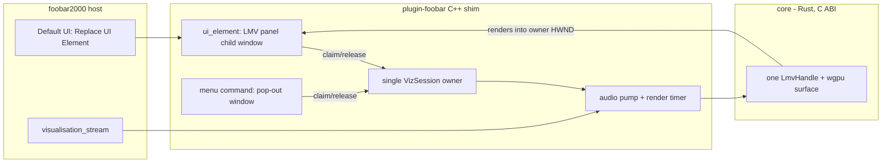

# 0004 — foo_lmv as an embeddable Default UI panel

> **Status:** in-progress
> **Created:** 2026-07-21
> **Owner skill(s):** dev
> **Related ADRs:** none (no C ABI change — see Decision)

## TL;DR

Make the foobar2000 plugin appear in Default UI's "Replace UI Element" list so the visualizer
can be docked as a panel inside the player layout, not just opened as a separate pop-out window.
We register a Default UI `ui_element` service whose instance window hosts the core's wgpu output
via the existing `lmv_attach_window` HWND path. The pop-out menu command stays; a single global
visualizer session is shared between the pop-out and the panel so only one wgpu surface ever
exists. First user-visible behavior: right-click a layout pane → Replace UI Element → Library →
Light Music Visualizer → the panel shows audio-reactive visuals in place.

## Context & problem

`plugin-foobar/foo_lmv.cpp` today registers only a `mainmenu_commands` command that opens a
singleton top-level `WS_OVERLAPPEDWINDOW` and attaches the core to it. Default UI only lists
components that register a `ui_element` service in its "Replace UI Element" menu, so LMV cannot
be embedded as a panel — the user's actual request. The window/handle/stream/cursor state is a
set of file-scope globals (`g_hwnd`, `g_handle`, `g_stream`, `g_cursor`, `g_rate`,
`g_channels`) driven by a `WM_TIMER` pump; there is exactly one of everything.

The C ABI does not need to change: `lmv_attach_window(handle, hwnd, w, h)` accepts any HWND, and
`render`/`resize`/`push_samples`/`cycle_scene`/`free` are all per-handle, so a child window
parented into the layout hosts the core exactly like the pop-out does.

## Decision

Register a Default UI `ui_element` (subclass: playback visualisation) whose instance owns a
`WS_CHILD` window parented into the layout, and refactor the current file-scope globals into a
single **`VizSession`** — one `LmvHandle` + `visualisation_stream` + pump + render timer that is
*claimed* by exactly one host window at a time (either the pop-out or one panel). A second host
(a second panel, or the pop-out while a panel owns the session) paints a lightweight GDI
placeholder instead of creating a second core handle. This preserves the project's
"lightweight / one wgpu surface" value while satisfying "keep both entry points".

Chosen from the interview: **keep both** entry points (rejected panel-only — loses the quick
standalone window at no real saving); **single instance** (rejected multiple — N panels = N wgpu
devices/surfaces, heavier GPU/memory and trickier teardown for no clear v1 benefit); **right-click
"Next scene" + Space** for cycling (rejected click-to-focus-only — non-obvious and steals focus
from the playlist); **throttle + pause-when-hidden** for idle (rejected always-full-rate — pegs
the GPU on a paused/background panel, against the lightweight value). Columns UI's separate
`uie::window` panel API is **out of scope** (follow-up) — the user runs Default UI.

No ABI change means no ADR: the extension seam (the C ABI) is untouched, and single-vs-multi
instance is a plugin-local policy, not a durable architecture tradeoff future readers must revisit.

## Architecture diagram



## Implementation phases

### Phase 1 — Default UI panel skeleton (single session)
- **Owner skill:** dev
- **Area:** plugin
- **What:** Extract the current globals into a `VizSession` (one handle + stream + cursor + pump
  + timer, claimable by one host HWND), and register a Default UI `ui_element` whose instance
  creates a child window that claims the session and hosts the core. Re-point the existing pop-out
  command at the same session so no code path creates a second `LmvHandle`.
- **Files touched:** `plugin-foobar/foo_lmv.cpp` (refactor globals → `VizSession`; add
  `ui_element_instance` + `ui_element_impl` factory; child-window `wnd_proc`); `plugin-foobar/build.ps1`
  (only if the SDK `ui_element` sources need adding to the build).
- **Done when:** In a running foobar2000 v2, layout editing → Replace UI Element lists "Light
  Music Visualizer", and adding it shows audio-reactive visuals embedded in the pane, resizing
  with `WM_SIZE → lmv_resize`. Exactly one `lmv_create` is live at any time (verified by the
  single-owner guard — a non-owning host does not call `lmv_create`).

### Phase 2 — Ownership arbitration + placeholder
- **Owner skill:** dev
- **Area:** plugin
- **What:** Formalize claim/release: whichever host (pop-out or a panel) first claims the session
  owns it; other hosts paint a GDI placeholder ("Light Music Visualizer is active in another
  window"). Releasing the owner (pop-out closed, panel removed by a layout edit, tab destroyed,
  app shutdown) frees the session and lets a still-open host claim it, or idles it if none remain.
- **Files touched:** `plugin-foobar/foo_lmv.cpp`.
- **Done when:** With a panel active, invoking the View menu command paints the placeholder rather
  than opening a second surface; removing the owning panel lets the pop-out (if open) or a second
  panel take over on next paint; closing everything frees the handle exactly once (no leak, no
  double-free) across normal use and app shutdown.

### Phase 3 — Scene cycling in the panel
- **Owner skill:** dev
- **Area:** plugin
- **What:** Add a "Next scene" item to the panel window's right-click context menu (works without
  keyboard focus), and keep `Space` cycling when the panel window has focus. Both route to
  `lmv_cycle_scene` on the owning session; non-owner hosts ignore the request.
- **Files touched:** `plugin-foobar/foo_lmv.cpp`.
- **Done when:** Right-click the panel → Next scene advances the scene; clicking the panel then
  pressing Space also advances it; neither does anything on a placeholder (non-owner) host.

### Phase 4 — Idle throttle + pause-when-hidden
- **Owner skill:** dev
- **Area:** plugin
- **What:** Drive the render cadence from playback + visibility: full timer rate while playing,
  a reduced cadence when paused/stopped, and the render timer stopped entirely when the host is
  not visible (Default UI visibility notification / `WM_SHOWWINDOW` / zero client size), resumed
  on show. Preserve the pump's existing resync-on-gap logic when resuming.
- **Files touched:** `plugin-foobar/foo_lmv.cpp`.
- **Done when:** A hidden panel (background layout tab) does no rendering (render timer not
  firing); paused/stopped playback renders at the reduced cadence; active playback renders at full
  cadence; switching back to the tab or resuming playback restores visuals without a stuck cursor.

## Data shapes

No new C ABI. The one new C++ type is the session owner — illustrative sketch:

```cpp
// illustrative — not the final interface
struct VizSession {            // exactly one instance, main-thread only
    HWND owner   = nullptr;    // the host window currently driving the core (pop-out or panel)
    LmvHandle*   handle = nullptr;
    visualisation_stream::ptr stream;
    double cursor = 0.0;
    uint32_t rate = 0; uint16_t channels = 0;
    // claim(host_hwnd) -> bool : succeeds only if owner == nullptr; attaches core to host_hwnd
    // release(host_hwnd)       : if owner == host_hwnd, frees handle + stream, owner = nullptr
};
```

## Risks & open questions

- **Two wgpu surfaces via a claim race.** The single-`LmvHandle` invariant is load-bearing for the
  "lightweight" value; guard it so no non-owner path can reach `lmv_create` (owner check before
  create, asserted).
- **Panel lifetime vs. global session.** Layout edits create/destroy `ui_element` instances freely;
  the instance's `WM_DESTROY` must `release()` the session (only if it was the owner) so the handle
  is freed exactly once. App shutdown ordering (`initquit::on_quit` vs. host-destroyed panels) must
  free the handle once, not twice.
- **Keyboard focus.** Panels frequently never receive `WM_KEYDOWN`; the context-menu "Next scene"
  is the reliable path (Space is a bonus when focused). This is why Phase 3 ships both.
- **Correct "hidden" signal.** The exact Default UI notification for visibility needs confirming
  during Phase 4 (`ui_element_instance` notify vs. `WM_SHOWWINDOW` vs. zero-size); pick whichever
  the SDK actually delivers for a backgrounded layout tab.
- **Main-thread real-time discipline unchanged.** The pump still runs on the foobar main thread with
  the existing fixed `conv[]` buffer (no per-tick allocation) and non-blocking
  `get_chunk_absolute`; the refactor must not introduce allocation or blocking in the timer path.

## What this plan does NOT do

- **No Columns UI panel** (`uie::window`) — a follow-up; the user is on Default UI.
- **No multiple simultaneous visualizers / independent surfaces** — single session by decision.
- **No per-panel configuration/persistence** beyond the minimal empty `ui_element_config` the
  service requires (scene choice is transient, cycled at runtime).
- **No C ABI change and no core/Rust change** — this is a plugin-only feature.
- **No macOS** — the foobar plugin is Windows-only regardless.

## Followups (after this lands)

- Columns UI `uie::window` panel variant for CUI users.
- Optional: persist the last scene per panel via `ui_element_config` if users ask.
