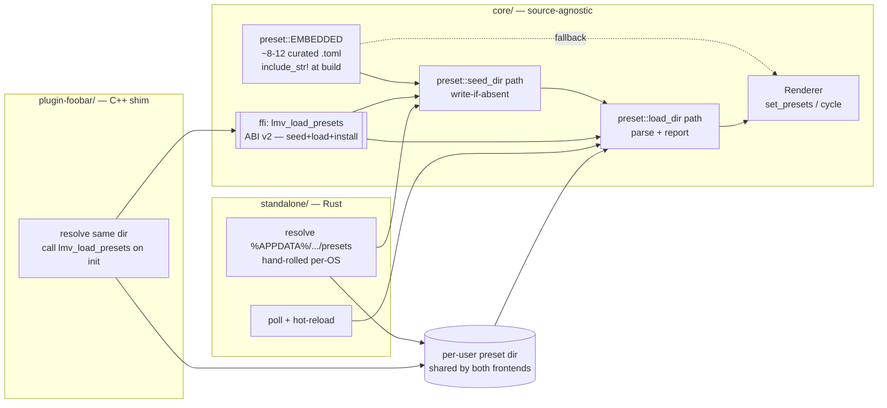

# 0007 — Curated preset library: robust loading + seed-on-first-run + C ABI v2

> **Status:** approved
> **Created:** 2026-07-21
> **Owner skill(s):** dev
> **Related ADRs:** [ADR-0006](../adrs/0006-c-abi-v2-preset-loading.md) — C ABI v2 preset
> loading (proposed by this plan; accepted at close). Builds on
> [ADR-0002](../adrs/0002-layered-preset-architecture.md) (the preset engine) and extends
> [ADR-0003](../adrs/0003-c-abi-v1-surface.md) (the v1 ABI).

## TL;DR

Presets already load from a directory with hot-reload (Plan 0003), but the standalone reads a
**CWD-relative `presets/` folder** and only four minimal example presets ship — so a user who runs
the installed exe from anywhere gets nothing, and foobar sees only the core's embedded defaults.
This plan makes the library real and portable: on first run each frontend **seeds a per-user
directory** with an embedded curated set (~8–12 hand-tuned presets), then loads and hot-reloads
that directory; the standalone and the foobar plugin **share the same directory** so a preset
edited once shows in both. foobar reaches parity through **one new C ABI function**
(`lmv_load_presets`, ABI v2 — [ADR-0006](../adrs/0006-c-abi-v2-preset-loading.md)). First
user-visible behavior lands in Phase 1: `cargo run -p standalone` from any working directory seeds
`%APPDATA%\light-music-visualizer\presets` and renders from it. The **in-app browse overlay** the
interview picked is a **separate follow-up plan** (it needs a new text-rendering stack); selection
here stays cycle + title-bar.

## Context & problem

Plan 0003 delivered ADR-0002's data + expression preset layer: `core::preset::load_dir` parses a
directory of TOML presets, `core::preset::EMBEDDED` holds four example presets `include_str!`'d from
the repo-root `presets/` folder, and the standalone loads that folder over the renderer's embedded
defaults and polls it for hot-reload edits. Three concrete gaps remain:

- **The load path is CWD-relative** (`standalone/src/main.rs`: `const PRESET_DIR = "presets"`). It
  works only when the exe runs from the repo root; a packaged build (roadmap item 5) run from an
  install directory finds no presets and silently falls back to the embedded defaults.
- **The curated set is four proof-of-concept files.** The user wants a real, hand-picked library
  across both built-in systems (fragment field + swarm).
- **foobar has no preset access at all.** ADR-0003 froze the ABI before the preset engine existed;
  `lmv_cycle_scene` cycles only the core's embedded defaults. A plugin user cannot reach the curated
  library or their own presets — the exact "preset addressing" v2 event ADR-0003 anticipated.

The user chose (interview, 2026-07-21): **seed a user directory on first run** then watch that one
directory; **both frontends** in scope (accepting the ABI widening); ship a **mechanism + starter
curated set (~8–12)**; and an **in-app browse overlay** for selection — which is split out because
the codebase has *no* text rendering today and a glyph stack is a dependency-and-render cost that
would make this plan un-reviewable in one `dev` session.

## Decision

Add `core::preset::seed_dir(path)` — write each embedded curated file into `path` if absent, never
overwriting — and have each frontend resolve a **per-user directory**, seed it, then `load_dir` +
watch it. Expand `EMBEDDED` (and the repo-root `presets/` sources it `include_str!`s) to ~8–12
curated presets. Widen the C ABI with one function, `lmv_load_presets(handle, path, len)`
(seed-then-load-then-install), bump `LMV_ABI_VERSION` to 2 per ADR-0006, and wire the foobar shim to
call it against the **same** directory the standalone uses, so the two frontends share one library.
Directory resolution is **hand-rolled per-OS** (`%APPDATA%` on Windows, `$XDG_DATA_HOME`/`~/Library`
elsewhere) — no new runtime dependency; we rejected the `directories` crate to hold the size cap
(NFR §4), given Windows-first and that a mis-resolved dir degrades to the embedded defaults rather
than crashing. Selection stays **cycle + title-bar**; the browse overlay is **Plan 0008** (draft
follow-up). We rejected folding the overlay in here (text stack balloons the review) and rejected a
two-function seed/load ABI split (ADR-0006 Alternative A — wider frozen surface for no real gain).

## Architecture diagram



## Implementation phases

Each phase is one commit. `dev` runs all phases in one session; the architect reviews the whole plan
at the end.

### Phase 1 — `seed_dir` + per-user dir resolution + standalone loads it (walking skeleton)

- **Owner skill:** dev
- **Area:** core, standalone
- **What:** Add `core::preset::seed_dir(dir: &Path) -> io::Result<usize>` that creates `dir` and
  writes each `EMBEDDED` `(name, contents)` pair to `dir/name` **only if that file does not already
  exist** (never clobber a user edit), returning how many it wrote. In the standalone, replace the
  CWD-relative `const PRESET_DIR = "presets"` with a hand-rolled per-OS resolver
  (`%APPDATA%\light-music-visualizer\presets` on Windows; `$XDG_DATA_HOME`/`~/.local/share` or
  `~/Library/Application Support` fallback elsewhere), call `seed_dir` once at startup, then feed
  that resolved path into the existing `reload_presets` + poll/hot-reload machinery unchanged. If
  resolution or seeding fails, log to stderr and keep the renderer's embedded defaults (degrade,
  never crash — NFR §10). No new dependency; no ABI change yet; still four presets.
- **Files touched:** `core/src/preset/mod.rs` (`seed_dir`), `standalone/src/main.rs` (path
  resolver + call `seed_dir`; `PRESET_DIR` becomes a per-OS resolved `PathBuf`).
- **Done when:** running `cargo run -p standalone` from a directory **other than the repo root**
  creates `%APPDATA%\light-music-visualizer\presets` populated with the four curated `.toml` files
  and renders from it; deleting one file and relaunching re-seeds only the missing file; editing a
  file's expression still hot-reloads within ~1 s (existing behavior, new path). A unit test asserts
  `seed_dir` writes all embedded files into an empty temp dir and, on a second call, writes **zero**
  (idempotent, no overwrite) — the write-if-absent contract, not "the test passes".

### Phase 2 — C ABI v2: `lmv_load_presets` + version bump + FFI test

- **Owner skill:** dev
- **Area:** core (ffi + header)
- **What:** Add `lmv_load_presets(handle, path_utf8, path_len) -> i32` to `core/src/ffi.rs`,
  implementing ADR-0006's seed-then-load-then-install: validate handle + non-null path, decode UTF-8
  (reject with an `LMV_ERR_*` code otherwise), call `preset::seed_dir` then `preset::load_dir`,
  install the resulting presets on the handle's renderer, and return the installed count (`>= 0`) or
  a negative error code. A malformed/empty directory keeps the current set (degrade). Bump
  `LMV_ABI_VERSION` from `1` to `2` and mirror the new prototype + any new error code in
  `core/include/lmv_core.h` (hand-synced, per ADR-0003). No panic may cross the boundary.
- **Files touched:** `core/src/ffi.rs`, `core/include/lmv_core.h`, `core/tests/` (new FFI test).
- **Done when:** `cargo nextest run` includes a Rust-side FFI test that calls `lmv_create` →
  `lmv_load_presets` on a fresh temp dir → asserts the return is the number of curated presets
  (`> 0`) and the temp dir is now seeded → `lmv_free`, plus a call with a null path returns the
  documented negative error code without UB. `lmv_abi_version()` returns `2`. The header prototype
  matches the Rust signature (reviewed). This is the ABI's first automated coverage.

### Phase 3 — foobar shim: resolve the shared dir + load presets on init

- **Owner skill:** dev
- **Area:** plugin
- **What:** In the C++ shim, resolve the **same** directory the standalone uses
  (`%APPDATA%\light-music-visualizer\presets` via the Win32 known-folder API / `%APPDATA%` env) and
  call `lmv_load_presets(handle, path, len)` once after `lmv_create`/attach, so the plugin seeds and
  renders the curated + user library. Guard on the `lmv_abi_version()` handshake (expect `2`).
  `lmv_cycle_scene` (already wired, incl. Plan 0004's right-click "Next scene") now cycles the loaded
  presets. Selection stays cycle-only on the plugin — no overlay.
- **Files touched:** `plugin-foobar/src/…` (shim init + path resolution), plugin build if a new
  source file is added.
- **Done when:** the plugin builds against the v2 header and, on load in foobar2000, seeds the shared
  directory and cycles the curated presets via right-click "Next scene" — **runtime confirmation in
  foobar is a host/hardware smoke check** (like Plan 0001 Phase 8): if a foobar install is
  unavailable at implementation time, the done-when is "builds against v2, path resolution + load
  call wired and code-reviewed," and the live smoke is flagged for the user to confirm (a `human`
  follow-up noted at close, not a silent gap).

### Phase 4 — Author the curated set (~8–12 presets)

- **Owner skill:** dev
- **Area:** core (preset content)
- **What:** Expand the repo-root `presets/*.toml` sources (and the `EMBEDDED` array that
  `include_str!`s them) from four to **~8–12 hand-tuned presets** spanning both built-in systems —
  a range across the fragment-field system (calm/warp/bright variants) and the swarm system
  (flow/burst/dense variants), each binding parameters to distinct expressions so the set reads as a
  curated library, not four near-duplicates. Keep each preset valid TOML that `load_dir` accepts.
- **Files touched:** `presets/*.toml` (new files), `core/src/preset/mod.rs` (`EMBEDDED` entries +
  count), any `hygiene.rs` note if the preset count is asserted anywhere.
- **Done when:** `cargo nextest run` and clippy `-D warnings` stay green; the standalone seeds all
  ~8–12 files and cycling walks a set of **visibly distinct, audio-reactive** visuals — a runtime /
  visual judgment on the dev box (the same class of check as Plan 0003's "visibly flows and reacts";
  flagged for on-box confirmation, not review-verifiable). Every embedded preset parses (a unit test
  over `default_presets()` asserts the count and that all parse without error).

## Data shapes

```rust
// illustrative — not the final interface

// core::preset — the embedded curated set grows from 4 to ~8-12 entries.
const EMBEDDED: [(&str, &str); N] = [
    ("fragment_aurora.toml", include_str!("../../../presets/fragment_aurora.toml")),
    // ... ~8-12 total across fragment_field + swarm
];

/// Write each embedded curated file into `dir` if absent (never overwrite).
/// Returns the number of files newly written. Idempotent.
pub fn seed_dir(dir: &Path) -> std::io::Result<usize>;
```

```c
/* core/include/lmv_core.h — ABI v2 (LMV_ABI_VERSION == 2) */
/* Seed `path` with the embedded curated set if needed, then load + install
   every valid preset found. Returns installed count (>=0) or negative LMV_ERR_*. */
int32_t lmv_load_presets(LmvHandle* handle, const uint8_t* path_utf8, size_t path_len);
```

## Risks & open questions

- **Curated updates don't propagate to already-seeded files.** `seed_dir` never overwrites, so a
  user who seeded v0.2's presets keeps them after upgrading to v0.3 even if a curated file changed.
  This is the accepted consequence of the user's chosen "seed on first run" model; note it in the
  `seed_dir` doc comment. A future "refresh curated" affordance is a follow-up, not this plan.
- **Shared directory, two frontends, possible schema drift.** If one frontend ships a newer built-in
  system than the other, a preset referencing it is simply skipped by the older `load_dir` (existing
  degrade-on-parse-error contract) — no crash. Keep both frontends on the same core version to avoid
  it; the ABI handshake (`lmv_abi_version`) catches gross mismatch.
- **Hand-rolled path resolution edge cases.** `%APPDATA%` unset, or a read-only/again non-writable
  dir: seeding fails → fall back to embedded defaults and log. Windows is the tested path; the
  macOS/Linux branches are best-effort until the Mac path is validated on hardware (the standing
  Plan 0001 Mac caveat). No new dependency is the deliberate trade (NFR §4) — revisit `directories`
  only if the hand-rolled branches prove fragile on a real Mac.
- **`lmv_load_presets` write side effect** (ADR-0006 negative). Documented + idempotent; the FFI
  test must exercise it against a temp dir, never a real user dir.
- **foobar runtime unverifiable without foobar.** Phase 3's live smoke may land as a `human`
  confirmation (see its done-when) — same posture as Plan 0001 Phase 8.
- **Preset quality is a visual judgment.** Phase 4's "visibly distinct/reactive" is not
  review-verifiable; it is an on-box check, flagged like Plan 0003's runtime done-whens.

## What this plan does NOT do

- **No in-app browse overlay and no text rendering** — that is **Plan 0008** (the interview's
  chosen selection UX, split out because it introduces a glyph/text stack + dependency). Selection
  here is cycle + title-bar (standalone) and right-click "Next scene" (foobar).
- **No preset selection by name/index over the C ABI.** v2 adds directory loading only;
  `lmv_cycle_scene` still cycles a flat set. Pick-by-name over the ABI is a later v-bump if wanted.
- **No new runtime dependency** — path resolution is hand-rolled (the `directories` crate is the
  noted alternative, deferred for the size cap).
- **No preset metadata / tags / categories / thumbnails** — filenames only; a richer catalog is a
  future concern (and would interact with the browse overlay plan).
- **No "refresh curated on upgrade"** — seeding is write-if-absent; propagation of changed curated
  files to already-seeded dirs is out of scope (see Risks).
- **No packaging/install work** (roadmap item 5) — this plan makes the load path install-ready but
  does not build the release zip.

## Followups (after this lands)

- **Plan 0008 — in-app preset browse overlay** (standalone): a text-rendering stack (glyph crate =
  ADR-worthy dependency) + a toggleable on-screen list to browse/select presets by name. Depends on
  this plan's loading foundation.
- A "refresh curated set" affordance so upgraded app versions can offer updated built-in presets
  without clobbering user edits.
- Reconsider `directories` if hand-rolled per-OS resolution proves fragile once the Mac path is
  validated on hardware.
- Preset metadata (name/author/tags) and pick-by-name selection — over the ABI (a v-bump) and in the
  overlay.
