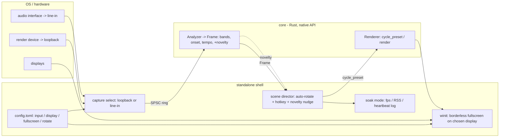

# 0009 — Live performance features (standalone)

> **Status:** draft
> **Created:** 2026-07-21
> **Owner skill(s):** dev, human
> **Related ADRs:** none (standalone-only; the C ABI stays frozen — see Decision)

## TL;DR

Make the standalone usable to drive a live DJ show onto a projector: pick the **output display**
and go **borderless-fullscreen** on it, capture from a **line-in / audio interface** (not just
loopback), let scenes **rotate themselves** (energy/drop-biased) with a **manual hotkey override**,
add **experimental track-change detection** as a soft nudge, and prove a **≥4-hour session** is
stable with an instrumented long-run mode. Operator choices persist in a small per-user
`config.toml`. Everything lands in the standalone via the native Rust API and one deterministic DSP
addition in core; the C ABI is untouched, so no ADR.

First user-visible behavior (walking skeleton): launch → the app opens borderless-fullscreen on the
configured display and shows visuals; `F` toggles fullscreen, and the choice persists.

## Context & problem

Per NFR §10 the primary real-world use is a live DJ show: the app renders to a projector/LED wall
while a DJ mixes. The standalone today (`standalone/src/main.rs`) opens a single 1080p **windowed**
winit window, captures only **WASAPI loopback of the default render device** (`capture_win.rs`
hardcodes `eRender` + `AUDCLNT_STREAMFLAGS_LOOPBACK`), advances scenes only on manual `Space`, and
persists nothing. A stage setup needs the opposite defaults: fullscreen on a chosen screen, a robust
cable feed from the mixer via an audio interface, hands-off scene rotation with a manual override,
and multi-hour stability.

The standalone consumes core through the **native Rust API** (`dsp::Analyzer`, `render::Renderer`),
not the C ABI. So new analysis (track-change novelty) added to core's `Frame`, and all shell
behavior (capture-device choice, fullscreen, the scene director, config), are reachable **without
touching the C ABI** — ADR-0003/0006 stay frozen and the foobar plugin is unaffected.

## Decision

Build the live-show feature set **in the standalone**, with exactly one new **deterministic DSP
signal in core** (track-change novelty) consumed via the native `Frame`. Concretely:

- **Output:** enumerate monitors, open `Fullscreen::Borderless(Some(monitor))` on the configured
  display; hotkeys toggle fullscreen and cycle display. Projector output is first-class (NFR §10),
  so it is the walking skeleton.
- **Input:** extend `capture_win.rs` to enumerate render **and** capture endpoints by friendly name
  and start from the config-selected device — either loopback of a render device (existing path) or
  direct capture of an input device (line-in from an interface; `eCapture`, no loopback flag).
- **Triggers (a shell "scene director"):** a testable decision function driven by elapsed time +
  the analysis `Frame`'s energy/onset that calls `Renderer::cycle_preset()` on a MilkDrop-style
  timer biased toward energy drops, with min/max dwell clamps; a manual hotkey forces the next scene
  and resets the dwell; another toggles auto-rotate. The **track-change novelty** signal (core DSP)
  feeds the director as a *nudge* (raises rotation probability near a detected boundary) — never the
  sole trigger, since beatmatched blends have no hard edge (NFR §10).
- **Persistence:** a small per-user `config.toml` (input device, display, fullscreen, auto-rotate
  on/off + dwell params) read at startup and written back when a hotkey changes one. Only the fields
  this plan needs — the full settings-persistence UX stays roadmap item 4.
- **Stability:** an instrumented long-run mode logging fps + resident-set + a heartbeat to a file,
  then a human ≥4-hour run on the projector rig reporting before/after (NFR §10 soak; NFR §12
  "measurement not vibes"). This plan **measures** stability; the memory *trim* is roadmap item 3.

**Layering:** the track-change detector is pure DSP on PCM windows (source-agnostic, deterministic,
unit-testable) and belongs in core's analysis. The **director** is wall-clock-timed orchestration —
a shell concern, like the existing FPS pacing — so it lives in the standalone; its decision logic is
a pure function of injected `dt` + `Frame`, kept testable. Putting the director in core (rejected)
would drag a live-show timer and scene-rotation policy into the source-agnostic engine for no
plugin benefit (plugin parity is out of scope). This is an application of ADR-0001's layering, not a
new architecture decision — hence no ADR.

**From the interview:** standalone only (rejected plugin parity — would grow the frozen C ABI for the
non-target embedded-desktop case); auto-rotate + hotkey + track-change (rejected MIDI **now** — new
dependency + input mechanism + hardware to test, deferred to its own ADR-backed follow-up); persisted
config + hotkeys (rejected CLI-only — re-specify every launch, no mid-show change; rejected runtime
overlay UI — needs a text/egui stack and NFR §10 puts projector output above desk UX); instrumented
soak + manual run (rejected plain watch — "no leak" becomes a judgment call, not a measured number).

## Architecture diagram



## Implementation phases

### Phase 1 — Per-user config + fullscreen on a chosen display (walking skeleton)
- **Owner skill:** dev
- **Area:** standalone
- **What:** Add a minimal `config.toml` under the per-user dir (`%APPDATA%\light-music-visualizer\`
  on Windows; the same base Plan 0007 uses for `presets/` — reuse its resolver if landed, else a
  self-contained `APPDATA`/`XDG` helper with a windowed fallback). Fields for this phase: `display`
  (index, with a name/position match preferred over raw index) and `fullscreen` (bool). Enumerate
  monitors via winit; open `Fullscreen::Borderless(Some(monitor))` on the chosen display, or windowed
  if unset/unmatched. Hotkeys: `F` toggle fullscreen, `D` cycle target display; both write the choice
  back to `config.toml`. Missing/garbled config degrades to the current windowed 1080p default, never
  crashes.
- **Files touched:** `standalone/src/main.rs` (config load/save, monitor enum, fullscreen state,
  hotkeys); new `standalone/src/config.rs`; `standalone/Cargo.toml` (add already-vetted
  `serde` + `toml`).
- **Done when:** With `fullscreen = true, display = 1`, launching opens borderless-fullscreen on the
  second monitor showing visuals; `F` toggles fullscreen and `D` moves it to another display; the
  choice persists across a restart; deleting the config falls back to windowed without a crash.

### Phase 2 — Line-in / audio-interface capture selection
- **Owner skill:** dev
- **Area:** standalone (Windows-first)
- **What:** Enumerate WASAPI render endpoints (for loopback) and **capture** endpoints (for line-in)
  with friendly names, and start capture from the config-selected device: `input.mode = "loopback"`
  (existing default-render + loopback path) or `input.mode = "line-in"` (`eCapture` dataflow on the
  named input device, no loopback flag). Add a `--list-devices` startup aid printing the enumerated
  names. Format is still validated once at the boundary (`AudioFormat::validate`); an unknown device
  or rejected format falls back to the default with a stderr note. Enumeration and friendly-name
  strings are built at setup, **before** the real-time loop — the post-start capture thread keeps its
  NFR §5 discipline (zero alloc/lock/log/IO).
- **Files touched:** `standalone/src/capture_win.rs` (endpoint enumeration; device-selected + capture
  path alongside loopback); `standalone/src/main.rs` (pass the config selector to `start_capture`);
  `standalone/Cargo.toml` (add narrow `windows` features for device enumeration / property store if
  needed — no new crate).
- **Done when:** With an interface connected and `input.mode = "line-in"` + its device name, visuals
  react to the line-in signal; loopback still works when configured; `--list-devices` prints both
  input and output device names; an unknown name falls back to default with a clear stderr message
  and keeps rendering.

### Phase 3 — Scene director: auto-rotate (energy/drop-biased) + manual hotkey override
- **Owner skill:** dev
- **Area:** standalone (may add one deterministic `Frame` field in core if the drop signal is absent)
- **What:** A `director` module: a pure decision function `advance(&mut State, dt, &Frame) ->
  Option<Reason>` driving `Renderer::cycle_preset()`. Auto-rotate on a MilkDrop-style timer biased
  toward energy drops — rotate sooner after a large downward energy shift, hold during steady
  passages — with `min_dwell` / `max_dwell` clamps from config. Prefer reading the `Frame`'s existing
  bands/onset/tempo (Plan 0003); only if no usable energy-delta/drop scalar is exposed, add a
  deterministic one to core's `Frame` in this phase. Manual hotkeys layer on the same state: next
  scene (forces `cycle_preset`, resets the dwell), and toggle auto-rotate on/off (`A`). Wall-clock
  `dt` is measured by the shell loop and injected, so the decision logic stays clock-free and
  testable.
- **Files touched:** `standalone/src/director.rs` (new); `standalone/src/main.rs` (feed `dt` +
  `Frame`, wire hotkeys, honor config); `standalone/src/config.rs` (rotate on/off + dwell params);
  possibly `core/src/dsp.rs` (deterministic drop/energy-delta scalar on `Frame`, iff not already
  present).
- **Done when:** With auto-rotate enabled, scenes advance on their own — visibly sooner around drops,
  holding during steady passages — respecting `min`/`max` dwell; the manual next hotkey advances
  immediately and resets the countdown; `A` freezes rotation (manual only); a unit test feeds
  synthetic `Frame` sequences with injected `dt` and asserts rotation timing/bias deterministically.

### Phase 4 — Experimental track-change detection (core DSP → director nudge)
- **Owner skill:** dev
- **Area:** core (DSP) + standalone (director wiring)
- **What:** Add a long-window **spectral/tempo novelty** detector to core's analysis — a pure
  function of the analysis window (no wall clock, no unseeded randomness, per NFR §6) — exposing a
  `novelty`/`track_change_score` on the `Frame` (native API only; the C ABI is untouched). Wire it
  into the director as a **nudge**: near a detected boundary the rotation probability rises, but
  novelty never triggers a change alone (beatmatched blends have no hard edge). Config gate
  `track_change = true|false`, default on but clearly experimental.
- **Files touched:** `core/src/dsp.rs` (+ maybe a small `core/src/dsp/novelty.rs` under the hot-path
  pragma/guard set); `standalone/src/director.rs` (consume the nudge); `standalone/src/config.rs`.
- **Done when:** A deterministic unit test feeds a synthetic two-segment signal (distinct
  spectra/tempo) and asserts the novelty score spikes at the boundary and stays low within a
  segment; with the nudge enabled the director rotates near detected boundaries but a steady signal
  never rotates on novelty alone; any new core module is added to Plan 0002's hygiene guard scan set.

### Phase 5 — Soak instrumentation (long-run mode)
- **Owner skill:** dev
- **Area:** standalone
- **What:** A `--soak <path>` (or config flag) long-run mode that periodically appends a line of
  `elapsed, fps, resident-set-bytes, frames, heartbeat` to a log file, so a multi-hour run yields a
  measurable fps/RSS trace. Resident-set is read via a cheap per-OS query (Windows
  `GetProcessMemoryInfo`); the sampling is off the render hot path (a coarse timer, e.g. every few
  seconds) and never blocks rendering.
- **Files touched:** `standalone/src/main.rs` (soak sampler + flag); new
  `standalone/src/soak.rs` (RSS query + log writer); `standalone/Cargo.toml` (narrow `windows`
  PSAPI feature if needed — no new crate).
- **Done when:** Running with `--soak` produces a growing log of timestamped fps + RSS samples at the
  configured cadence; disabling it has zero effect on the normal render loop; the sampler adds no
  allocation/blocking to per-frame rendering.

### Phase 6 — 4-hour soak run on the projector rig
- **Owner skill:** human
- **Area:** standalone (validation)
- **What:** Run the instrumented standalone borderless-fullscreen on the projector rig with a live
  line-in feed and auto-rotate enabled for ≥4 continuous hours; capture the soak log and report
  before/after resident-set, fps stability, and any crash/freeze/visual degradation. Route any fix
  back to `dev`.
- **Files touched:** none (validation + report).
- **Done when:** A ≥4-hour session completes with no crash, no visual freeze, fps holding the NFR §1
  floor throughout, and resident-set flat after warmup (no unbounded growth — a stated bound, e.g.
  <~10% drift over the run); the soak log and the pass/fail verdict are reported. (Runtime/hardware
  check — like the Plan 0001/0003/0004 on-device done-whens — recorded as a carry-forward if the rig
  is unavailable at close.)

## Data shapes

No new C ABI. New shell config (illustrative — not the final schema):

```toml
# illustrative — config.toml under the per-user dir
[output]
display = 1            # monitor index; a name/position match is preferred over raw index
fullscreen = true

[input]
mode = "line-in"       # "loopback" | "line-in"
device = "Scarlett 2i2 USB"   # friendly name; "default" or unknown -> default device

[rotate]
auto = true
min_dwell_secs = 8
max_dwell_secs = 40
track_change = true    # experimental novelty nudge
```

Core gains one deterministic scalar on the native `Frame` (novelty / track-change score); the
`Frame` is not exposed across the C ABI, so this is a native-API-only addition.

## Risks & open questions

- **Monitor identity is not stable.** winit's monitor ordering can shift across boot/hotplug, so a
  raw `display` index may point at the wrong screen. Prefer matching a stored monitor name/position
  with an index fallback; document the behavior when the configured display is absent (fall back to
  primary, windowed if needed).
- **Line-in format variance.** An interface may present an unusual sample rate/channel count; the
  boundary validation already rejects the unsupported, but the fallback must be graceful (default
  device + stderr note), never a crash mid-show.
- **Auto-rotate "feel" is subjective.** The drop bias and dwell clamps need on-rig tuning; exposing
  them in config (not hardcoded) is deliberate so the operator can tune without a rebuild.
- **Track-change false positives on beatmatched sets.** By design novelty is only a nudge; verify in
  Phase 4's test that a steady/beatmatched signal does not rotate on novelty alone.
- **Per-user dir resolver shared with Plan 0007.** Both plans need the same base dir; whichever lands
  first should introduce the resolver and the other reuse it. Keep Phase 1's helper trivial and
  converge them (a duplicated 3-line `APPDATA` read is acceptable if 0007 has not landed).
- **Soak "degradation" bar.** Define pass concretely (Phase 6): no crash/freeze, fps ≥ NFR §1 floor,
  RSS flat after warmup within a stated drift bound — not a vibe.
- **Real-time discipline unchanged.** The line-in capture thread keeps NFR §5 (enumeration/naming at
  setup only); the soak sampler and director run off the render loop and must not allocate or block
  per frame.

## What this plan does NOT do

- **No MIDI trigger** — deferred; it adds an input dependency (e.g. `midir`) + a new input mechanism
  and gets its own ADR + `human` hardware-test phase when drafted.
- **No runtime overlay / settings UI** — needs a text-rendering stack (adjacent to Plan 0008's
  browse overlay); config + hotkeys only here.
- **No plugin parity for triggers / no C ABI change** — standalone-only by decision; the frozen C ABI
  (ADR-0003, extended by ADR-0006) is untouched.
- **No adaptive quality tiers and no memory *trim*** — roadmap item 3. This plan *measures* stability
  and RSS; it does not chase the ~100 MB NFR §12 target.
- **No Rhai per-track arcs / preset blending** — Plan 0003 follow-ups; the director cycles existing
  presets, it does not script them.
- **No macOS line-in** — WASAPI device selection is Windows-first; fullscreen, config, the director,
  and track-change DSP are portable, but the mac capture-device path is a follow-up (the mac capture
  path is already asterisked per platform realities).

## Followups (after this lands)

- MIDI scene triggers (ADR + `midir` + hardware test).
- macOS line-in / input-device selection (ScreenCaptureKit or a CoreAudio input path).
- Fold this plan's live-only persisted fields into the full settings-persistence UX (roadmap item 4).
- Tune auto-rotate/novelty defaults from the soak-run findings.
