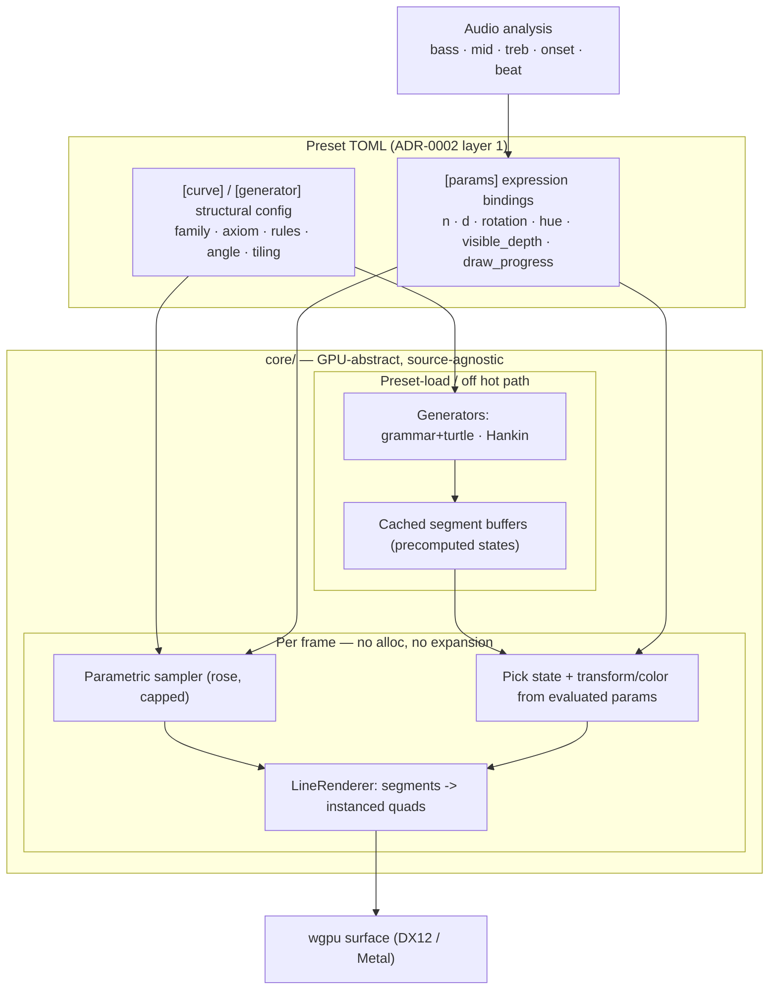

# 0010 — Line-geometry scenes: parametric curves, L-systems, star patterns

> **Status:** approved
> **Created:** 2026-07-21
> **Owner skill(s):** dev
> **Related ADRs:** [0007-line-geometry-generators](../adrs/0007-line-geometry-generators.md); extends [0002-layered-preset-architecture](../adrs/0002-layered-preset-architecture.md) layer 2

## TL;DR

Add a **line-art category** to the built-in system vocabulary, ported from three of the user's
existing generative sketches (Maurer rose, L-systems, Islamic star patterns via the Hankin
method). One shared `LineRenderer` draws thick glowing lines as instanced quads; on top of it
sit two build models — a **parametric** system (cheap, sampled every frame; the rose) and a
**generator** system (expensive structure built at preset load and cached; L-systems and star
patterns). Audio drives continuous motion every frame (scale, hue, rotation, draw-on) with beat
accents advancing precomputed structural states. First user-visible behavior: cycling to the new
scene shows a thick glowing Maurer rose (Phase 1), then it sweeps to music (Phase 2).

## Context & problem

The user has three generative-art repos — [Maurer_Rose](https://github.com/IgorKonovalov/Maurer_Rose),
[L-systems](https://github.com/IgorKonovalov/L-systems),
[Islamic_Star_Patterns_SVG](https://github.com/IgorKonovalov/Islamic_Star_Patterns_SVG) — and
wants them as audio-reactive scenes. The code itself can't be reused: it is JavaScript on
canvas2D/SVG, while the core is Rust on wgpu with no immediate-mode canvas. The **algorithms**
port, and they fill a real gap — the engine has no line/curve renderer at all (today: a
full-screen fragment field and a point swarm). All three sketches are line-art.

The three families are not one computational shape (see ADR-0007): a rose is a pure parametric
curve (cheap, per-frame), while L-systems and star patterns are expensive to *build* but cheap
to *animate*. Recomputing the latter per frame would break the 60 fps @ 1080p iGPU floor
(NFR §1) and the sacred-hot-path rule. And their structural inputs (grammar rules, tiling
angle) are not expressible in the pure `f32` expression language (ADR-0002 layer 1). This plan
implements the ADR-0007 decision that resolves all three tensions.

## Decision

Build one crate-internal `LineRenderer` (segments -> instanced quads, thick + additive-glow,
the swarm scene's pipeline shape) and two build models over it: **parametric** (`parametric_curve`,
sampled per frame into a capped buffer) and **generator** (`lsystem`, `star_pattern`, built off
the hot path on preset load and cached, per-frame transform only). Structural inputs arrive as a
new optional TOML config table (`[curve]` / `[generator]`) consumed through one new optional
`Scene::configure` hook; continuous inputs stay `[params]` expression bindings. We rejected
native wgpu lines (1px, backend-inconsistent), per-frame regeneration (blows the hot path), and
a background-regen worker (deferred escape hatch) — all recorded in ADR-0007.

## Architecture diagram



## Implementation phases

Ordered so value lands early: a rose is on screen after Phase 1 and reacting to music after
Phase 2; the two generator families are additive after that. `dev` runs all phases in one
session; the architect reviews the whole plan once at the end.

### Phase 1 — Line renderer + a static rose (walking skeleton)
- **Owner skill:** dev
- **Area:** core, standalone
- **What:** The shared `LineRenderer` GPU helper and a `ParametricCurveScene` hardcoded to one
  Maurer rose, registered in the scene registry so cycling reaches it. No preset, no audio yet.
- **Files touched:** `core/src/render/scenes/lines/mod.rs` (new), `.../lines/renderer.rs` (new,
  the `LineRenderer` pipeline: instanced-quad segment expansion, width + additive-glow uniforms,
  aspect), `.../lines/curves.rs` (new, the `maurer_rose(n, d, samples) -> segments` function),
  `.../lines/parametric.rs` (new, `ParametricCurveScene`), `core/src/render/scenes/mod.rs`
  (add to `create_all`, `pub mod lines`).
- **Done when:** `cargo run -p standalone`, cycle to the curve scene, and a thick glowing Maurer
  rose renders steadily at a stable frame rate; the geometry is identical every run (pure
  sampling, no wall-clock, no unseeded randomness). The `renderer.rs` and `parametric.rs` files
  carry the hot-path panic pragma; `curves.rs` sampling is allocation-free into a preallocated
  buffer.

### Phase 2 — Parametric curves as presets + continuous audio sweep
- **Owner skill:** dev
- **Area:** core
- **What:** Make the parametric system preset-driven. Add `SystemKind::ParametricCurve`
  (`"parametric_curve"`), a `[curve]` structural-config table (`family`, static seeds), and the
  named parameter surface (`n`, `d`, `samples`, `thickness`, `hue`, `spin`, `scale`,
  `brightness`, `draw_progress`) bound to expressions. Ship 3-4 distinct curve presets so the
  user can eyeball looks side by side (their stated preference for concrete samples).
- **Files touched:** `core/src/preset/schema.rs` (extend `SystemKind` + `from_name`; add the
  optional per-system config table to `RawPreset`/`Preset`), `.../lines/parametric.rs`
  (`set_time`/`reset_params`/`set_param`, plus reading the curve config via `configure`),
  `.../lines/mod.rs` (structural-config type), preset files under the preset dir
  (`presets/*.toml`).
- **Done when:** dropping curve presets in the preset dir drives the scene; bass visibly scales
  the rose and treb sweeps its hue while it animates; at least 3 visually distinct rose/curve
  presets are selectable; a malformed `[curve]`/binding degrades to the last good preset with a
  surfaced error and never panics (extend the existing preset-load test to cover a bad curve
  config).

### Phase 3 — Generator infrastructure + L-system
- **Owner skill:** dev
- **Area:** core
- **What:** Introduce the generator build model: the optional `Scene::configure(&GeneratorConfig)`
  hook (default no-op, like `set_param`), invoked at preset load off the hot path, which builds
  and caches segment buffers. Add the pure grammar + turtle generator and `SystemKind::LSystem`
  (`"lsystem"`). Precompute depths `1..=max_depth` as separate cached buffers; per frame pick the
  visible depth and apply transform/color. Structural TOML: `axiom`, `rules`, `angle_deg`,
  `max_depth`, `seed`. Params: `visible_depth`, `rotation`, `hue`, `draw_progress`, `thickness`,
  `scale`, `brightness` — beat accents drive `visible_depth` (e.g. `1 + floor(4 * energy)`),
  continuous motion drives the rest.
- **Files touched:** `.../lines/grammar.rs` (new, string rewriting), `.../lines/turtle.rs` (new,
  turtle -> segments with a push/pop branch stack), `.../lines/lsystem.rs` (new, `LSystemScene`),
  `core/src/render/scenes/mod.rs` (register; add optional `configure` to the `Scene` trait),
  `core/src/preset/schema.rs` (generator config), preset files.
- **Done when:** an L-system preset (a plant/tree or a space-filling curve) grows one iteration
  on rising energy and rotates with `time`, holding a stable frame rate; grammar expansion is a
  pure deterministic function — a unit test asserts `expand(axiom, rules, depth)` yields the
  exact expected string (e.g. `F`,`{F->"F+F--F+F"}`, depth 2 -> the exact expanded string) and a
  fixed structure yields a fixed segment count; expansion and turtle-walking happen only inside
  `configure`, with zero per-frame allocation (assert via inspection + the zero-alloc test
  pattern already used for presets).

### Phase 4 — Star patterns (Hankin generator)
- **Owner skill:** dev
- **Area:** core
- **What:** Add the Hankin star-pattern generator over the same infrastructure.
  `SystemKind::StarPattern` (`"star_pattern"`); at `configure` time build the tiling, apply the
  contact angle, intersect to segments, and cache. Structural TOML: `tiling` (e.g. `"6.6.6"` /
  named), `contact_angle_deg`, and a small set of precomputed variants a beat can switch between.
  Params: `rotation`, `hue`, `draw_progress`, `thickness`, `scale`, `brightness`; beat swaps the
  active variant index.
- **Files touched:** `.../lines/hankin.rs` (new, tiling + contact-angle construction),
  `.../lines/star.rs` (new, `StarPatternScene`), `core/src/render/scenes/mod.rs` (register),
  `core/src/preset/schema.rs` (star config), preset files.
- **Done when:** a star-pattern preset renders a symmetric tiling that rotates and re-colors with
  audio and can jump between precomputed variants on a beat, at a stable frame rate; the Hankin
  construction is a pure deterministic function — a unit test asserts a given tiling +
  contact angle yields the expected segment count and the pattern's rotational symmetry (e.g.
  n-fold symmetry -> segment set invariant under 2π/n rotation within tolerance); construction
  runs only in `configure`.

### Phase 5 — Curated presets across all three families + authoring note
- **Owner skill:** dev
- **Area:** core
- **What:** Provide a curated preset per family (≥1 rose, ≥1 L-system, ≥1 star) as `.toml` files
  ready for Plan 0007's seeding channel, and a short authoring note listing the curve families,
  generator config keys, and the named params each system exposes. This plan adds the *systems*
  and the preset files; **Plan 0007 owns the embed-and-seed mechanism** — reference it, do not
  reimplement seeding here.
- **Files touched:** preset `.toml` files in the curated set location Plan 0007 defines; a
  `presets/README.md` (or equivalent doc comment) describing the new config keys and params.
- **Done when:** the curated set contains at least one working preset per family that loads and
  cycles from the standalone; the authoring note documents every new `[curve]`/`[generator]`
  key and every named param, cross-checked against `schema.rs`.

## Data shapes

```rust
// illustrative — not the final interface

// The shared line primitive: a segment is two endpoints; the renderer expands
// each into a camera-facing quad (width + glow as uniforms). Buffer is fixed-
// capacity and reused every frame (no per-frame alloc), like SwarmScene::instances.
#[repr(C)]
#[derive(Clone, Copy, bytemuck::Pod, bytemuck::Zeroable)]
struct SegmentInstance { a: [f32; 2], b: [f32; 2], color: [f32; 3], width: f32 }

// New optional Scene hook (default no-op, like set_param) — invoked at preset
// LOAD, off the hot path. Non-generator scenes never implement it.
trait Scene /* extended */ {
    // ...existing name/update/render/set_time/reset_params/set_param...
    fn configure(&mut self, _cfg: &GeneratorConfig) {}
}

// Structural config, deserialized from the preset's [curve]/[generator] table.
// NOT expressions — declarative data the generator/sampler consumes.
enum GeneratorConfig {
    Curve  { family: CurveFamily },                       // e.g. MaurerRose
    LSystem{ axiom: String, rules: Vec<(char, String)>,
             angle_deg: f32, max_depth: u32, seed: u64 },
    Star   { tiling: String, contact_angle_deg: f32 },
}
```

```toml
# illustrative preset — an L-system that grows with energy
system = "lsystem"
name   = "fern-grow"

[generator]
axiom      = "X"
rules      = { X = "F+[[X]-X]-F[-FX]+X", F = "FF" }
angle_deg  = 25
max_depth  = 5
seed       = 1

[params]
visible_depth = "1 + floor(4 * energy)"   # beat/energy accents advance structure
rotation      = "0.15 * time"
hue           = "treb"
draw_progress = "min(1, bar * 1.5)"        # line-draw-on within a bar
thickness     = "1.5 + 3 * bass"
```

## Risks & open questions

- **Segment-count cap must be explicit, not silent.** The `LineRenderer` buffer is fixed
  capacity (cap ~20k segments, tuned to the iGPU floor). A generator that exceeds it must
  truncate *and surface it at load* (a warning + the count dropped) — never a silent cut that
  reads as "rendered everything". Parametric `samples` is likewise clamped.
- **`configure` widens the thin `Scene` trait.** Keep it to exactly one optional off-hot-path
  method; if a second generator need appears, prefer a richer `GeneratorConfig` payload over a
  second trait method. The Mode-4 reviewer should confirm the seam didn't grow further
  (ADR-0007 negative).
- **Pragma placement.** `renderer.rs`, `parametric.rs`, and the per-frame halves of
  `lsystem.rs`/`star.rs` are hot-path (carry the panic pragma). `grammar.rs`, `turtle.rs`,
  `hankin.rs` run only in `configure` — colocated but not per-frame. Getting the pragma on the
  wrong file either over-constrains build code or leaves a real hot path unguarded; the hygiene
  guard scans `render/` recursively, so it will *expect* the pragma — split files so the
  hot/build boundary matches the pragma boundary.
- **L-system depth blow-up at build.** `max_depth` on a branching rule can produce enormous
  buffers; even off the hot path a multi-second `configure` stalls a preset switch. Clamp
  `max_depth`, cap total segments per depth, and precompute lazily if needed. Validate the
  chosen defaults hold on the iGPU test PC.
- **Hankin scope.** A full Islamic-pattern engine is large; v1 targets a few regular tilings
  (e.g. 4/6/8/12-fold) with a contact angle, not arbitrary tessellations. Say so; more tilings
  are a data/generator follow-up.
- **Boundary validation.** Structural config is validated once in `configure` (rules reference
  defined symbols, angle finite, depth in range); the per-frame path trusts the cached buffer.
- **iGPU 60 fps @ 1080p confirmation is a hardware check** (NFR §1/§9), same carry-forward as
  Plan 0003 — verify on the test PC, tune caps if it misses.

## What this plan does NOT do

- **No background-thread regeneration.** Beat-driven structural change moves only between states
  cheap enough to precompute at load (ADR-0007 escape hatch, deferred).
- **No preset seeding/embedding mechanism.** That is Plan 0007; this plan produces preset files
  that ride it (Phase 5).
- **No new public plugin seam.** Generators stay crate-private Rust; the extension surface stays
  the C ABI + the (minimally widened) `Scene` trait.
- **No 3D, boids, or feedback/warp systems** — those remain the separate ADR-0002 follow-ups.
- **No arbitrary Islamic tessellations** — v1 is a small set of regular tilings.
- **No C ABI change.** Line scenes are engine-internal; `LMV_ABI_VERSION` is untouched.
- **No script layer (Rhai).** Structure is data + Rust generators; orchestration scripting stays
  the ADR-0002 layer-3 follow-up.

## Followups (after this lands)

- Background-thread regeneration for unbounded live structural params (ADR-0007 escape hatch).
- More curve families (epicycloids, Lissajous, superformula) — pure data presets, no Rust.
- More tilings / a richer Hankin (irregular tessellations, multiple contact angles).
- Cross-state blending (morph between L-system depths / tiling variants instead of snapping).
- Fold the authoring note into a proper `docs/` preset-authoring reference if it grows.
