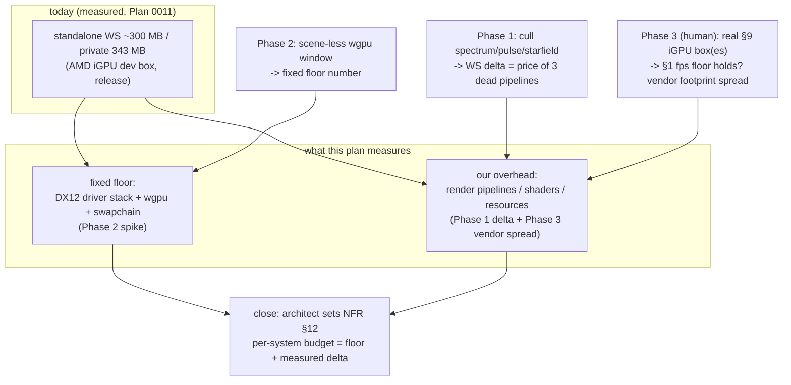

# 0012 — Measure the driver-memory floor + cull dead scenes

> **Status:** approved
> **Created:** 2026-07-22
> **Owner skill(s):** dev, human
> **Related ADRs:** [0010](../adrs/0010-accept-gpu-driver-memory-floor.md) (accept the DX12/wgpu driver-stack floor; retarget NFR §12) — this plan resolves its open questions with numbers.
> **Amended:** 2026-07-22 — Phase 2 recast from "clear-only render pass" to **construct-only**. A
> feasibility check found `RenderContext` exposes only `new`/`resize`/`surface_format` publicly; its
> `device`/`queue`/`surface` are `pub(crate)`, so an example compiling as a separate crate cannot encode
> its own render pass without adding public API to core — which the phase's "no shipped-code change" rule
> forbids. We measure at the configure boundary instead (a faithful floor; see Phase 2 and its risk note).

## TL;DR

Turn ADR-0010's open questions into measured numbers, and take the one free memory win it points to.
Three phases: (1) **cull the three dead legacy scenes** (`spectrum`/`pulse`/`starfield` — built and
driver-compiled at startup but addressed by no preset), measuring the working-set delta as the first
data point on "pipeline count as a memory lever"; (2) a **bare-wgpu driver-floor spike** — a throwaway
scene-less window that isolates the fixed DX12+driver floor from our per-system overhead; (3) a
**human capture on the real §9 iGPU box(es)** confirming the §1 perf floor still holds and recording the
footprint on a second GPU vendor. The plan produces the hard denominator NFR §12's per-system budget
currently lacks; it does **not** build the adaptive-quality tier system (still its own plan).

## Context & problem

Plan 0011 measured the NFR §12 backend-trim lever and disproved it: the release standalone sits at
~300 MB working set / 343 MB private commit on the AMD iGPU dev box, dominated by the **DX12 driver
stack's private heap**, not by wgpu's compiled backend code (ADR-0010). ADR-0010 retargeted §12 to
harness-enforceable requirements but left two questions open, both blocking any confident memory work:

1. **How much of the ~300 MB is the fixed driver floor vs. our own pipelines/resources?** Until this is
   split, every "reduce our footprint" idea is a guess. ADR-0010 names a scene-less wgpu spike as the
   way to isolate it.
2. **Is the ~350 MB soft ceiling AMD-specific?** Everything measured so far is one box, one GPU vendor.
   The §9 matrix has a separate "older Windows PC (iGPU)" that validates the §1 perf floor and an Intel
   iGPU floor that will differ from AMD.

Alongside those measurements sits a free win already in the code: `render::scenes::create_all` builds
**all five** scenes at startup — `fragment_field`, `swarm`, and the legacy `spectrum`/`pulse`/`starfield`
— but `system_slot` maps presets only to the first two, and `SystemKind` has only those two variants.
The three legacy scenes are dead `Scene` impls whose render pipelines the driver compiles and holds heap
for, never drawn. Plan 0003's close flagged them as a cleanup candidate ("delete, or expose via a
`SystemKind`"). This plan takes the delete — they are superseded by the ADR-0002 layer-2 preset systems,
and git history keeps them if ever wanted — and uses the diagnostics harness to price the removal.

## Decision

Do the cheap, high-information work first: cull the dead scenes (a real reduction, priced by the
harness), stand up a scene-less floor spike (the missing denominator), and validate on the real §9
hardware (portability of both the §1 floor and the §12 ceiling). The architect folds the resulting
numbers into NFR §12's per-system budget at the close review. We are **not** building adaptive-quality
tiers, a frame-time governor, or lazy pipeline construction here — those are downstream of the floor
number this plan produces.

## Architecture diagram

## Implementation phases

Each phase ships as its own commit; `dev` runs the `dev` phases in one session. Phase 1 is the walking
skeleton — a real, priced reduction, not plumbing.

### Phase 1 — Cull the three dead legacy scenes
- **Owner skill:** dev
- **Area:** core
- **What:** Remove `spectrum`, `pulse`, and `starfield` from `render::scenes::create_all` and delete
  their modules (`core/src/render/scenes/{spectrum,pulse,starfield}.rs` + their `pub mod` lines). Only
  `FragmentField` (slot 0) and `Swarm` (slot 1) are addressed by `system_slot`/`SystemKind`, so the
  removal is a straight deletion of the trailing vec entries — no preset, no `SystemKind` variant, and no
  other call site references them (verify with a grep before deleting). Update the `system_slot` comment
  that mentions "legacy scenes occupy later slots." **Measure the win:** capture the standalone's
  steady-state working set (Task Manager or `diagnostics.log`'s `rss_bytes`) on the dev box before and
  after, and state the delta in the commit message — the first data point for ADR-0010's per-system cost.
- **Files touched:** `core/src/render/scenes/mod.rs` (drop 3 `pub mod` + 3 `Box::new` lines), delete the
  three scene files, `core/src/render/mod.rs` (comment), plus any test that names them.
- **Done when:** `create_all` builds only the preset-addressed systems; `cargo test -p lmv-core` +
  `cargo clippy --workspace --all-targets -D warnings` green; the standalone renders all 10 presets
  unchanged (fragment/swarm only — nothing visually addressed those scenes); the before/after working-set
  delta is stated in the commit.

### Phase 2 — Bare-wgpu driver-floor spike
- **Owner skill:** dev
- **Area:** standalone (throwaway example — not shipped)
- **What:** A minimal, non-shipped measurement binary that stands up **only** the wgpu context — a winit
  window + `lmv_core::render::RenderContext::new` — with no scenes, no DSP, no audio, no overlay. It
  builds the context (which configures the surface/swapchain), pumps the event loop through a short
  warmup, then prints its own working set + private commit. This isolates the fixed DX12 driver + wgpu
  + swapchain floor. **Construct-only, not a clear-only pass:** `RenderContext` exposes only `new`,
  `resize`, and `surface_format` publicly — its `device`/`queue`/`surface` are `pub(crate)`, and this
  example compiles as a separate crate, so it cannot encode its own render pass without adding public API
  to core. The phase's "no shipped-code change" rule forbids growing core's surface for a diagnostic, so
  we measure at the configure boundary instead. That is a faithful floor because DX12 allocates the
  swapchain backbuffers at `surface.configure` (called inside `new`), not lazily at first present — the
  fixed driver heap is realized without drawing a frame. Put it in `standalone/examples/floor.rs` so it
  never links into the release exe; it may inline the ~8-line `GetProcessMemoryInfo` read rather than
  depend on the bin's `rss` module.
- **Files touched:** `standalone/examples/floor.rs` (new); no change to shipped code.
- **Done when:** `cargo run -p standalone --example floor --release` on the dev box prints a steady-state
  WS/private number; subtracting it from the Phase-1 post-cull standalone gives the fixed-floor-vs-our-
  overhead split, and that split is stated (commit message or a short note appended to the plan) so
  NFR §12's per-system budget gets a hard denominator. If the construct-only number lands implausibly
  low (well under the Phase-1 standalone minus a plausible pipeline cost — a sign the driver defers
  allocation until first present), that is a **finding to route back to architect**, not a licence to
  expose `device`/`queue`; the fix would be scoped separately, not smuggled into this spike.

### Phase 3 — Validate on the real §9 iGPU hardware
- **Owner skill:** human
- **Area:** standalone (runtime)
- **What:** On the actual §9 "older Windows PC (iGPU)" box — and a second GPU vendor (Intel) if one is
  available, since the dev box is AMD — run the post-Phase-1 standalone at 1080p, capture
  `diagnostics.log`, and report: (a) the §1 perf floor holds (≥ 60 fps @ 1080p at the shipped single
  fixed tier), and (b) the steady-state working set / private commit. This confirms whether the ~350 MB
  ceiling is AMD-specific and whether the scene cull regressed nothing on the weakest box.
- **Done when:** the user reports fps (≥ 60 @ 1080p) and WS/private from the iGPU box(es); a floor
  regression or a wildly different vendor footprint is routed back to `dev`/`architect` as a follow-up.

## Risks & open questions

- **The cull's win may be small.** The three legacy scenes might be cheap pipelines, so the delta could
  be modest. Accepted — the removal is free and directional, and the number itself is the deliverable:
  it tells us how much pipeline count actually moves the needle (ADR-0010 point 3).
- **The floor spike is one machine, one vendor.** Same portability caveat as ADR-0010's ceiling; Phase 3
  widens it to a second vendor. The construct-only window is a faithful floor only if it uses the same
  adapter/device options the real renderer does — it calls `RenderContext::new` verbatim, so this holds
  by construction. The construct-only choice (vs. a clear-only present loop) trades a few MB of possible
  first-present allocation for keeping core's public surface untouched; see Phase 2 for why that trade is
  the right one and what signal (an implausibly low number) triggers a re-think.
- **The example must stay out of the shipped binary.** Cargo `examples/` never link into the `[[bin]]`,
  but confirm the release build's size/features are unchanged (the hygiene exact-pin guard already covers
  any new dep — prefer none; winit + lmv-core are already present).
- **NFR §12 refinement is architect work, not a phase.** The per-system budget update lands at the close
  review (dev/human own phases; the architect folds the measured floor + deltas into §12 then).

## What this plan does NOT do

- **No adaptive-quality tiers or frame-time governor.** The NFR §1 mechanism (the remaining half of
  roadmap item 3) stays its own plan; it consumes the floor number this plan produces.
- **No lazy pipeline construction.** The build-on-first-use tradeoff (vs. the "instant cycle" guarantee)
  is a conditional follow-up, taken only if Phase 2 shows our pipelines are a meaningful share of the
  footprint.
- **No new scene systems, no C ABI change** (frozen — this is core-internal cleanup plus a measurement
  example), **no macOS** (Windows §9 box; the Mac path is the standing Plan 0001 carry-forward).

## Followups (after this lands)
- Architect: set NFR §12's per-system working-set budget from the measured floor + Phase 1/3 deltas.
- If Phase 2 shows our pipelines dominate our-overhead: a lazy-pipeline-construction plan (build systems
  on first use), weighed against the instant-cycle guarantee.
- Adaptive-quality tiers + frame-time governor (roadmap item 3 remainder), scoped on the real §9 fps data.
- Leak guard: fold `diagnostics.log` into the Plan 0009 4-hour soak as a done-when (no private-commit
  growth, no fps decay) — the new NFR §12 hard requirement.
