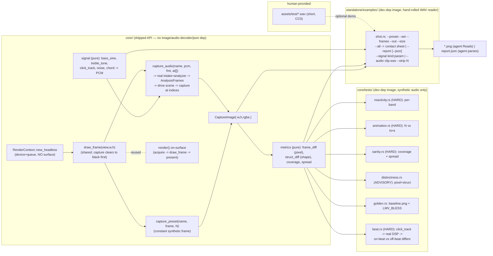

# 0013 — Headless scene capture + differential visual QA (reactivity, distinctness, sanity, animation, beat) + golden images + shot CLI

> **Status:** approved
> **Created:** 2026-07-22
> **Owner skill(s):** dev, human
> **Related ADRs:** [0011](../adrs/0011-image-crate-for-capture-tooling.md) (the `image`
> dev-dependency), [0002](../adrs/0002-layered-preset-architecture.md) (scenes/presets are what's
> captured), [0008](0008-preset-browse-overlay.md) (overlaps on preset-by-name selection — Risks)

## TL;DR

Give `core` the ability to render a scene with **no window** — a surface-less wgpu context that
draws N frames into an offscreen texture and returns raw RGBA pixels — and build a **differential
visual-QA harness** on top, fed by both synthetic frames and **real audio through the real DSP**. A
headless render is a pure function of `(preset, input, frame-count)` (scenes are seeded, `SCENE_DT`
is fixed, DSP is pure), so we measure how different renders are along the axes the user needs:

- **Reactivity, per audio band** — probe each stimulus (bass / mid / treb / onset+beat) separately;
  reports what each preset reacts to (and likely why family presets look identical).
- **Beat** — feed a synthetic click track through the *real* analyzer (`FFT → onset → tempo`) and
  assert beat-accent scenes visibly respond on-beat vs off-beat. Constant frames can't test this.
- **Animation** — same preset, same audio, frame *N* vs *N+k* must differ, or the scene is frozen.
- **Distinctness** — pairwise-diff a family with **two** metrics (mean-abs pixel + shape-aware
  `struct_diff`), so a recolor of one shape is flagged as a near-duplicate.
- **Shape sanity** — a new curve/L-system that drew nothing or a single dot fails.

Reactivity, beat, animation, and sanity are **hard `core` tests**; distinctness is an **advisory
report** (text or `--json`). The plan is **ordered so the full non-audio visual-QA loop ships first**
(Phases 1–5, a natural stopping point), with the real-DSP audio/beat path as a self-contained tail
(Phases 6–9). Test audio is **synthetic** (pure `core::signal` — zero dep, deterministic, targeted);
a short **real CC0 clip** (human, Phase 9) drives the `shot` demo filmstrip via a hand-rolled WAV
reader. `image` is dev-only, so the shipped `lmv.exe` is untouched (ADR-0011); the audio path adds
**no** dependency. First user-visible behavior: `cargo run -p lmv-standalone --example shot --
--preset warp --frames 120 --out shot.png` writes an image.

## Context & problem

The `dev` agent builds visuals but has **no visual feedback loop** — judging a shape means running
the windowed app on a machine with a display (why Plans 0003/0004/0007 defer "visibly flows/reacts"
to a human). The user sharpened the need well past "look at a picture":

There are **two visualization families** (`fragment_field`, `swarm` systems), ~**5 presets each**
(Plan 0007), and *within a family the presets look almost identical*. The real questions are
differential, per-stimulus, and — critically — must exercise the **real audio pipeline**:

- **Does it work, and to what?** Same-silent-vs-loud tells you *if*; per-band tells you *what*;
  and only **real audio through the DSP** tells you whether **beat/tempo/onset**-driven behavior
  actually fires — a constant hand-set `AnalysisFrame` (`beat=true` forever) is not a real beat.
- **Does it animate** (over time, independent of audio)?
- **Are presets distinct in shape, not just color** (a structural diff, not a pixel diff)?
- **Did a new shape draw at all?**

Puppeteer / OS window-grab were rejected up front (native `winit`+`wgpu`; non-deterministic; needs a
window). What the code makes easy vs hard:

- **Easy:** a scene draws into any `wgpu::TextureView` (`core/src/render/mod.rs:244-254`); the swarm
  is seeded (`swarm.rs:218`); `SCENE_DT` is fixed (`scenes/mod.rs:25`); DSP is pure and already
  takes PCM at a validated boundary (`dsp/mod.rs:96`) — so both `(preset, frame, N)` and
  `(preset, PCM, N)` → pixels are reproducible.
- **Hard:** `RenderContext` is **surface-bound** (`context.rs:50,65`) and `render` *acquires +
  presents* it (`mod.rs:240,272`). No window-less path; no preset-by-name selector; the renderer
  doesn't currently run the analyzer itself (frontends do).

## Decision

Add a surface-less render path, a pure **metrics** module, a pure **signal** generator module, and
an **audio-driven capture** primitive to `core`, and drive them from dev-only tooling.
`RenderContext::new_headless` builds a device+queue with **no surface**; a shared `draw_frame`
(extracted from `render`) draws into any `TextureView`, reused by the present path and an offscreen
capture that clears to black, draws, and copies back tight RGBA. Two capture primitives:
`capture_preset(name, frame, frames)` (constant synthetic frame) and `capture_audio(name, pcm,
format, at_frames)` (feeds PCM through the **same intake the frontends use**, drives the scene with
the *produced* `AnalysisFrame`s). On top: **hard `core` tests** for per-band reactivity, beat,
animation, and sanity; an **advisory** dual-metric distinctness report; a golden-drift test; and the
`standalone/examples/shot.rs` CLI. **Phase order ships the non-audio loop first** (Phases 1–5) and
the audio/beat path last (6–9), so a long session has a clean stopping point with the agent's
primary tool — render-a-PNG + differential tests — already delivered. Test audio is synthetic
(`core::signal`, pure, zero-dep); the real demo clip is human-provided WAV, read by a hand-rolled
parser in the example.

We rejected feature-gating the image dep (dev-dependency scope already excludes it — ADR-0011), a
standalone `src/lib.rs` (tests belong next to the scenes, in `core`), `png` over `image` (gallery
montage — ADR-0011), an **audio-decoder dependency** (`symphonia`/`hound` — a hand-rolled 16-bit-PCM
WAV reader keeps the audio path dep-free, matching the repo's hand-rolled WAV/font/RSS), a
**serde/json** dependency (a small hand-rolled JSON writer suffices), and making distinctness a hard
test ("too similar" is a judgment call). No cargo feature is introduced.

## Architecture diagram



## Implementation phases

> **Ordering:** Phases 1–5 deliver the complete non-audio visual-QA loop (the agent can render,
> eyeball, and hard-test scenes) — a natural stopping point. Phases 6–9 add the real-DSP audio/beat
> path and the human demo clip as a self-contained tail.

### Phase 1 — Surface-less context + shared draw path + readback
- **Owner skill:** dev
- **Area:** core
- **What:** Window-less render producing RGBA pixels for the active preset.
- **Files touched:** `core/src/render/context.rs` (`new_headless`), `core/src/render/mod.rs`
  (extract `draw_frame`; `Renderer::new_headless` + single-frame readback), new
  `core/src/render/capture.rs` (readback + row-unpad + clear helper).
- **Details:** `new_headless(width, height, opts)` requests an adapter with **no surface**;
  `opts.prefer_software` ⇒ `force_fallback_adapter: true` (WARP on DX12) for reproducible tests.
  Store device/queue/size, **no `Surface`** (Option or `Headless` split so the on-surface path is
  byte-for-byte unchanged). Offscreen format `Rgba8UnormSrgb`; scenes built against it. Extract
  scene-eval + `scene.render` + overlay into `draw_frame`; on-surface `render` = acquire →
  `draw_frame` → present. Capture: `RENDER_ATTACHMENT | COPY_SRC` texture, **clear to opaque
  black**, `draw_frame`, `copy_texture_to_buffer` honoring **256-byte `bytes_per_row`** (pad, strip
  on read), `map_async` + `poll(Wait)`, tight `CaptureImage`. Diagnostics **off** (no clock read).
- **Done when:** a `core` test builds a 256x256 headless renderer, captures one active-preset frame,
  asserts `256*256*4` bytes with ≥1 non-black pixel. `cargo test -p lmv-core` passes.

### Phase 2 — Deterministic frame primitive: preset-by-name + N-frame advance
- **Owner skill:** dev
- **Area:** core
- **Files touched:** `core/src/render/mod.rs` (`select_preset_by_name`, `capture_preset`).
- **Details:** `select_preset_by_name(&mut self, name) -> bool` (scan loaded presets; Plan 0008
  overlap **resolved** — see Risks). `capture_preset(name, frame, frames)`: select, reset scene clock
  to `0.0`, run `draw_frame` `frames` times feeding the **same** fixed `AnalysisFrame`, read back — a
  pure function.
  > **Note (Plan 0008 close review, 2026-07-22):** the "first-to-land defines `select_preset`" plan is
  > stale — 0008 landed **`select_preset(&mut self, index: usize) -> &str`** (by *absolute index*,
  > returning the new active name), which does **not** match this phase's by-name `-> bool` shape. The
  > two are complementary, not the same method, so **do not redefine `select_preset`** here (it would
  > collide with a different signature). Add the by-name lookup under a distinct name —
  > `select_preset_by_name(&str) -> bool` — ideally implemented on top of the existing
  > `preset_names()` + index-based `select_preset`, rather than a parallel scan.
- **Done when:** a `core` test captures `(preset, frame, N)` twice → **byte-identical**; `N=1` vs
  `N=120` differ. `prefer_software` so it holds on any CI adapter.

### Phase 3 — Metrics module + hard tests: per-band reactivity, animation, shape sanity
- **Owner skill:** dev
- **Area:** core
- **Files touched:** `core/src/render/metrics.rs` (new, pure, re-exported), `core/tests/reactivity.rs`,
  `core/tests/animation.rs`, `core/tests/sanity.rs`.
- **Details:**
  - **Metrics (pure, unit-tested):** `frame_diff(a,b)->f32` (mean-abs per-channel, 0..1);
    `struct_diff(a,b)->f32` (downscale to ~32x32 grayscale, Sobel edge magnitude, mean-abs of edge
    maps — recolor-robust, geometry-sensitive; SSIM a followup); `coverage(img,bg,eps)->f32`;
    `quadrant_spread(img,bg,eps)->u8`.
  - **Reactivity (HARD, per band):** for each embedded preset (`default_presets()`, grouped by
    system), silent baseline vs one frame per stimulus (`bass=1`, `mid=1`, `treb=1`,
    `onset=1,beat=true`) at the same N; `reactivity[band]=frame_diff(silent,band)`; **assert
    `max_band >= REACTIVITY_FLOOR`**; retain the per-band vector (a dead treble binding is visible
    even when bass passes). Floor catches *dead* not *subtle*; documented `#[ignore]`/allowlist.
  - **Animation (HARD):** frame `N` vs `N+k` (e.g. 60 vs 90) at **identical** fixed audio; assert
    `frame_diff >= ANIM_FLOOR`. Audio-only-animated scenes may need allowlisting (Risks).
  - **Sanity (HARD):** `coverage >= floor` (not blank) and `quadrant_spread >= 2` (not a dot);
    per-system tuning (Risks). Small (256x256) renders, small N for adapter speed.
- **Done when:** `cargo test -p lmv-core` runs per-band reactivity + animation + sanity across all
  presets and passes; probes (zero a binding / freeze `time` / draw nothing) redden the respective
  test; failures name the preset (reactivity prints the per-band vector).

### Phase 4 — Distinctness report (advisory, dual-metric) + golden-drift regression
- **Owner skill:** dev
- **Area:** core
- **Files touched:** `core/tests/distinctness.rs` (prints, no assert), `core/Cargo.toml`
  (`[dev-dependencies] image = "=<pin>"`), `core/tests/golden.rs`, `core/tests/golden/*.png`.
- **Details:** **Distinctness (ADVISORY):** per family, capture every preset at one fixed frame and
  print **two** pairwise matrices — `frame_diff` (pixel) and `struct_diff` (shape); flag pairs with
  `struct_diff` below a small threshold as **near-duplicate geometry** (the recolor case: high pixel
  + low struct is called out). Never asserts; reused by the CLI report (Phase 5). **Golden-drift
  (HARD, tolerance):** a small `(preset, frame, frames, size)` matrix across both systems; render via
  `prefer_software`, decode the committed baseline with `image`, compare with a **tolerance**
  (`frame_diff` below threshold + max-outlier guard). `LMV_BLESS=1` rewrites baselines.
- **Done when:** `cargo test -p lmv-core -- --nocapture` prints per-family pixel + struct matrices
  with near-duplicate flags; golden passes within tolerance; a perturbing probe reddens golden;
  `LMV_BLESS=1` regenerates; baselines are visually sane (dev-checked, re-checked at Mode 4).

### Phase 5 — Standalone `shot` CLI (non-audio): shots, gallery, report (+JSON)  ·  natural stopping point
- **Owner skill:** dev
- **Area:** standalone
- **Files touched:** `standalone/Cargo.toml` (`[dev-dependencies] image = "=<pin>"`),
  `standalone/examples/shot.rs`.
- **Details:** Hand-rolled arg parsing over `std::env::args` (no `clap`). Flags: `--preset <name>`,
  `--set k=v,...`, `--frames <N>` (default 120), `--size <WxH>` (default 1280x720), `--out <path>`;
  `--all --out <dir>` → labeled contact-sheet PNG; `--report [family=<sys>] [--json]` → per-family
  per-band reactivity, animation, dual distinctness (near-dup flags), coverage (text table, or a
  **hand-rolled JSON emitter** — fixed numeric schema, no serde). Loads the app's on-disk preset
  library (reuse the standalone resolver), else embedded defaults; groups by `preset.system` (tiny
  core accessor if needed). Reuses core `metrics`; `image` only encodes/blits.
- **Done when:** `--preset <name> --frames 120 --out shot.png` writes a viewable PNG; `--all` writes
  a labeled contact sheet; `--report --json` emits valid parseable JSON; bad args exit non-zero with
  a message. Release `lmv.exe` unchanged. **At this point the full non-audio visual-QA loop is
  shipped** — the agent can render, eyeball, and hard-test scenes without a display.

### Phase 6 — Audio core: signal generators + real-DSP `capture_audio` + beat hard test
- **Owner skill:** dev
- **Area:** core
- **What:** Drive scenes with real audio through the real analyzer, and test beat response.
- **Files touched:** `core/src/signal.rs` (new, pure, public), `core/src/render/mod.rs`
  (`capture_audio`), `core/tests/beat.rs`.
- **Details:**
  - **`core::signal` (pure, no dep, deterministic):** `bass_sine(freq, secs, fmt)`,
    `treble_tone(...)`, `click_track(bpm, secs, fmt)`, `noise(seed, ...)`, `chord(...)` → interleaved
    PCM `Vec<f32>` + the `AudioFormat`. Synthesis is pure math, **not** an audio *source* (no
    WASAPI/file) — it belongs in core; unit-tested (a 60Hz sine's energy sits in the bass band after
    the real FFT; a 120 BPM click yields onsets ~every 0.5 s).
  - **`capture_audio(name, pcm, format, at_frames) -> Result<Vec<CaptureImage>>`:** select the
    preset, construct the **core analyzer** (`dsp` intake, format validated at the boundary —
    source-agnostic rule), feed the PCM hop-by-hop in order (analysis is stateful — onset/tempo warm
    up), drive the scene with each produced `AnalysisFrame` (clock reset to 0), read back at each
    requested index. Deterministic. **No file/decoder code here** — in-memory PCM only, like a
    frontend pushing samples.
  - **Beat test (HARD):** `click_track(120bpm)` → `capture_audio` on a **beat-accent** preset (one
    whose bindings reference `beat`/`onset`; if no default does, the test builds a minimal
    beat-bound preset); capture on a frame where a beat fired vs a frame between beats; assert
    `frame_diff >= BEAT_FLOOR`. Optionally assert the analyzer detected beats (integration sanity),
    without re-testing DSP internals covered by existing unit tests.
- **Done when:** `cargo test -p lmv-core` runs the beat test green; a probe zeroing the preset's
  beat/onset binding reddens it; `core::signal` generators are unit-tested against the real analyzer;
  `capture_audio` adds **no** dependency and contains no file/OS/audio-source code.

### Phase 7 — Standalone `shot` CLI (audio): `--signal` / `--audio` filmstrips
- **Owner skill:** dev
- **Area:** standalone
- **Files touched:** `standalone/examples/shot.rs`.
- **Details:** Extend the CLI: `--signal <kind:param>` (e.g. `click:120`, `bass:60`) via
  `core::signal` (in-memory, zero asset) and `--audio <clip.wav>` via a **hand-rolled 16-bit-PCM WAV
  reader** in the example, each feeding `capture_audio`; `--strip <N>` tiles N frames sampled along
  the audio into one filmstrip PNG. The `--signal` path validates the whole audio path with **no**
  committed asset, so this phase is self-contained (does not wait on Phase 9's clip).
- **Done when:** `--signal click:120 --strip 8` writes a beat filmstrip; `--audio <wav>` reads a real
  clip and writes a filmstrip; bad `--signal`/`--audio`/`--strip` args exit non-zero with a message.

### Phase 8 — Discoverability: the capture/QA workflow doc
- **Owner skill:** dev
- **Area:** docs
- **Files touched:** `docs/capturing.md` (new), a one-line pointer from `README.md` / `CLAUDE.md`.
- **Details:** Document every entry point — `shot` (the agent **Reads** the PNG), `--signal`/`--audio`
  filmstrips, `--report --json`, and the `core/tests/` reactivity/animation/sanity/distinctness/
  golden/beat harness (`LMV_BLESS`). Capture the habit: *a new scene adds reactivity+animation+sanity
  (and, if beat-driven, a beat) case and eyeballs its PNG before blessing a golden*; distinctness is
  advisory.
- **Done when:** `docs/capturing.md` exists with runnable commands for all entry points; a top-level
  doc points to it.

### Phase 9 — Provide a CC0 test clip (human)
- **Owner skill:** human
- **What:** Source and license-vet a short (~5 s) CC0 / self-made audio clip for the `--audio` demo.
- **Details:** The agent cannot source licensed music. Provide a mono or stereo **16-bit PCM WAV**
  (convert from any source) at `assets/test/<name>.wav`, confirming it is CC0/public-domain or your
  own. The whole audio path already works on synthetic `--signal` without this, so it is
  demo-polish, not a blocker; dev completes Phases 1–8 and hands off here.
- **Done when:** a properly-licensed short WAV is committed under `assets/test/`, and
  `cargo run -p lmv-standalone --example shot -- --audio assets/test/<name>.wav --strip 8 --out
  strip.png` produces a filmstrip that visibly reacts to the music.

## Data shapes

```rust
// illustrative — not the final interface

pub struct CaptureImage { pub width: u32, pub height: u32, pub rgba: Vec<u8> } // Rgba8UnormSrgb, tight
pub struct HeadlessOptions { pub width: u32, pub height: u32, pub prefer_software: bool }

impl Renderer {
    pub fn new_headless(opts: HeadlessOptions) -> Result<Self, RenderError>;
    // Distinct from 0008's `select_preset(index) -> &str` (by index) — see Risks.
    pub fn select_preset_by_name(&mut self, name: &str) -> bool;
    pub fn capture_preset(&mut self, name: &str, frame: &AnalysisFrame, frames: u32)
        -> Result<CaptureImage, RenderError>;
    // Feeds PCM through the same intake a frontend uses; captures at each analysis-frame index.
    pub fn capture_audio(&mut self, name: &str, pcm: &[f32], format: AudioFormat, at_frames: &[u32])
        -> Result<Vec<CaptureImage>, RenderError>;
}

// core::signal — pure, no dep, deterministic PCM synthesis (NOT an audio source).
pub fn click_track(bpm: f32, secs: f32, format: AudioFormat) -> Vec<f32>;
pub fn bass_sine(freq_hz: f32, secs: f32, format: AudioFormat) -> Vec<f32>;
// + treble_tone, noise(seed), chord

// core::render::metrics — pure, no dep, shared by tests and the CLI.
pub fn frame_diff(a: &CaptureImage, b: &CaptureImage) -> f32;           // mean-abs pixel, 0..1
pub fn struct_diff(a: &CaptureImage, b: &CaptureImage) -> f32;          // edge/shape, recolor-robust
pub fn coverage(img: &CaptureImage, bg: [u8; 4], eps: u8) -> f32;
pub fn quadrant_spread(img: &CaptureImage, bg: [u8; 4], eps: u8) -> u8;
```

`AnalysisFrame` has all-public fields + `Default` (`core/src/dsp/mod.rs:37,56`). The `--json` schema
is a nested object of numbers keyed by family/preset (per-band reactivity, animation, coverage,
pixel/struct distinctness matrices, `near_duplicates`).

## Risks & open questions

- **Thresholds (reactivity/beat/animation/distinctness) are judgment calls.** Floors catch
  *dead/frozen/silent* only, with documented per-preset `#[ignore]`/allowlist; distinctness stays
  **advisory**. Per-band + beat narrow the judgment (a dead *treble* or *beat* binding is unambiguous).
- **Analyzer warmup / beat determinism.** Onset/tempo are stateful and warm up; `capture_audio` must
  feed samples **in order** from 0. The beat test picks capture indices from *known* click positions
  (deterministic), not from the tempo lock, so it doesn't depend on autocorrelation converging. Open:
  which default preset is beat-driven — if none, the test builds a minimal beat-bound preset.
- **Animation vs audio-only motion.** Fixed-audio animation test false-positives a scene animated
  *only* by audio edges. Allowlist + note; most scenes use the shared `time` clock.
- **`struct_diff` is an approximation** (downscaled-edge, not SSIM) — unit-tested on same-shape-recolor
  (low) vs different-shape (high); SSIM a followup.
- **Sanity thresholds are per-system** (full-screen `fragment_field` vs sparse scenes) — broad "not
  blank, not a dot", tuned per system; Mode 4 checks it isn't tautological.
- **Cross-GPU drift (golden only).** Software adapter + tolerance + `LMV_BLESS`; WARP-on-CI is an
  open question (pinned runner / wider tolerance). Differential + audio tests are robust (same
  adapter, no committed file).
- **`render` refactor touches the hot path.** Pure extraction of `draw_frame`; no new alloc/lock/log/
  clock on the on-surface path; keep the panic pragma; add `render/capture.rs`, `metrics.rs`,
  `signal.rs` to the `hygiene.rs` scan set if they carry per-frame indexing.
- **Preset-by-name overlaps Plan 0008 — RESOLVED (0008 landed first, 2026-07-22).** 0008 defined
  `select_preset(&mut self, index: usize) -> &str` (by *absolute index*). That is a different shape
  from this plan's by-name `-> bool`, so the two are complementary rather than one reusing the other:
  add the by-name selector under a **distinct** name (`select_preset_by_name(&str) -> bool`) built on
  the existing `preset_names()` + index-based `select_preset` — do **not** redefine `select_preset`.
- **Blocking readback + software-adapter speed**, multiplied by per-band (5 stimuli) + audio hops —
  small size/N in tests; CLI uses the real GPU at full size. Never wire readback into live `render()`.
- **Real-clip licensing** — the committed WAV must be CC0/self-made (Phase 9 human vet); dev never
  commits sourced music. Hand-rolled WAV reader handles 16-bit PCM only (documented); other formats
  are a followup.
- **First baseline could enshrine a wrong image** — "eyeball before you bless" (Phase 8) + Mode 4
  opens the PNGs.

## What this plan does NOT do

- **No video/GIF capture** — stills only (the animation/beat tests diff stills; the filmstrip tiles
  stills). GIF/MP4 later.
- **No auto-fixing near-duplicate presets** — the tool *measures*; redesigning the too-similar
  presets is separate content work (a followup the report scopes — likely per-band remapping).
- **No audio-decoder dependency** — synthetic signals are pure; the real-clip path is a hand-rolled
  16-bit-PCM WAV reader. MP3/FLAC via `symphonia` is a followup if wanted.
- **No SSIM / serde / clap / text-rendering dependency** — `struct_diff` is edge-based, JSON and arg
  parsing and gallery labels are hand-rolled/`image` blits.
- **No live-window screenshot; no end-user feature; no C ABI change** — dev/agent tooling over the
  native Rust API; the plugin path is untouched.

## Followups (after this lands)

- Feed Plan 0010's line-geometry presets into the reactivity/beat/animation/sanity/golden matrices —
  the prime consumer.
- Use the dual distinctness report to redesign the near-duplicate `fragment_field`/`swarm` presets
  into genuinely distinct variants (likely per-band remapping).
- SSIM/perceptual `struct_diff`; `symphonia` for MP3/FLAC demo clips; short animation/GIF capture.
- If the golden job is flaky on CI hardware, revisit adapter pinning or tolerance.
