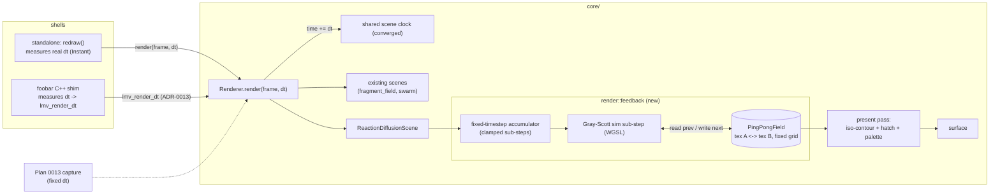

# 0014 — Reaction-diffusion feedback scene + frame-rate-independent render clock

> **Status:** in-progress
> **Created:** 2026-07-22
> **Owner skill(s):** dev
> **Related ADRs:** [0012](../adrs/0012-stateful-feedback-render-system.md) (stateful feedback render system), [0013](../adrs/0013-c-abi-v4-render-dt.md) (C ABI v4: lmv_render_dt), [0002](../adrs/0002-layered-preset-architecture.md) (preset layers)

## TL;DR

Add the engine's first **stateful feedback** scene: a Gray-Scott reaction-diffusion
simulation that evolves organic, restructuring patterns (nested contours, cellular
tissue, a hatched maze) frame to frame on the GPU. The simulation lives on a reusable
`render::feedback::PingPongField` (two offscreen textures swapped each sub-step) at a
fixed internal grid, is driven by a **fixed-timestep accumulator fed by real injected
`dt`** so it looks identical on any device over wall-clock time, and reacts to audio
(bands modulate feed/kill/flow; beats stamp seeds). Delivering `dt` to the render seam
lets us **converge the shared scene clock globally and retire `SCENE_DT`**, making every
existing scene frame-rate-independent too, and adds C ABI **v4 `lmv_render_dt`** so the
foobar plugin gets the same behavior. First user-visible behavior: a new preset whose
pattern slowly grows and reorganizes, breathing with the music, at the same speed
whether the display runs at 60 Hz or 144 Hz.

## Context & problem

Every current scene is stateless — a pure function of the analysis frame plus a scene
clock (`fragment_field = f(uv, time)`, `swarm` = seeded particles transformed per frame).
The user wants reaction-diffusion / organic-simulation visuals whose *topology changes
over time* (three reference frames seconds apart showed regions splitting, merging, and
growing). That is a running simulation: each frame's field depends on the previous
frame's field, held in a texture — the engine's first feedback path, which ADR-0002
named as a deferred follow-up and never built.

Two forces shape it. Real-time budget: Gray-Scott needs several stabilizing sub-steps
per frame, so cost must stay bounded. Determinism and device-independence: the engine
advances all animation by a fixed `SCENE_DT = 1/60` per frame, so machines at different
refresh rates drift — the user's standing complaint — and a feedback simulation would
make that worse unless it is stepped on a real-time budget rather than per frame. The
full design and the rejected alternatives (warp-feedback advection, engine-managed
multi-pass, per-frame stepping) are in ADR-0012; the ABI shape in ADR-0013.

## Decision

Build a reusable `render::feedback` seam (a `PingPongField` composed by scenes, keeping
the `Scene` trait thin per ADR-0002) and one `ReactionDiffusionScene` on top of it,
Gray-Scott, at a fixed internal grid. Drive it with a fixed-timestep accumulator fed by
real `dt` injected at the render entry point (`Renderer::render(&frame, dt)`) — never a
wall-clock read inside `core`, so headless capture stays reproducible. Since `dt` now
flows through the seam, converge the shared scene clock onto it and retire `SCENE_DT`
globally. Wire audio through the existing preset expression layer, add C ABI v4
`lmv_render_dt` for plugin parity, and back it with hard determinism/shape tests. We
rejected warp-feedback advection (wrong look), engine-managed declarative passes (widens
the thin scene seam), and per-frame stepping (reopens the frame-rate divergence) — see
ADR-0012.

## Architecture diagram



## Implementation phases

Each phase is its own commit. `dev` runs all phases in one session; the architect reviews
the whole plan once at the end. Phase 1 is a walking skeleton — the actual feature
rendering end-to-end, ugly but alive — before it is made correct, reactive, and pretty.

### Phase 1 — Walking skeleton: a reaction-diffusion scene renders end-to-end
- **Owner skill:** dev
- **What:** A `render::feedback::PingPongField` helper (two `Rgba16Float` offscreen
  textures at a fixed internal grid, plus swap and a sim-pass encode) and a
  `ReactionDiffusionScene` that seeds an initial field (via `SeededRng`), encodes a small
  **fixed count** of Gray-Scott sub-steps per frame (temporary — the accumulator lands in
  Phase 2), and runs a basic grayscale present pass to the surface. Register a new
  `SystemKind::ReactionDiffusion` (roster slot 2, `system_slot`) and add one default
  preset so it is reachable by cycling.
- **Files touched:** `core/src/render/feedback.rs` (new), `core/src/render/mod.rs`
  (module decl, `system_slot`), `core/src/render/scenes/reaction_diffusion.rs` (new) +
  `core/src/render/scenes/mod.rs` (`create_all`, module decl), `core/src/preset.rs`
  (`SystemKind::ReactionDiffusion` + parse), a new default preset in the embedded set,
  WGSL for the sim + present passes.
- **Done when:** `cargo run -p standalone`, cycle to the new preset, and an evolving
  reaction-diffusion pattern grows on screen (not blank, not static); `cargo test -p
  lmv-core`, `cargo clippy --workspace --all-targets -- -D warnings`, `cargo fmt --all
  --check` all green.

### Phase 2 — Frame-rate independence: real-dt seam, global SCENE_DT convergence, accumulator
- **Owner skill:** dev
- **What:** Thread real `dt` through the render entry: `Renderer::render(&frame, dt: f32)`,
  advance `self.time += dt` (retiring the `SCENE_DT` per-frame advance), and add a
  no-op-default `Scene::advance(&mut self, _dt: f32)` (mirroring `set_time`) that the RD
  scene implements to run a **fixed-timestep accumulator** (`accumulator += dt; while >=
  FIXED_STEP { queue one sub-step; -= FIXED_STEP }`, clamped to a max sub-step count per
  frame). The standalone's `redraw()` (`main.rs:192`) measures elapsed wall-clock `dt`
  (it already owns `Instant` timing) and passes it; the core stays clock-free. Existing
  scenes keep their look (at `dt ≈ 1/60` live) but are now frame-rate-independent.
- **Files touched:** `core/src/render/mod.rs` (`render` signature, clock advance),
  `core/src/render/scenes/mod.rs` (`Scene::advance` default, retire `SCENE_DT` or demote
  it to the ABI-wrapper fallback constant), `core/src/render/scenes/reaction_diffusion.rs`
  (accumulator + sub-step count consumed by `render`), `core/src/ffi.rs` (`lmv_render`
  passes the legacy `1.0/60.0` for now), `standalone/src/main.rs` (measure + pass `dt`).
- **Done when:** the RD pattern advances at the same wall-clock rate with the frame loop
  capped at 60 fps vs uncapped on the dev box (visibly same speed, not 2× faster
  uncapped); existing presets look unchanged; the core contains no new wall-clock read
  (`dt` is a parameter); tests / clippy / fmt green.

### Phase 3 — Audio reactivity: params breathe, beats inject
- **Owner skill:** dev
- **What:** Expose named parameters on the RD scene through the existing `set_param`
  surface (ADR-0002 layer 2): continuous knobs (`feed`, `kill`, `flow`/warp, `contour`
  density, `hue`) and discrete injection (`inject` amount + a seeded stamp position the
  sim shader applies when set). Author the default preset's bindings so bass/mid/treb
  modulate feed/kill/flow smoothly and onset/beat stamps seeds into the field. Injection
  is a pure function of the frame's beat/onset and seeded positions (NFR §6 — no
  unseeded randomness).
- **Files touched:** `core/src/render/scenes/reaction_diffusion.rs` (`set_param`,
  injection uniform), the sim WGSL (apply injection + audio-modulated feed/kill/flow),
  the default preset's `[params]` bindings.
- **Done when:** on the standalone the pattern visibly responds — bands shift the texture
  regime and beats spawn new growth; captures with the same seed + same frames reproduce
  identically (determinism preserved).

### Phase 4 — The look: iso-contour + hatch present shader + palette
- **Owner skill:** dev
- **What:** Replace the basic present pass with the reference aesthetic: analytic
  iso-contour extraction of the field with `fwidth`-based anti-aliasing, per-band palette
  coloring of nested loops, the perpendicular hatch/comb ticks (field-gradient-aligned
  striping), and a soft glow. Iterative shader authoring — use Plan 0013's headless
  capture to render frames to PNG and eyeball, if that harness has landed; otherwise
  eyeball live in the standalone.
- **Files touched:** the present WGSL, `core/src/render/scenes/reaction_diffusion.rs`
  (palette/contour/hatch uniforms), preset defaults for the look.
- **Done when:** the output reads as the reference family — colored contour loops with
  visible hatch ticks over a restructuring field — at a stable frame rate on the dev box.

### Phase 5 — C ABI v4 + foobar plugin parity: lmv_render_dt
- **Owner skill:** dev
- **What:** Add `lmv_render_dt(handle, dt_seconds)` to the FFI surface, bump the ABI
  version to 4, and keep `lmv_render` as the exact `1.0/60.0` wrapper (ADR-0013). Update
  `core/include/lmv_core.h` in lockstep (`LMV_ABI_VERSION 4u`, the new prototype, doc
  comment). The C++ shim measures elapsed wall-clock `dt` on its render thread and calls
  `lmv_render_dt`. Extend the FFI test to assert the v4 version and the new entry.
- **Files touched:** `core/src/ffi.rs` (`lmv_render_dt`, `lmv_abi_version` → 4, `lmv_render`
  wrapper), `core/include/lmv_core.h`, `plugin-foobar/` (shim render call + dt timing),
  the FFI/version test.
- **Done when:** `lmv_abi_version()` returns 4; `lmv_core.h` and `ffi.rs` agree; the
  plugin's simulation is frame-rate-independent; FFI tests green; `lmv_render` still works
  unchanged for a caller that ignores `dt`.

### Phase 6 — Determinism + shape/animation/reactivity tests
- **Owner skill:** dev
- **What:** Hard `core` tests for the RD scene, riding Plan 0013's capture primitives if
  that harness has landed (offscreen render + RGBA readback), else a minimal local
  readback: **shape-sanity** (a warmed field is neither blank nor a single dot),
  **animation** (frame N differs from frame N+k under a fixed `dt` — catches a frozen
  sim), **reactivity** (a synthetic beat/onset frame perturbs the field vs a silent one),
  and **seed reproducibility** (same seed + same fixed-`dt` sequence → identical readback,
  within the documented cross-GPU float tolerance). Add `reaction_diffusion.rs` to Plan
  0002's hot-path hygiene scan set if it is not covered transitively.
- **Files touched:** `core/tests/` (new RD test module or additions), possibly
  `core/tests/hygiene.rs` (scan-set extension), reuse of Plan 0013 capture if present.
- **Done when:** the four behavioral tests pass and assert the claims above (not
  `assert!(true)`); the hot-path pragma covers the new scene module; full `cargo test -p
  lmv-core` green.

## Data shapes

```rust
// illustrative — not the final interface

// core/src/render/feedback.rs
pub(crate) struct PingPongField {
    textures: [wgpu::Texture; 2], // Rgba16Float, fixed internal grid (e.g. 512x512)
    views: [wgpu::TextureView; 2],
    front: usize,                 // read index; write is 1 - front
    grid: (u32, u32),
}
// swap() flips `front`; sim_view() returns the current read view for the present pass.

// core/src/render/scenes/mod.rs — one thin, no-op-default trait addition
trait Scene {
    // ...existing: name, update, render, set_time, reset_params, set_param...
    /// Real elapsed seconds this frame (converged clock). Feedback scenes run
    /// their fixed-timestep accumulator here; stateless scenes ignore it.
    fn advance(&mut self, _dt: f32) {}
}

// core/src/render/mod.rs — the seam change
// pub fn render(&mut self, frame: &AnalysisFrame, dt: f32) -> Result<(), RenderError>
//     self.time += dt;                 // was: += SCENE_DT
//     scene.advance(dt);               // new; drives the accumulator
```

```c
/* core/include/lmv_core.h — ADR-0013, additive */
#define LMV_ABI_VERSION 4u
/* Analyze pending audio and draw one frame, advancing simulation by dt_seconds
 * of real time. Call at display cadence with measured elapsed time. Added v4. */
int32_t lmv_render_dt(LmvHandle *handle, float dt_seconds);
/* lmv_render stays: identical to lmv_render_dt(handle, 1.0f/60.0f). */
```

## Risks & open questions

- **Render-signature ripple vs Plan 0013 (in flight).** Changing `Renderer::render` to take
  `dt` will require Plan 0013's not-yet-built capture harness to pass a fixed `dt`
  (e.g. `1/60`) per synthetic frame. Coordinate: whoever implements 0013 threads a fixed
  `dt`; this plan's Phase 6 assumes that. If 0013 lands first, its `capture_*` primitives
  gain a `dt` argument; if this plan lands first, 0013's draft must be amended before
  implementation. Flag in both plans' notes.
- **Cross-GPU float non-determinism.** Reaction-diffusion stepping is not bit-identical
  across vendors (ADR-0012). Phase 6's reproducibility test must use a tolerance, not exact
  equality, and the golden path (if 0013's software/WARP adapter is used) pins one adapter.
- **`Rgba16Float` renderability.** The sim writes to a float color attachment; confirm the
  format is renderable on the wgpu downlevel targets we ship (DX12/Vulkan/Metal). Fallback:
  `Rgba32Float` (double the grid memory) or pack into `Rgba8Unorm` with reduced precision
  (risks banding in the slow RD gradients). Decide in Phase 1.
- **Accumulator spiral-of-death.** A long stall could queue unbounded sub-steps; the clamp
  (max sub-steps/frame) prevents it but means the sim briefly slows rather than diverges —
  acceptable, but document the clamp value.
- **Grid-vs-surface aspect.** A square internal grid presented to a non-square surface needs
  an aspect decision (letterbox vs stretch vs tile). Present pass handles it; pick in
  Phase 4 alongside the look.
- **`lmv_render` / `lmv_render_dt` coherence.** The wrapper must stay exactly `1/60`; a
  drift between the two entry points is a silent bug. Guard with the FFI test.

## What this plan does NOT do

- **No warp-feedback / advection scene, no boids/walkers/3D.** Only Gray-Scott
  reaction-diffusion on the new `PingPongField` seam; the other ADR-0002 feedback/warp
  variants remain deferred (they can reuse the helper later).
- **No compute shaders.** The simulation is fragment-shader ping-pong, consistent with the
  existing engine; a compute path is a possible future optimization, not this plan.
- **No new preset-engine vocabulary beyond named params.** Injection/seed use existing
  `set_param` bindings (ADR-0002 layer 2); no scripting (layer 3), no new config table.
- **No macOS-specific work.** Core scene, wgpu-abstract; runs wherever the engine runs.
- **No headless-capture harness itself.** That is Plan 0013; this plan consumes it if
  present and otherwise uses a minimal local readback for Phase 6.

## Followups (after this lands)

- Amend/verify Plan 0013 so its capture primitives thread a fixed `dt` (cross-plan
  dependency above).
- Consider a second feedback scene (warp-feedback advection) on the same `PingPongField`
  seam — cheap now that the seam exists.
- Revisit whether the global clock convergence lets any existing preset's timing be
  simplified (some may have been tuned around the fixed `1/60`).
