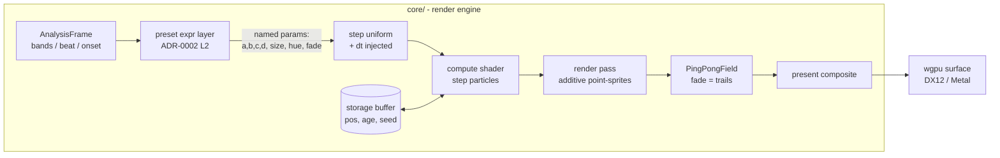

# 0016 — GPU compute-particle scenes: strange attractors

> **Status:** in-progress
> **Created:** 2026-07-22
> **Owner skill(s):** dev
> **Related ADRs:** [0015-gpu-compute-particle-idiom](../adrs/0015-gpu-compute-particle-idiom.md); extends [0002-layered-preset-architecture](../adrs/0002-layered-preset-architecture.md) layer 2; reuses [0012-stateful-feedback-render-system](../adrs/0012-stateful-feedback-render-system.md)'s `PingPongField`

## TL;DR

Add the engine's first **GPU compute-particle** scene family: a compute shader steps a
storage buffer of particles through a strange-attractor map each frame, and a render pass
draws them as additive point-sprites with fading trails. First user-visible behavior: a
new preset renders a dense, glowing, slowly-morphing attractor (De Jong) point cloud that
reacts to the music. This lands idiom B from [ADR-0015](../adrs/0015-gpu-compute-particle-idiom.md)
and opens the path for curl-noise flow fields and fractal flames later. Core-only; **C ABI
untouched**; both frontends inherit the scenes.

## Context & problem

Three of the four render idioms already exist here (lines = Plan 0010, ping-pong = Plan
0014, fragment = `fragment_field.rs`); the one gap is **GPU-resident particle systems**.
The current `swarm.rs` integrates ~10k points on the CPU each frame, which caps scale and
spends render-thread CPU against the lightweight value. Strange attractors are the
cheapest high-impact particle family — a handful of scalar coefficients producing an
iconic dense point cloud — and their verified rendering keeps all state on the GPU. We
want them as the walking skeleton that proves the compute idiom, with audio reactivity and
determinism riding the mechanisms the project already has.

## Decision

Per [ADR-0015](../adrs/0015-gpu-compute-particle-idiom.md), build a compute-pipeline
particle system in `core`: particle state in a `wgpu` storage buffer, stepped by a compute
shader from injected real `dt`, drawn as additive point-sprites, trails via Plan 0014's
`PingPongField`. Attractor coefficients and look scalars are ADR-0002 layer-2 named
parameters so presets bind them to audio; init is seeded (`SeededRng`) for reproducibility.
We rejected fragment/texture-state particles (count bound to texture size, no fractal-flame
path) and extending the CPU swarm (~10k ceiling, per-frame CPU) — both recorded in ADR-0015.

## Architecture diagram



## Implementation phases

Each phase is one commit. `dev` runs all phases in one session. Phase 1 is a walking
skeleton — a visible animated attractor end-to-end — not plumbing.

### Phase 1 — Compute-particle skeleton (one attractor, no trails)
- **Owner skill:** dev
- **Area:** core
- **What:** New `render/scenes/particles/` module: a storage buffer of particle state, a
  compute pipeline that steps a single hardcoded 2D attractor (De Jong) each frame from
  injected `dt`, and a render pipeline drawing additive point-sprites. Seeded init via
  `SeededRng`. Registered in `scenes::create_all` and addressed by one new preset.
- **Files touched:** `core/src/render/scenes/particles/mod.rs` (+ `step.wgsl`/`draw.wgsl`
  inline or as `const`), `core/src/render/scenes/mod.rs`, `core/tests/hygiene.rs` (scan set),
  a `presets/*.toml`.
- **Done when:** a new preset renders a visibly animated De Jong point cloud that holds 60 fps
  on the dev box; two runs from the same seed produce the same first frame (determinism); the
  new module carries the hot-path panic pragma and is in the hygiene scan set.

### Phase 2 — Trails via PingPongField
- **Owner skill:** dev
- **Area:** core
- **What:** Route the particle draw into Plan 0014's `render::feedback::PingPongField` so
  points accumulate additively into a texture that fades each frame; a present pass composites
  it to the surface. Trail persistence is a named parameter (`fade`).
- **Files touched:** `core/src/render/scenes/particles/mod.rs`, `core/src/render/feedback/` (reuse only).
- **Done when:** particles leave glowing trails that fade over ~0.5-2 s; setting `fade` to 0
  reproduces Phase 1's trail-free look; no second feedback mechanism was introduced.

### Phase 3 — Audio-reactive named parameters
- **Owner skill:** dev
- **Area:** core
- **What:** Expose the attractor coefficients (`a,b,c,d`), `size`, `hue`, `fade`, and a
  beat-driven `reseed`/coefficient-kick through `reset_params`/`set_param` (ADR-0002 layer 2).
  Author a preset binding them to bass/mid/treble + beat.
- **Files touched:** `core/src/render/scenes/particles/mod.rs`, a `presets/*.toml`.
- **Done when:** the reactivity/animation capture tests (Plan 0013 harness) show the scene
  responds per-band and differs frame N vs N+k; a beat click-track visibly perturbs the cloud;
  unbound params fall back to calm defaults.

### Phase 4 — Attractor family set + selection
- **Owner skill:** dev
- **Area:** core
- **What:** Add Clifford, Thomas, and a 3D-projected Lorenz alongside De Jong; select the
  family + its coefficient defaults via a `[particles]` config table through the existing
  ADR-0007 `configure` hook (no new trait method). Ship 3-4 curated presets.
- **Files touched:** `core/src/render/scenes/particles/mod.rs`, `core/src/preset/schema.rs`,
  `core/src/render/scenes/lines/mod.rs` (only if the `GeneratorConfig`/config enum is shared),
  `presets/*.toml`.
- **Done when:** presets exist for >=3 families, each visibly distinct in the `shot` contact
  sheet; family selection is data-driven (no engine edit to add a preset for an existing family).

### Phase 5 — Regression coverage + per-system golden fixture
- **Owner skill:** dev
- **Area:** core tests
- **What:** Extend `core/tests/` sanity/reactivity for the particle scene (coverage + quadrant
  spread against its own sampled background, not tautological) — these structural metrics stay the
  cross-adapter behavioral assertion of record, since chaos-amplified FP divergence makes pixels
  differ across GPUs. Then add the particle system's **frozen golden fixture** per the post-Plan-0022
  layout ([ADR-0023](../adrs/0023-golden-drift-guard-uses-frozen-fixtures.md)): golden now renders one
  do-not-tune fixture per `SystemKind` under `core/tests/fixtures/`, keyed by an exhaustive
  `match SystemKind` in `golden.rs::fixture`, and drift is a WARP-only pixel comparison (deterministic
  on that one adapter, so a seeded particle scene pins fine there). The new `SystemKind` variant this
  plan adds makes `fixture()` fail to compile until its arm exists — author `fixtures/<system>.toml`
  (minimal, deterministic, do-not-tune header), add the `fixture()` arm **and** the `SYSTEMS` entry,
  and bless + eyeball the baseline on WARP.
- **Also close the Plan 0022 half-enforced-coverage followup here** (this phase is its folded-in home):
  golden's `SYSTEMS` iteration list is hand-maintained *separately* from the exhaustive `fixture()`
  match, so today a new variant is compiler-forced to add a fixture **arm** but **not** forced into
  `SYSTEMS` — it could compile green and silently never be rendered/compared. Add a structural guard so
  `SYSTEMS` provably covers every `SystemKind` variant (e.g. an `assert_eq!(SYSTEMS.len(), <variant
  count>)` backed by a single source, or derive one list from the other) — a variant absent from
  `SYSTEMS` must then fail the suite, not just a missing arm. This plan's new variant is the first real
  exercise of that guard.
- **Files touched:** `core/tests/golden.rs` (fixture arm + `SYSTEMS` entry + coverage guard),
  `core/tests/fixtures/<system>.toml`, `core/tests/golden/<system>.png` (WARP-blessed baseline),
  `core/tests/sanity.rs` / `core/tests/reactivity.rs` (new cases).
- **Done when:** `cargo test -p lmv-core` green (new sanity + reactivity cases included);
  `cargo clippy -p lmv-core -p standalone --all-targets -D warnings` clean; the particle system has
  exactly one fixture + one WARP-blessed baseline and golden passes on WARP within the existing
  mean/outlier tolerance (skips cleanly on an adapterless runner per ADR-0016); and the new
  `SYSTEMS`-covers-every-variant guard is in place — removing the particle entry from `SYSTEMS` (or
  adding a throwaway variant absent from it) fails the suite (verify once, then revert).

## Data shapes

```rust
// illustrative — not the final interface

// One particle, GPU storage-buffer layout (std430). 16 bytes if 2D + packed age/seed.
#[repr(C)]
struct Particle {
    pos: [f32; 2], // attractor state (x, y); 3D families project to 2D in the draw
    age: f32,      // frames alive, for lifetime/respawn
    seed: f32,     // per-particle jitter, set once at seeded init
}

// Compute step uniform (per frame).
#[repr(C)]
struct StepUniform {
    coeffs: [f32; 4], // a, b, c, d — attractor coefficients (named params)
    dt: f32,          // injected real dt (Plan 0014), NOT SCENE_DT
    family: u32,      // which attractor map to iterate
    count: u32,       // active particle count (quality knob)
    _pad: u32,
}
```

Named parameters (ADR-0002 layer 2): `a`, `b`, `c`, `d`, `size`, `hue`, `fade`, `reseed`.

## Risks & open questions

- **iGPU fill rate, not memory, is the ceiling.** 100k additive point-sprites is ~1.6 MB but
  heavy overdraw. Mitigation: `count` is a preset param; low-end iGPU 60 fps @ 1080p smoke goes
  to `docs/on-device-validation.md` (non-blocking), matching how Plans 0011/0012 handled iGPU checks.
- **Cross-vendor FP divergence is amplified by chaotic iteration**, so pixel-exact goldens will
  differ across adapters. Mitigation (Phase 5): software-adapter baseline + tolerance, and assert
  structural coverage/spread rather than exact pixels.
- **Dependency on Plan 0014.** Trails (Phase 2) reuse `PingPongField`, and the step uses injected
  `dt` — both land in 0014. This plan is sequenced **after** 0014; if 0014 slips, Phase 1 still
  stands (trail-free, and it can inject `dt` via the same seam 0014 adds). Surface the coupling if 0014 is not yet merged at `go`.
- **Compute support on target backends.** wgpu compute works on DX12 and Metal; confirm no
  downlevel-limits gate on the low-end iGPU. Fallback if compute is unavailable there: the
  fragment/texture-state path (ADR-0015 Alternative A) — but do not build it pre-emptively.
- **Determinism.** The compute step must read no wall-clock and use no unseeded randomness; all
  jitter comes from the per-particle `seed` set at init. Verify in Phase 1's same-seed check.

## What this plan does NOT do

- **No curl-noise flow fields, no fractal flames, no boids.** They ride the same compute idiom but
  are separate plans (fractal flames additionally need a density-histogram + log-tonemap pass; boids
  need a spatial-hash neighbor grid).
- **No 3D camera controls** beyond a fixed projection for Lorenz.
- **No conversion of the existing fragment/line/swarm scenes to compute.**
- **No C ABI change** (`LMV_ABI_VERSION` unchanged) and **no new dependency**.
- **No quality-tier / frame-time governor** — the `count` param is the only manual knob (the
  governor is roadmap item 3).

## Followups (after this lands)

- Curl-noise flow-field scene on the same compute path (named params: noise scale, advection strength).
- Fractal flames (IFS chaos game): density-histogram accumulation + log tonemap — its own plan/ADR.
- Boids / autonomous agents (needs spatial-hash neighbor grid) — its own plan.
- Low-end iGPU compute + additive-fill smoke → `docs/on-device-validation.md`.
- Consider a shared `count`/quality knob feeding the future adaptive-quality governor (roadmap item 3).
