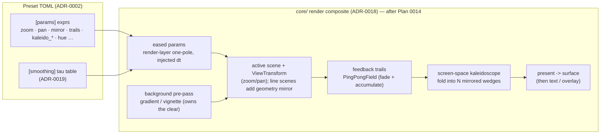

# 0018 — Engine-wide visual enrichment: zoom, atmosphere, easing, and mirrors for every scene

> **Status:** in-progress
> **Created:** 2026-07-23
> **Owner skill(s):** dev
> **Related ADRs:** [0018-engine-wide-scene-compositing](../adrs/0018-engine-wide-scene-compositing.md), [0019-eased-parameters](../adrs/0019-eased-parameters.md); builds on Plan 0014 ([ADR-0012](../adrs/0012-stateful-feedback-render-system.md) `PingPongField` + [ADR-0013](../adrs/0013-c-abi-v4-render-dt.md) injected `dt`); extends [ADR-0002](../adrs/0002-layered-preset-architecture.md) layer 2

## TL;DR

Add four engine-wide visual controls the live smoke of the line scenes surfaced as missing: a
shared **view transform** (zoom / pan), a **gradient/atmosphere background** behind every scene,
frame-rate-independent **parameter easing** (so band- and beat-driven motion stops feeling rigid
and fast), and **mirrors** — a true line-geometry fractal replication *and* a screen-space
kaleidoscope. They land as a **fixed-order engine composite** (background -> scene+view -> trails
-> kaleidoscope -> present, [ADR-0018](../adrs/0018-engine-wide-scene-compositing.md)) plus a
**render-layer smoothing seam** ([ADR-0019](../adrs/0019-eased-parameters.md)), all audio-bindable
as ADR-0002 named params. **Sequenced after Plan 0014** (reuses its offscreen/present +
`PingPongField` + injected `dt`). First user-visible behavior: cycle to a rose and watch it zoom
in/out (Phase 1).

## Context & problem

The user smoke-tested the app live after Plan 0010 landed and named four gaps, verbatim: "we
don't have zoom", "changes in shapes are very rigid and fast", "there is no background on shapes",
and "we should be able to mirror shapes to create fractals". None of these is a single-scene
concern:

- **Zoom/pan** is a view/camera transform every scene should share; today only a per-shape
  `scale` exists (it shrinks geometry *within* the frame, it does not zoom the view).
- **Rigid/fast motion** is because every evaluated param is applied *instantly* — raw band values
  are noisy and beat-driven values snap. There is no easing.
- **No background** is because each line scene hard-clears to near-black; a backdrop is a pass
  that must run *before* the scene, owned by something other than the scene.
- **Mirrors/fractals** need either the segment geometry replicated under symmetry (a true
  fractal) or the finished frame folded (a screen-space kaleidoscope) — the user wants **both**.

The interview settled the scope: **both mirror kinds**, **both background kinds** (gradient now +
feedback trails), **frame-rate-independent easing** (so it sequences after Plan 0014's injected
`dt`), and **engine-wide from the start**, structured as **one plan with a fixed-order composite**
(not a general render graph). This plan implements that.

## Decision

We build a fixed-order engine composite (ADR-0018) and a render-layer easing seam (ADR-0019),
reusing Plan 0014's offscreen target, present pass, `PingPongField`, and injected `dt`. We
rejected a general render graph (premature for four effects), per-scene ownership of each effect
(duplication; a screen-space post can't be expressed per-scene), a screen-space-only mirror (the
user wants a true geometric fractal too), a stateful `smooth()` expression builtin (breaks the
pure/zero-alloc evaluator), and smoothing on the fixed `1/60` clock (frame-rate-coupled) — all
recorded in ADR-0018 / ADR-0019.

## Architecture diagram



## Implementation phases

Ordered so value lands early and the Plan-0014-independent work (Phases 1-4) precedes the work
that needs 0014's offscreen/present + injected `dt` (Phases 5-7). The whole plan is sequenced
after Plan 0014; the intra-plan boundary is noted so Phases 1-4 can proceed even if 0014 slips.
`dev` runs all phases in one session; the architect reviews once at the end.

### Phase 1 — Shared `ViewTransform` + zoom/pan on line scenes (walking skeleton)
- **Owner skill:** dev
- **Area:** core
- **What:** A shared `ViewTransform` (zoom, pan_x, pan_y about the frame centre) applied by the
  line scenes — the `LineRenderer` vertex shader multiplies endpoint positions by it — driven by
  new named params (`zoom`, `pan_x`, `pan_y`). No composite change yet; scenes still clear.
- **Files touched:** `core/src/render/scenes/lines/renderer.rs` (view uniform in the shader),
  `.../lines/mod.rs` (`ViewTransform` type + apply in `transform_cached` / the parametric path),
  `.../lines/{parametric,lsystem,star}.rs` (accept `zoom`/`pan_*` params), `presets/*` (one demo).
- **Done when:** `shot --preset <a rose> --set …` and the live app show a rose that zooms in and
  out and pans as `zoom`/`pan_*` change (bind `zoom` to `1 + bass` and it pumps); geometry is
  identical every run at a fixed param set (pure transform, no wall-clock). A `shot` capture at
  two zoom levels differs in coverage/spread as expected.

### Phase 2 — Extend `ViewTransform` to fragment + swarm (engine-wide zoom)
- **Owner skill:** dev
- **Area:** core
- **What:** Apply the same `ViewTransform` to the fragment field (transform its sample
  coordinates) and the swarm (multiply particle positions), so zoom/pan are engine-wide.
- **Files touched:** `core/src/render/scenes/fragment_field.rs`, `.../scenes/swarm.rs`, the shared
  `ViewTransform` plumbing in `core/src/render/mod.rs` if a single uniform is threaded there.
- **Done when:** `zoom`/`pan_*` visibly move a fragment preset and a swarm preset (a `shot`
  before/after differs); no scene regresses its existing reactivity/animation/golden tests.

### Phase 3 — Background pre-pass (gradient/vignette) engine-wide; scenes stop clearing
- **Owner skill:** dev
- **Area:** core
- **What:** A `render::background` pass that fills the frame with an audio-tintable gradient /
  vignette *before* the scene draws; every scene switches `Clear` -> `Load` so it composites over
  the backdrop. New params (`bg_hue`, `bg_bright`, `bg_vignette`, …). This begins the ADR-0018
  composite.
- **Files touched:** `core/src/render/background.rs` (new), `core/src/render/mod.rs::draw_frame`
  (run background first), every scene's `render` (`Clear` -> `Load`), `presets/*`.
- **Done when:** presets show a visible backdrop behind the strokes/particles; a scene with no
  background params still renders (default backdrop or transparent); the Plan 0013 **sanity/golden
  suite still passes** (no scene silently wipes the backdrop by clearing) — this is the guard that
  the `Clear`->`Load` migration is complete and correct.

### Phase 4 — Geometry mirror (line kaleidoscope replication)
- **Owner skill:** dev
- **Area:** core
- **What:** Line scenes replicate their segment set under N-fold rotation + optional reflection
  *before* the segment cap, forming a true geometric fractal. New params (`mirror_order`,
  `mirror_reflect`). Replication multiplies segment count and must respect `MAX_SEGMENTS` (surface
  overflow via the Plan 0010 finding-#1 `CapOverflow` path).
- **Files touched:** `core/src/render/scenes/lines/mod.rs` (`transform_cached` / a mirror helper),
  `.../lines/parametric.rs` (mirror the sampled curve too), `presets/*`.
- **Done when:** a line preset with `mirror_order = 6` draws a six-fold kaleidoscopic figure whose
  segment set is invariant under `2*pi/6` rotation (a unit test asserts the symmetry, like the
  Hankin test); exceeding `MAX_SEGMENTS` truncates and **surfaces** the drop (reuses `CapOverflow`),
  never a silent cut.

### Phase 5 — Eased parameters (render-layer one-pole on injected `dt`)
- **Owner skill:** dev
- **Area:** core
- **What:** The ADR-0019 smoothing seam: each evaluated param passes through an optional one-pole
  low-pass with a per-`(preset,param)` `tau`, on Plan 0014's injected `dt`, before `set_param`.
  Optional `[smoothing]` preset table (`param = seconds`); state reset on preset switch **and** on
  the capture scene-rebuild. Expression layer unchanged.
- **Files touched:** `core/src/render/mod.rs` (smoothing state + apply in `draw_frame`; reset in
  the preset-switch and `capture_preset`/`capture_audio` paths), `core/src/preset/schema.rs`
  (`[smoothing]` table), `presets/*`, `core/tests/*` (determinism + reset assertions).
- **Done when:** a param bound to a noisy band visibly eases instead of snapping; two identical
  `capture_preset(name, frame, N)` calls are **still byte-identical** (state reset holds
  determinism, NFR §6); a preset switch snaps to the new preset's first value (no cross-preset
  bleed) — a test asserts the reset. Requires Plan 0014's injected `dt`.

### Phase 6 — Feedback trails (fade + accumulate via `PingPongField`)
- **Owner skill:** dev
- **Area:** core
- **What:** Route the composited scene through a fade-and-accumulate feedback stage so moving
  shapes leave light trails, reusing Plan 0014's `render::feedback::PingPongField`. New param
  (`trails` amount / decay).
- **Files touched:** `core/src/render/mod.rs::draw_frame` (trails stage in the composite),
  possibly a thin `render::trails` wrapper over `PingPongField`, `presets/*`.
- **Done when:** a moving/rotating scene leaves visibly fading trails whose length tracks the
  `trails` param; the field is reset on scene rebuild so a `capture_preset` stays deterministic;
  holds the iGPU 60 fps floor. Requires Plan 0014's `PingPongField`.

### Phase 7 — Screen-space kaleidoscope post-pass
- **Owner skill:** dev
- **Area:** core
- **What:** A post-pass that folds the composited offscreen frame into `N` mirrored wedges before
  present — the general (engine-wide) kaleidoscope. New params (`kaleido_order`, `kaleido_angle`).
- **Files touched:** `core/src/render/kaleidoscope.rs` (new post-pass sampling the offscreen
  target), `core/src/render/mod.rs::draw_frame` (post stage before present), `presets/*`.
- **Done when:** any scene (fragment / swarm / line) with `kaleido_order = 8` presents an
  eight-fold mirrored frame that rotates with `kaleido_angle`; `kaleido_order <= 1` is an identity
  passthrough; holds the iGPU floor. Requires the ADR-0018 offscreen/present (Plan 0014).

### Phase 8 — Curated presets + authoring note
- **Owner skill:** dev
- **Area:** core
- **What:** A handful of presets showcasing the new controls (a zoomed pumping rose, an
  atmospheric backdrop, a mirrored fractal, a trailed scene, a kaleidoscoped fragment, an eased
  one), and an update to `presets/README.md` documenting every new param (`zoom`, `pan_*`,
  `bg_*`, `mirror_*`, `trails`, `kaleido_*`) and the `[smoothing]` table.
- **Files touched:** `presets/*.toml`, `presets/README.md`.
- **Done when:** the curated set loads and cycles from the standalone and `shot --all`; the
  authoring note documents every new param and the `[smoothing]` table, cross-checked against
  `schema.rs`.

## Data shapes

```rust
// illustrative — not the final interface

// Shared camera transform applied by every scene family (ADR-0018). Zoom about
// the frame centre, then pan; rotate is optional/future.
#[repr(C)]
#[derive(Clone, Copy, bytemuck::Pod, bytemuck::Zeroable)]
struct ViewTransform { zoom: f32, pan: [f32; 2], _pad: f32 }

// Per-parameter easing time constants (ADR-0019), from an optional [smoothing]
// preset table. Unlisted params use a small default (or 0 = off).
// [smoothing]
//   zoom = 0.12
//   hue  = 0.4
struct Smoothing { tau: BTreeMap<String, f32> }  // seconds

// The render-layer smoothing state, keyed per active preset+param, reset on
// preset switch and on the capture scene-rebuild (determinism, NFR 6).
struct ParamSmoother { last: HashMap<String, f32> }
```

## Risks & open questions

- **Passthrough/offscreen cost vs the iGPU floor (NFR §1).** Always compositing through an
  offscreen target + present adds a full-frame present even with no effect bound. Measure on the
  test box; if it regresses the 60 fps @ 1080p floor, bypass the offscreen hop when no effect is
  active. Carry-forward hardware check, same posture as Plan 0003/0010.
- **`Clear` -> `Load` migration must be total.** A scene that still clears wipes the background.
  The Plan 0013 sanity/golden suite is the guard; Phase 3 is done only when it stays green.
- **Determinism of stateful effects (NFR §6).** Easing state (Phase 5) and the trails field
  (Phase 6) must reset wherever scenes are rebuilt for capture (`capture_preset`/`capture_audio`),
  or a capture stops being a pure function of its inputs. Assert byte-identical recaptures.
- **Geometry-mirror segment blow-up.** `mirror_order = N` multiplies the base segment count by N;
  a dense curve at high order can exceed `MAX_SEGMENTS`. Reuse the Plan 0010 `CapOverflow`
  surfacing — truncate and report, never a silent cut.
- **Default `tau` and the "not rigid, not sluggish" feel** is an on-box tuning judgment (ADR-0019
  leaves the exact default to this plan); validate live.
- **Hard dependency on Plan 0014.** Phases 5-7 need its injected `dt`, `PingPongField`, and
  offscreen/present. If 0014 is not yet landed, Phases 1-4 (view transform, background, geometry
  mirror) can proceed; 5-7 block on it.

## What this plan does NOT do

- **No general render graph.** The composite order is fixed in the render loop (ADR-0018); a
  data-driven pass/effect graph is explicitly rejected until effect count/reordering demands it.
- **No structural crossfade.** Easing smooths a discrete param's pre-floor value, but morphing
  *between* cached L-system depths / tiling variants (instead of snapping) stays the Plan 0010
  followup — a separate feature.
- **No new C ABI.** The whole composite + easing is engine-internal and driven by named params;
  `LMV_ABI_VERSION` is untouched. The foobar frontend inherits it through the shared preset
  library.
- **No stateful expression builtins.** Smoothing lives in the render layer; the expression
  evaluator stays pure and allocation-free (ADR-0019).
- **No new dependency.** Gradient, mirror, trails, and kaleidoscope are wgpu passes over existing
  primitives; `image` stays a dev-only dependency.
- **It does not re-do Plan 0014's `PingPongField` or injected-`dt` work** — it consumes them.

## Followups (after this lands)

- **Structural crossfade** between cached L-system depths / tiling variants (morph, not snap).
- **View rotate** (the `ViewTransform` reserves it) and per-scene view anchors.
- **More post-effects** on the same fixed composite (bloom, colour grade) — each one more optional
  stage.
- **Expose the composite/effect params over the C ABI** if the foobar UI ever needs direct
  control beyond presets (ADR-worthy; today presets suffice).
