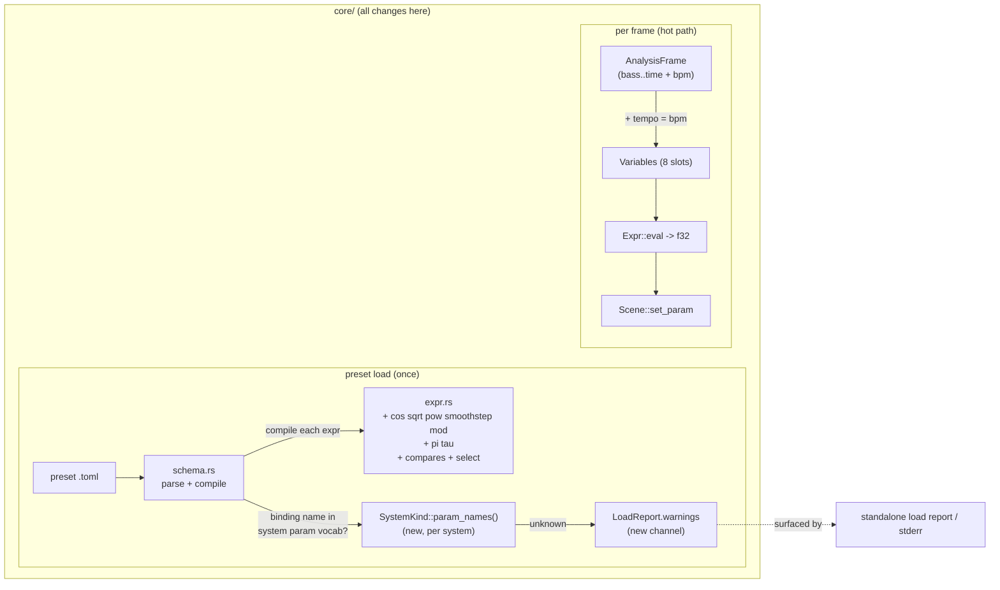

# 0019 — Preset expression grammar v2: branching, math functions, tempo, and typo warnings

> **Status:** approved
> **Created:** 2026-07-23
> **Owner skill(s):** dev
> **Related ADRs:** [0020-preset-grammar-v2-branching-functions-tempo](../adrs/0020-preset-grammar-v2-branching-functions-tempo.md), supplements [0002-layered-preset-architecture](../adrs/0002-layered-preset-architecture.md)

## TL;DR

Grow the preset expression language additively so preset authors stop hitting walls: add the math functions `cos sqrt pow smoothstep mod` and the constants `pi tau`, add branching (six comparison operators yielding `0/1`, plus a `select(cond, x, y)` conditional), and expose the two already-computed but unread analysis fields as new variables — `tempo` (BPM) and `novelty` (the experimental spectral track-change signal). Separately, stop the silent-typo footgun: an unknown parameter name becomes a surfaced load-time **warning** (the preset still loads its good bindings) instead of being silently dropped. Finally, rewrite the stale `docs/presets.md` (it claims 10 presets / 2 systems; the code ships 17 / 5) to match the finished grammar. Everything stays core-internal, allocation-free, and panic-free per frame — the C ABI is untouched. (The additions happen to break no existing preset, but the app is pre-1.0 and in active development, so that's a convenience, not a constraint — preset-format stability starts at 1.0.0.)

## Context & problem

A grammar exploration (from the [`preset-author` lane](../adrs/0017-preset-author-skill-lane.md)) found the shipped expression surface narrower than the docs claim, and one real footgun:

- **No `cos`** (authors write `sin(x + 1.5708)`), no `sqrt`/`pow`/`smoothstep`/`mod`, no `pi`/`tau`, no comparisons or conditional.
- **No `tempo`**, though `AnalysisFrame.bpm` already exists (`core/src/dsp/mod.rs:52`) and is deterministic (`dsp/tempo.rs`); `render/mod.rs:474` just never passes it into `Variables::new`.
- **Unknown parameter names are silently ignored.** `schema.rs` compiles every bound name blindly into a `Binding`; each scene's `set_param` ends in `_ => {}` (`fragment_field.rs:218`, `swarm.rs:290`, the three `lines/*` scenes). So a typo (`warpp = "…"`) compiles and does nothing — while an unknown *system*/*function*/*variable* is already a hard load error. That inconsistency is the bug.
- **`docs/presets.md` is stale**: "accurate as of 2026-07-22, 10-preset set", two systems — but `EMBEDDED` is `[(&str, &str); 17]` (`preset/mod.rs:24`) across five `SystemKind`s (`fragment_field`, `swarm`, `parametric_curve`, `lsystem`, `star_pattern`).

The design decision — how far to expand, `select` vs ternary, warn vs reject, which variables — is recorded in [ADR-0020](../adrs/0020-preset-grammar-v2-branching-functions-tempo.md). This plan implements it. The one hard constraint throughout is **hot-path safety** (`preset/expr.rs` carries the panic-denial pragma and `eval` runs per param per frame — every new operation must be total and allocation-free). **Backward compatibility is not yet a constraint** — the app is pre-1.0 (0.3.0) and in active development; preset-format stability begins at 1.0.0. The additions here happen to break no shipped preset (each was previously a compile error), but `dev` should feel free to pick the cleanest implementation rather than preserve any incidental current behavior for compatibility's sake.

## Decision

Implement ADR-0020: additive grammar growth (math functions, constants, comparison operators + `select`), two plumbed variables (`tempo`, `novelty`), and warn-but-load typo handling backed by a declared per-system parameter vocabulary — then rewrite the reference doc last so it describes the finished grammar once. `select(cond, x, y)` over a ternary (reuses the call/arity machinery, branch-skips to avoid `NaN` poisoning); warn over reject (NFR §10 degrade-never-crash); no boolean operators (`min`/`max`/`1 - c` already serve). Core-only; C ABI untouched.

## Architecture diagram



## Implementation phases

Each phase is one commit. Ordered so the grammar core lands first (independently valuable), then branching, then the new input, then the hardening, then the doc rewrite last so it describes the finished surface. No `unwrap`/`expect`/`panic`/indexing may be introduced in `expr.rs` — the hygiene guard (`core/tests/hygiene.rs`) enforces its panic pragma; new `Call` arms must use slice patterns like the existing ones.

### Phase 1 — Math functions + constants
- **Owner skill:** dev
- **What:** Add `cos`, `sqrt`, `pow`, `smoothstep`, `mod` to the `Func` enum (with arities) and `pi`/`tau` as constant identifiers, all in `core/src/preset/expr.rs`; update the module's grammar doc-comment.
- **Files touched:** `core/src/preset/expr.rs`, `core/tests/dsp.rs` (or the existing expr test location — put the tests where the current `expr` unit tests live).
- **Details:**
  - `Func`: `Cos`/`Sqrt` arity 1, `Pow`/`Mod` arity 2, `Smoothstep` arity 3. Eval: `cos` = `x.cos()`; `sqrt` = `x.sqrt()`; `pow(b, e)` = `b.powf(e)`; `mod(a, b)` = `a - b * (a / b).floor()` (floored / divisor-signed); `smoothstep(e0, e1, x)` = clamp `t = (x - e0) / (e1 - e0)` to `[0,1]` via the existing `max().min()` idiom, then `t * t * (3 - 2*t)`. All total — no branch panics; degenerate inputs yield `NaN`/`inf`/`0`, never a panic.
  - Constants: in `parse_primary`, when an identifier is **not** followed by `(`, check `pi`/`tau` (→ `Node::Const(std::f32::consts::PI / TAU)`) **before** the `VAR_NAMES` lookup, so they can't be shadowed and an unknown bare name still errors.
- **Done when:** An expression `cos(pi) + sqrt(4) + pow(2,3) + mod(7,3) + smoothstep(0,1,0.5)` compiles and evaluates to the mathematically expected value (with a test asserting each function's result on a known input, and that `mod(-0.2, 1.0)` wraps to `0.8` not `-0.2`); a bare unknown ident (e.g. `foo`) still returns `UnknownIdent`; `cargo test -p lmv-core` green and clippy `-D warnings` clean (hot-path pragma intact).

### Phase 2 — Branching: comparison operators + `select`
- **Owner skill:** dev
- **What:** Add the six comparison operators at a new lowest-precedence grammar tier (each yielding `1.0`/`0.0`) and the `select(cond, x, y)` conditional, in `core/src/preset/expr.rs`.
- **Files touched:** `core/src/preset/expr.rs`, expr tests.
- **Details:**
  - Tokenizer: add `Gt Lt Ge Le EqEq NotEq` with two-char lookahead for `>=`/`<=`/`==`/`!=`; a bare `=` or bare `!` becomes `UnexpectedChar` (they're only valid as the two-char forms).
  - Parser: new tier `parse_compare` between `parse_expr` (add/sub) and the current top — grammar becomes `top := compare; compare := sum (cmp sum)*; sum := term (('+'|'-') term)*; …`. Left-associative (reuse the existing while-loop shape). Chained `a > b > c` parses as `(a>b) > c` — legal but discouraged in docs.
  - `BinOp` gains the six comparison variants; eval returns `if a <cmp> b { 1.0 } else { 0.0 }` (`NaN` compares false, so a `NaN` operand yields `0.0` — total).
  - `select`: add `Func::Select` (arity 3); eval `if cond.eval(vars) != 0.0 { x.eval(vars) } else { y.eval(vars) }` — **only the taken branch is evaluated** (the `NaN`-guard property; do not pre-evaluate both).
- **Done when:** `1 + (2 > 1)` evaluates to `2.0` and `1 + (1 > 2)` to `1.0`; `select(bass > 0.5, 10, 20)` returns `10`/`20` on either side of the threshold; `select(0, sqrt(-1), 5)` returns `5` (a test proving the untaken `sqrt(-1)` does **not** poison the result to `NaN`); `>=`/`<=`/`==`/`!=` each tested on a boundary; a bare `!` or `=` returns a compile error; `cargo test -p lmv-core` green, clippy clean.

### Phase 3 — The `tempo` and `novelty` variables
- **Owner skill:** dev
- **What:** Expose the two already-computed `AnalysisFrame` fields expressions can't yet read — `bpm` as `tempo` (the grammar's 8th variable) and `novelty` as `novelty` (the 9th).
- **Files touched:** `core/src/preset/expr.rs` (`VAR_NAMES`, `VAR_COUNT`, `Variables::new`), `core/src/render/mod.rs` (the `Variables::new(...)` call at ~line 474), expr tests.
- **Details:** Append `"tempo"` then `"novelty"` to `VAR_NAMES` (now 9; `VAR_COUNT` follows automatically). Extend `Variables::new` with `tempo: f32` and `novelty: f32` arguments (append in that order to keep field/slot order matching `VAR_NAMES`). At the `render/mod.rs` call site, pass `frame.bpm` and `frame.novelty`. Determinism holds — `bpm` is a pure function of the onset/beat history (`dsp/tempo.rs`) and `novelty` a pure function of the spectra (`dsp/novelty.rs`, Plan 0009 Phase 4). `novelty` is native-only across the C ABI (no query function), but preset eval is core-internal so it reads through on both frontends.
- **Done when:** Preset expressions referencing `tempo` and `novelty` compile and, given an `AnalysisFrame` with a known `bpm`/`novelty`, `eval` returns those values (a test binding each and asserting it reads through); the seven existing variables are unchanged and still read their correct slots; `cargo test -p lmv-core` green.

### Phase 4 — Warn-but-load on unknown parameter names
- **Owner skill:** dev
- **What:** Give each built-in system a declared parameter vocabulary, validate bound names against it at load, and surface unknowns as warnings in the load report — without dropping the preset.
- **Files touched:** `core/src/preset/schema.rs` (validation + a `SystemKind::param_names()`), `core/src/preset/mod.rs` (`LoadReport` gains a warnings channel; `Preset` may carry its own warnings), each scene module for the declared name list (`render/scenes/fragment_field.rs`, `swarm.rs`, `lines/parametric.rs`, `lines/lsystem.rs`, `lines/star.rs`), the standalone load-report surfacing (`standalone/src/…` where errors are already printed), tests.
- **Details:**
  - Declare each system's known params once — e.g. a `pub const PARAMS: &[&str]` next to each scene's `set_param`, exposed through `SystemKind::param_names(self) -> &'static [&str]` in `schema.rs` (the preset layer already depends on `render::scenes::lines`, so this reference direction is fine).
  - In `Preset::from_toml_str`, after compiling a binding, if its name is not in `param_names(system)`, record it as a warning (do **not** error, do **not** drop the compiled binding — a param a system doesn't consume is harmless at apply time, and keeping it means a warning, not a silent loss).
  - Thread warnings out: `Preset` carries `warnings: Vec<String>` (or the loader aggregates `(path, warning)` into `LoadReport`), and the standalone's existing "reports a bad file" path prints them. Keep the surfacing off the render/audio hot path — this is load-time only.
  - **Drift guard:** a per-system unit test asserting each declared `PARAMS` name is actually handled by that scene's `set_param` and vice-versa (for the GPU-free-testable scenes; for the GPU scenes, assert the declared list matches the documented set and add the `// keep in sync with set_param` comment). This closes the parallel-list drift risk ADR-0020 flags.
- **Done when:** A preset binding a real param plus a bogus one (`warp = "0.4"`, `wrap = "0.4"`) **loads successfully**, applies `warp`, and produces a warning naming `wrap` and the system (a test asserting the preset compiles, the good binding is present, and the warning is emitted); an all-known-params preset produces zero warnings; the standalone prints the warning on load; `cargo test -p lmv-core` green.

### Phase 5 — Rewrite `docs/presets.md` to truth
- **Owner skill:** dev
- **What:** Bring the authoring reference in line with the code and the v2 grammar in a single rewrite.
- **Files touched:** `docs/presets.md`.
- **Details:** Correct the library (10 → **17** presets; 2 → **5** systems: `fragment_field`, `swarm`, `parametric_curve`, `lsystem`, `star_pattern`, with their param tables + defaults and the `[curve]`/`[generator]` structural tables from `schema.rs`). Update the expression-language section: **9** variables (add `tempo`, with the prominent "0 until warm, ~60–200, scale it or compare it" note, and `novelty`, clearly labelled **experimental** — a transient spiking at track/segment changes, shape may change), the full function table (`sin cos abs floor sqrt min max clamp lerp pow smoothstep mod` — 13), constants (`pi`, `tau`), comparison operators + `select`, and the `min`/`max`-as-and/or idiom. Fix "Keeping this current" counts (`EMBEDDED` length 17; the preset-count test's expected value). Bump the "accurate as of" date. Remove the "only fragment_field and swarm are addressable" claim.
- **Done when:** `docs/presets.md` names 17 presets across 5 systems, documents all 8 variables and all functions/operators/constants shipped by Phases 1–3, correctly describes the warn-but-load typo behavior from Phase 4 (superseding the current "silently ignored" paragraph), and its "four places to update" counts match `preset/mod.rs`; `novelty` is present and marked experimental; no remaining reference to "10 presets" or "two systems".

## Data shapes

```rust
// illustrative — not the final interface

// expr.rs — variables grow from 7 to 9
pub const VAR_NAMES: [&str; 9] =
    ["bass", "mid", "treb", "onset", "beat", "bar", "time", "tempo", "novelty"];

// expr.rs — Func enum gains the math + branching entries
enum Func { Sin, Cos, Abs, Floor, Sqrt, Min, Max, Clamp, Lerp, Pow, Smoothstep, Mod, Select }

// expr.rs — BinOp gains comparisons (each evals to 1.0 / 0.0)
enum BinOp { Add, Sub, Mul, Div, Gt, Lt, Ge, Le, Eq, Ne }

// schema.rs — a declared vocabulary per system, checked at load
impl SystemKind {
    fn param_names(self) -> &'static [&'static str] { /* per-system const */ }
}

// preset/mod.rs — warnings ride alongside the existing hard errors
pub struct LoadReport {
    pub presets: Vec<Preset>,
    pub errors: Vec<(PathBuf, PresetError)>,
    pub warnings: Vec<(PathBuf, String)>, // new: unknown-param typos, non-fatal
}
```

## Risks & open questions

- **Parallel-list drift** (declared `PARAMS` vs the `set_param` match): the two can diverge silently. Mitigated by the Phase 4 drift test + sync comment. Residual risk on the GPU scenes that can't be cheaply instantiated headlessly — if that proves fragile, the fallback is to change `Scene::set_param` to return `bool` (handled?) so the match is the single source of truth; noted here rather than done now to avoid a `Scene`-trait change (ADR-0020 keeps the seam stable).
- **`tempo` authoring gotcha**: `0` until warm and a `60–200` scale surprise authors who expect a `0–1` band. Mitigated by the prominent doc note (Phase 5) and the `select(tempo > k, …)` idiom the comparisons enable.
- **`novelty` is experimental** (Phase 3, decided in ADR-0020): its DSP shape may change or it may be withdrawn. Pre-1.0 that's a cheap promise, but the doc note must set the expectation so authors don't over-rely on it, and a later DSP revision to `novelty` is free to change what presets see.
- **Chained comparisons** (`a > b > c`) parse left-associatively into `(a>b) > c` — legal but rarely intended. Documented as discouraged rather than made a parse error (keeps the parser simple; harmless and total).
- **Tokenizer two-char forms**: `>=`/`<=`/`==`/`!=` need lookahead; ensure a trailing bare `>` at end-of-input still tokenizes as `Gt` (not a panic on the missing next char).

## What this plan does NOT do

- **No new DSP.** It plumbs `tempo` from existing `bpm` and `novelty` from the existing detector; it does **not** add spectral centroid, per-band onsets, a smoothed RMS `level`, or any new analysis signal (those are a separate future plan if wanted).
- **No boolean operators** (`&&`/`||`/`!`) and **no ternary** — `min`/`max`/`1-c` and `select()` cover the ground (ADR-0020).
- **No C ABI change.** Preset eval is core-internal; `LMV_ABI_VERSION` does not move. No foobar-plugin work.
- **No Rhai / layer-3 scripting, no cross-preset blending** — still deferred (ADR-0002).
- **No preset-content authoring.** New/tuned presets that exploit v2 features are the `preset-author` lane's job, not this plan.

## Followups (after this lands)

- The `preset-author` skill's grammar reference (if it embeds one) should be refreshed to v2 — track when that lane next runs.
