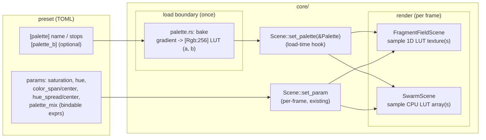

# 0020 — Shared palette system: gradient LUT, named + custom palettes, bindable color

> **Status:** draft
> **Created:** 2026-07-23
> **Owner skill(s):** dev
> **Related ADRs:** [0021](../adrs/0021-shared-palette-system.md) (supplements [0002](../adrs/0002-layered-preset-architecture.md))

## TL;DR

Give presets real color control. Add one shared `core/src/render/palette.rs` that bakes a gradient
— a built-in named palette **or** custom stops — into a 256-entry LUT every scene colors through,
and expose color as **bindable** named params (`saturation`, `hue`, fragment `color_span`/
`color_center`, swarm `hue_spread`/`hue_center`, plus an A/B `palette_mix` crossfade). First
user-visible behavior: a fragment preset that sets `[palette] name = "ember"` renders a cohesive
warm field instead of the fixed rainbow, and the 17 shipped presets look **unchanged** because the
default palette (`spectrum`) is the exact current cosine. Core-only, C ABI frozen, no new dependency.

## Context & problem

Both preset-driven scenes hardcode the **same** iq cosine palette (`fragment_field.rs` WGSL
`palette()`, `swarm.rs:262` CPU `palette()`), so a preset's only color lever is a scalar `hue`
offset that rotates one rainbow. The `preset-author` lane hit two walls no preset can pass (commit
`76a2fb4`): fragment fields can't hold a cohesive mood (the `field*0.6` span is fixed), and swarm
color is unreachable (per-particle hue is random across the full wheel, so `hue` is a visual no-op).
Color is a missing axis of the preset surface, and it is duplicated per scene — every new scene
re-duplicates it. See [ADR-0021](../adrs/0021-shared-palette-system.md) for the decision and the
rejected alternatives.

## Decision

Bake each palette (named or custom stops) into a 256-entry RGB LUT in a shared `palette.rs`; deliver
it to the fragment scene as a 256×1 1D texture and to the swarm as the identical CPU array; modulate
it per frame through bindable layer-2 params. Bindable palette *selection* is an A/B `palette_mix`
crossfade between two configured palettes, not a flickering float index. We rejected an in-shader
stop-array (two drifting sources of truth), cosine-coefficient params (unintuitive; no arbitrary
gradients), a minimal per-scene fix (re-duplicates on the next scene), and a bindable integer index
(flicker) — all recorded in ADR-0021.

## Architecture diagram



## Implementation phases

Ordered so Phase 1 is a walking skeleton — one scene, coloring through the shared module with a
selectable named palette — that is already useful. `dev` runs all phases in one session.

### Phase 1 — Shared palette module + named palettes, wired to the fragment scene
- **Owner skill:** dev
- **Area:** core
- **What:** Create `core/src/render/palette.rs`: a `Palette` holding one baked `[Rgb; 256]` LUT, a
  built-in named-palette set (`spectrum` = the current iq cosine coefficients, plus `ember`, `ice`,
  `mono`, `aurora`), and a pure `bake`/`sample` path. Add an optional `[palette]` config table
  (`name` only, this phase) parsed + validated at the load boundary in `schema.rs`. Add the
  load-time `Scene::set_palette(&Palette)` trait method (default no-op) called from
  `configure_active_scene`. Wire the fragment scene: upload the LUT as a 256×1 1D texture + linear
  sampler in its bind group, and replace its in-shader `palette()` with a LUT sample. Add the
  bindable `saturation`, `color_span` (replacing the hardcoded `field*0.6`), and `color_center`
  params (with defaults that reproduce today's look).
- **Files touched:** `core/src/render/palette.rs` (new), `core/src/render/mod.rs`,
  `core/src/render/scenes/mod.rs` (trait + dispatch), `core/src/render/scenes/fragment_field.rs`,
  `core/src/preset/schema.rs`, `core/tests/` (new palette unit test).
- **Done when:** `spectrum` bakes to a LUT whose sampled colors match the old cosine within a small
  tolerance at 8 sampled `t` (a unit test asserting the default palette reproduces the prior
  color — the no-regression guarantee); a fragment preset with `[palette] name = "ember"` renders a
  warm field and `shot --preset <it> --set ...` shows the shipped fragment presets visually
  unchanged (default path); `cargo clippy -p lmv-core -D warnings` clean with the hot-path pragma on
  `palette.rs` (it is sampled per-frame by the swarm in Phase 3; arm it now).

### Phase 2 — Custom gradient stops
- **Owner skill:** dev
- **Area:** core
- **What:** Extend `[palette]` to accept `stops = [{at, color}, …]` (hex `#rrggbb` or `[r,g,b]`),
  validated at the load boundary (monotonic-or-sorted `at` in `0..=1`, ≥2 stops, parseable colors —
  every failure a surfaced `PresetError::Config`, never a panic). Bake stops into the same LUT the
  named palettes produce. `name` and `stops` are mutually exclusive (stops win, or error — pick one
  and document).
- **Files touched:** `core/src/render/palette.rs`, `core/src/preset/schema.rs`, `core/tests/`.
- **Done when:** a preset with three custom stops bakes and renders that gradient; a malformed
  stop list (unsorted / out-of-range `at` / bad color / one stop) returns a load `Err` and the
  loader keeps the previous good preset (unit test asserts the error, not a panic).

### Phase 3 — Swarm through the shared module (fixes the unreachable-color gap)
- **Owner skill:** dev
- **Area:** core
- **What:** Delete `swarm.rs`'s private `palette()`; color each particle by CPU-sampling the shared
  baked LUT. Add bindable `hue_spread` and `hue_center` so particle hues occupy
  `hue_center + (particle_hue - 0.5) * hue_spread` (defaults reproducing today's full-wheel look:
  `spread = 1`, `center = 0.5`). Apply the shared `saturation`/`hue` semantics consistently.
- **Files touched:** `core/src/render/scenes/swarm.rs`, `core/tests/`.
- **Done when:** a swarm preset with `hue_spread = 0.15` renders a coherently-colored (single-family)
  swarm rather than full-rainbow confetti; `hue_spread = 1` reproduces the prior look; the swarm's
  `--report` distinctness across two presets that differ only in `hue_center` is now non-zero
  (color contributes to distinctness where before it was a no-op).

### Phase 4 — Bindable palette crossfade (A/B mix)
- **Owner skill:** dev
- **Area:** core
- **What:** Add an optional `[palette_b]` config table (same shape as `[palette]`; defaults to A when
  absent) and a bindable `palette_mix` param (`0..1`). `Palette` holds two LUTs; both scenes sample
  both and lerp by `palette_mix`. Fragment binds a second 1D texture; swarm lerps two CPU samples.
- **Files touched:** `core/src/render/palette.rs`, `core/src/render/scenes/fragment_field.rs`,
  `core/src/render/scenes/swarm.rs`, `core/src/preset/schema.rs`, `core/tests/`.
- **Done when:** a preset with `[palette]`=ember, `[palette_b]`=ice, `palette_mix = "bar"` shows the
  field/swarm crossfading warm↔cool across the beat phase in a `shot --signal click:120` filmstrip;
  `palette_mix = "0"` is identical to palette A alone (unit/visual check).
- **Note:** if scope must tighten, Phases 1–3 deliver strongly bindable color (hue/sat/span/spread)
  on their own; this phase adds bindable *selection* and is the natural cut line.

### Phase 5 — Docs + no-regression sweep
- **Owner skill:** dev
- **Area:** core
- **What:** Document the palette surface (the `[palette]`/`[palette_b]` tables, the built-in palette
  names, the new color params) where the preset surface is documented, coordinating with Plan 0019's
  `docs/presets.md` rewrite (do not duplicate — add the color section to whatever that plan lands, or
  a sibling doc if 0019 has not landed). Confirm all 17 shipped presets still load and render
  visually unchanged on the default palette (`shot --all` eyeball against a pre-change capture).
- **Files touched:** `docs/` (preset surface doc), `presets/README.md`.
- **Done when:** the palette surface is documented with one worked custom-stops example; `shot --all`
  shows no visual change to the shipped presets versus a baseline captured before Phase 1.

## Data shapes

```toml
# illustrative preset fragment — not final field names
[palette]
name = "ember"                     # a built-in; OR give stops instead:
# stops = [ {at=0.0, color="#0b0b2a"}, {at=0.5, color="#ff5500"}, {at=1.0, color="#ffdd88"} ]

[palette_b]                        # optional second palette for palette_mix crossfade
name = "ice"

[params]
saturation  = "0.7 + clamp(mid*3,0,0.4)"
color_span  = "0.25"               # fragment: low = cohesive mood (replaces hardcoded 0.6)
color_center= "0.1 + treb*0.2"     # fragment: where the field window sits in the gradient
hue_spread  = "0.15"               # swarm: narrow band -> coherent color (1.0 = old full wheel)
hue_center  = "0.05 + time*0.02"   # swarm: center of the hue band
palette_mix = "bar"                # 0..1 crossfade A<->B, fully bindable
```

```rust
// illustrative — not the final interface
pub struct Palette {
    lut_a: [ [f32; 3]; 256 ],   // baked once at load; sampled on CPU (swarm) and uploaded as a 1D texture (fragment)
    lut_b: [ [f32; 3]; 256 ],   // == lut_a when no [palette_b]
}
impl Palette {
    pub fn bake(cfg: &PaletteConfig) -> Result<Palette, PresetError>; // pure; off the hot path
    pub fn sample(&self, t: f32, mix: f32) -> [f32; 3];               // alloc-free; lerp(a,b,mix)
}
```

## Risks & open questions

- **No-regression is the load-bearing risk.** The default `spectrum` palette must reproduce the
  current cosine closely enough that the 17 shipped presets don't shift. Mitigation: bake `spectrum`
  from the exact `d = (0.10, 0.42, 0.62)` coefficients, and gate Phase 1 on a unit test comparing
  sampled colors, plus a Phase 5 `shot --all` eyeball against a pre-change baseline.
- **Saturation math.** Desaturating toward luma must be defined once in `palette.rs` and applied
  identically on CPU and GPU (or applied CPU-side before upload for both) to avoid fragment/swarm
  drift. Prefer applying `saturation`/`hue` in the shared sample path.
- **Cross-vendor filtering.** LUT texture linear filtering differs slightly by adapter — color is
  visually, not bitwise, identical (ADR-0021 / the ADR-0018 caveat). Determinism tests must compare
  with tolerance, not exact bytes.
- **Hot path.** `palette.rs::sample` runs per particle per frame (swarm) — it must be alloc-free and
  carry the panic pragma; `render/` is recursively scanned by the hygiene guard, so it is covered
  structurally, but confirm the pragma is present (Phase 1).
- **Fragment bind-group change.** Adding a texture+sampler (two for A/B) to the fragment pipeline is
  routine but must keep the on-surface present path byte-unchanged for the non-palette default.
- **Open:** exact field names (`color_span` vs `span`, `hue_spread` vs `spread`) — settle in Phase 1
  and keep consistent; the snapshot catalogues in the `preset-author` skill will need refreshing
  (that refresh is preset-lane maintenance, not this plan).

## What this plan does NOT do

- **No perceptual color management** (OKLab/gamma-correct interpolation) — deferred (ADR-0021 Alt E);
  the LUT bake is where it would slot in later without changing the preset surface.
- **No C ABI change** — palette lives entirely in core's preset + render layers; the plugin already
  loads presets over C ABI v3.
- **No preset re-authoring.** Updating the shipped presets (especially the field/flock ones from
  commit `76a2fb4`) to exploit palettes is a `preset-author` followup, not a `dev` phase here.
- **No new scene, no background color** (that is ADR-0018's `bg_hue`), no grammar change (that is
  Plan 0019).
- **No arbitrary N-palette selection** — bindable selection is the A/B crossfade only.

## Followups (after this lands)

- **`preset-author`:** re-author the field/flock presets (and others) to use named/custom palettes
  and `hue_spread`/`color_span`; flag strong ship candidates for `dev` to embed.
- Apply the shared palette to the reaction-diffusion scene (Plan 0014) and the compute-particle
  scene (Plan 0016) when they land — both should color through `palette.rs`, not a private fn.
- Consider OKLab interpolation in the bake for perceptually even gradients (ADR-0021 Alt E).
- Refresh the `preset-author` skill's `systems.md`/`grammar.md` snapshots for the new color surface.
