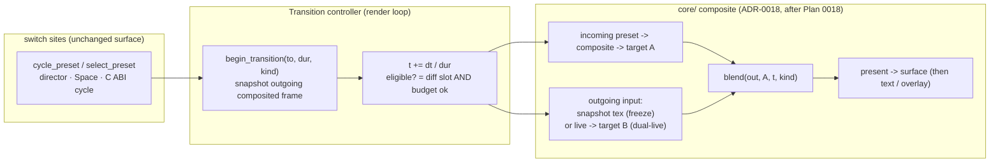

# 0023 — Cross-preset visual transitions: MilkDrop-style dissolves between presets

> **Status:** draft
> **Created:** 2026-07-23
> **Owner skill(s):** dev
> **Related ADRs:** [0024-cross-preset-transitions](../adrs/0024-cross-preset-transitions.md); builds on [ADR-0018](../adrs/0018-engine-wide-scene-compositing.md) (engine composite: offscreen target + present pass, scenes stop clearing) and Plan 0014 ([ADR-0012](../adrs/0012-stateful-feedback-render-system.md) `PingPongField` + [ADR-0013](../adrs/0013-c-abi-v4-render-dt.md) injected `dt`); realizes the "cross-preset blending" follow-up deferred by [Plan 0003](done/0003-generative-scenes-and-presets.md)

## TL;DR

Replace the instant preset **cut** with a MilkDrop-style **dissolve**. An engine `Transition`
controller, driven by injected `dt`, blends the outgoing and incoming presets over ~1 second using a
**small library** of blend kinds (crossfade, additive/burn, luma-dissolve, wipe/slide). The outgoing
side is **snapshotted at transition start** (the freeze path and safety net); the incoming side renders
live; **adaptive** logic re-renders the outgoing scene live too — but only when it is a *different*
scene object than the incoming and the frame budget is healthy, otherwise it falls back to the frozen
snapshot. Policy (duration, kind) is **engine-configured in code**; preset-declared transitions are a
follow-up. **Core-only, C ABI untouched.** First user-visible behavior: press Space and watch one
preset dissolve into the next instead of hard-cutting (Phase 1).

## Context & problem

Preset switching is an instant index bump (`Roster.active` in `render/mod.rs`), so the app reads as a
slideshow. The user asked for MilkDrop's continuous feel, where presets dissolve into one another. A
dissolve needs **two composited frames in one frame** plus a stage that mixes them by a factor `t` —
neither of which exists today (one live scene, drawn straight to the swapchain).

The interview settled the shape (see [ADR-0024](../adrs/0024-cross-preset-transitions.md)):

- **A small transition library**, not just one crossfade — so the blend stage must **sample both
  inputs** (an alpha lerp is out; the additive line/particle families won't composite correctly).
- **Adaptive** fidelity — dual-live when affordable, freeze otherwise — to protect the 60 fps @ 1080p
  iGPU floor (NFR §1) against the heavy stateful families (attractor, reaction-diffusion).
- **Core-level**, so both frontends get it with the C ABI untouched.
- **Built on Plan 0018's composite** (offscreen target + present pass + `Clear`->`Load` scenes),
  reusing that backbone rather than duplicating it.

## Decision

Append a **two-input blend stage** to the Plan 0018 composite and add a transition controller in the
render loop. The outgoing input is a **snapshot** taken at `begin_transition`; the incoming preset
renders live through the composite; a blend shader mixes them by `t` (advanced on injected `dt`) and a
`TransitionKind`. **Adaptive dual-live** re-renders the outgoing scene live *only* when it is a
different scene object than the incoming **and** the smoothed frame time (Plan 0011 `FrameStats`) is
under budget; else the snapshot is used. Policy lives in engine code. Full rationale and the rejected
alternatives (single-target alpha, always-dual-live, always-freeze, a `TransitionScene` wrapper,
preset-declared-now) are in ADR-0024.

## Architecture diagram

## Implementation phases

Each phase is one commit with a clear done-when. Phase 1 is a walking skeleton — an end-to-end visible
dissolve on the simplest path — not plumbing.

### Phase 1 — Walking skeleton: transition controller + frozen crossfade on the cycle path
**Owner skill:** dev
**Area:** core

Add a `Transition` state to the `Renderer` (`{ to_index, t, dur, kind, outgoing_tex }`). Route
`cycle_preset` through a new `begin_transition(to_index, dur, Crossfade)` instead of the instant swap:
on start, capture the current composited frame into `outgoing_tex` (reuse the Plan 0018 present/capture
machinery); set `Roster.active` to the incoming preset so the composite renders it live into the engine
target. Each frame while a transition is active, run a **crossfade** blend of `outgoing_tex` and the
engine target by `t`, present the result, and advance `t += dt / dur`; when `t >= 1`, finalize (drop the
snapshot, resume normal single-target present). Freeze-only, one kind, one switch path.

**Done when:** pressing Space (or `cycle_preset`) dissolves the current preset into the next over the
configured duration instead of hard-cutting; a headless `shot --signal` filmstrip across the transition
window shows intermediate **blended** frames (not a single-frame jump), and metrics confirm the mid-frame
differs from both endpoints; `t` advances purely from injected `dt` (no wall-clock), so a capture is
reproducible.

### Phase 2 — The transition library (blend kinds)
**Owner skill:** dev
**Area:** core

Introduce `TransitionKind { Crossfade, AddBurn, LumaDissolve, Wipe }` and the blend-shader variants
(one pipeline with a kind + `t` uniform, or one pipeline per kind — dev's call). Each kind **samples
both textures** so the additive families blend without alpha artifacts. Wire an engine-default policy
in code: a default duration and a default kind (or a deterministic rotation over the library) chosen at
`begin_transition`. Keep the choice in one place so it is trivially tunable.

**Done when:** each kind renders a correct dissolve in a `shot` filmstrip (crossfade = linear mix;
wipe = a moving boundary; luma-dissolve = brightness-ordered reveal; add/burn = additive mix); a
fragment-field <-> line-scene transition (additive family) shows no alpha/color corruption at mid-blend;
switching the default kind in code changes every transition with no other edit.

### Phase 3 — Adaptive dual-live upgrade + budget governor
**Owner skill:** dev
**Area:** core

When the outgoing and incoming presets resolve to **different scene objects** *and* the smoothed frame
time (Plan 0011 `FrameStats`/`Diag`) is under a budget threshold, re-render the **outgoing** scene live
into a second target each transition frame and blend two **live** composited frames; otherwise use the
frozen snapshot. Same-slot transitions (one shared scene object) always freeze. If the budget is blown
mid-transition, latch to the snapshot for the remainder (no per-frame flicker between modes). Allocate
the second target (or generalize the Plan 0018 target into a reusable pair).

**Done when:** a light, different-slot transition (e.g. two fragment presets on different slots, or a
line scene <-> fragment) shows **both** visuals live-animating through the dissolve; a forced-heavy case
(attractor <-> reaction-diffusion) exercises the freeze fallback and holds the frame budget on the dev
box (the low-end iGPU 60 fps confirmation is the standing on-device carry-forward,
`docs/on-device-validation.md`); a same-slot transition is verifiably freeze (asserted via the mode the
controller selects), never attempting a double live render of one object.

### Phase 4 — All switch paths, re-entrancy, tests, and docs
**Owner skill:** dev
**Area:** core

Route the remaining switch sites through the controller: `select_preset` / `select_preset_by_name`, the
`director` auto-rotate (Plan 0009), and the C ABI `lmv_cycle_scene` — each starting a transition (with a
defined instant-cut escape if a specific path should stay a hard cut, e.g. leave that a code constant).
Define re-entrancy: a switch arriving mid-transition **snap-finishes** the current one to its target then
starts the new one (simplest correct rule); a `set_presets` hot-reload or a browse-overlay select that
invalidates the in-flight target cancels cleanly to the resolved active index. Add core tests and refresh
docs.

**Done when:** every switch path dissolves (not just cycle); a mid-transition switch lands on the final
requested index with no stuck blend; hot-reload during a transition does not panic or leave a dangling
snapshot; core tests cover the controller as a pure-ish unit — `t` progresses deterministically over a
sequence of `dt`s, finalize lands **exactly** on the target index, same-slot forces freeze, and the
budget governor selects freeze when fed an over-budget frame time; `docs/` (a short "Transitions" note,
plus any composite-diagram touch-up) reflects the new stage. `cargo test -p lmv-core`, `clippy -D
warnings`, and the `hygiene` panic-pragma guard (any new hot-path `render/` file included) are green.

## Risks & open questions

- **Hard dependency on Plan 0018.** This plan assumes 0018 has landed its offscreen target, present
  pass, and the `Clear`->`Load` scene migration. If 0018's landed target shape differs from its ADR
  sketch, **trust the code over the plan** and adapt Phase 1's snapshot/target reuse to what exists.
  Do not start this before 0018 closes.
- **Blend granularity vs. the composite.** The blend should mix **fully-composited per-preset frames**
  (each preset's own background/view/trails/kaleidoscope), so the exact insertion point is *after* each
  composite and *before* present. Confirm this against 0018's landed pass order; a kaleidoscope or trail
  stage that assumes it is last may need the blend to sit outside it.
- **Stateful incoming hitch.** A lazily-built stateful scene (reaction-diffusion, attractor) builds its
  GPU resources on first render — now at the dissolve's opening frame. Consider pre-warming on
  `begin_transition`; if deferred, note the one-time hitch as a known limitation.
- **Trail-field ownership across a transition.** In dual-live, each side needs its own feedback field;
  on finalize the incoming field must become *the* field. Verify no field is leaked or shared across the
  two sides mid-blend.
- **Budget threshold tuning.** The dual-live/freeze cutover threshold is a magic number; keep it a named
  code constant for on-rig calibration (like the director dwell constants), and log the selected mode
  under the diagnostics overlay if cheap.
- **Interaction with Plan 0016 (attractor).** The compute-particle attractor is the heaviest scene and
  the primary freeze-fallback trigger; if 0016 has not landed, the heavy-case done-when uses
  reaction-diffusion alone.

## What this plan does NOT do

- **No preset-declared transitions.** The `[transition]` TOML table (per-preset kind/duration) is a
  deliberate follow-up (ADR-0024 Alternative E); v1 policy is engine-configured in code.
- **No beat-quantized transitions.** Firing/finishing a dissolve on a downbeat or bar is out of scope;
  transitions run on a wall-clock-free `dt` timer, not the beat/bar analysis.
- **No new C ABI surface or `Scene`-trait method.** Transitions run inside the render loop off the
  existing switch calls; the plugin gets dissolves through the unchanged `lmv_render_dt`.
- **No new dependency.** Blend shaders and the controller are hand-written; the snapshot reuses the
  Plan 0018 present/capture machinery.
- **No MIDI/UI to pick transitions.** Selection is code policy; exposing it to the operator is later work.
