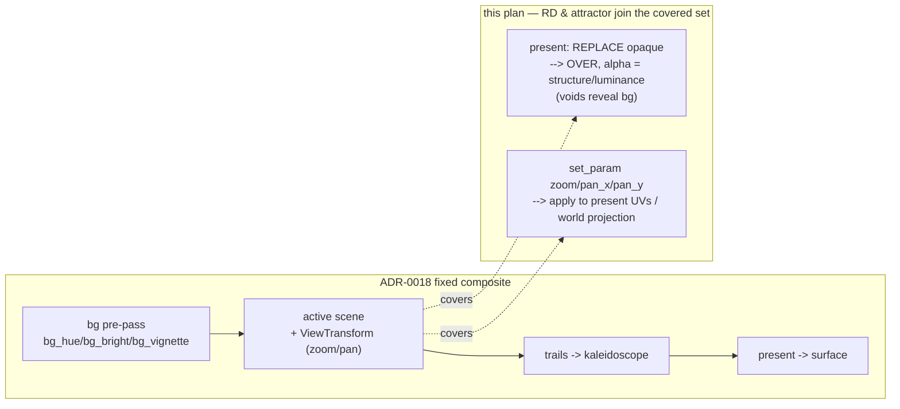

# 0025 — Full composite coverage: background + view transform for reaction-diffusion and attractor

> **Status:** approved
> **Created:** 2026-07-24
> **Owner skill(s):** dev
> **Related ADRs:** [0026-full-composite-coverage-fullscreen-scenes](../adrs/0026-full-composite-coverage-fullscreen-scenes.md); extends [ADR-0018](../adrs/0018-engine-wide-scene-compositing.md) (engine composite) and touches the same present shaders as [ADR-0021](../adrs/0021-shared-palette-system.md) / Plan 0020

## TL;DR

Two of ADR-0018's five composite levers — the **background pre-pass** (`bg_*`) and the **view
transform** (`zoom`/`pan_*`) — silently do nothing on the two fullscreen/accumulating scenes,
`reaction_diffusion` and `attractor`, because both present **opaque** (overwriting the backdrop) and
neither wired up the view params. This plan closes that: switch both scenes' **final present** to an
**alpha-blend over the backdrop** (scene structure drives alpha, so voids/empty space reveal the
`bg_*` gradient), and have both accept `zoom`/`pan_*` via `set_param` and apply them in their own space
— exactly as `fragment_field` already does. No `Scene`-trait change, no C ABI change. `mirror_*` stays
line-only by design (ADR-0018) and is out of scope. First visible behavior: a coral preset with
`bg_bright` set shows the atmosphere gradient in its black voids (Phase 1).

## Context & problem

ADR-0018 promised engine-wide compositing, but coverage is uneven (design-backlog entry 0001, from the
`preset-author` lane authoring the coral "Chthonic Coral Oracle"):

- **View transform** is delivered *through named params*: each scene reads `zoom`/`pan_x`/`pan_y` in
  `set_param` and applies the transform in its own sample/particle space. `fragment_field`, `swarm`,
  and the line scenes do this; `reaction_diffusion` and `attractor` never did, so those params hit the
  `_ => {}` arm and vanish (no `deny_unknown_fields`).
- **Background** draws first (`render/background.rs`), but `reaction_diffusion.rs`'s present returns
  `vec4(out_col, 1.0)` with `BlendState::REPLACE`, and the attractor's final surface present is
  likewise opaque `vec4(c, 1.0)`. A fullscreen opaque present overwrites the backdrop, so `bg_*` can
  never show behind these scenes — worst on coral, whose look is mostly dark voids.

`trails` and the screen-space kaleidoscope already work on both scenes (scene-agnostic post-passes), so
the gap is exactly *background* + *view transform* on these two scenes. ADR-0026 decides the fix:
composite over the backdrop (same mechanism as the other scenes), full-audit scope (both scenes).

## Decision

Per ADR-0026: extend the ADR-0018 composite to cover both fullscreen scenes using the **existing**
delivery mechanisms — alpha-present over the backdrop for `bg_*`, and named-param `set_param` for the
view transform. No new seam; the `Scene` trait and C ABI are untouched. Default backdrop is dark, so a
preset binding no `bg_*` stays visually ~unchanged (alpha present over black ≈ old opaque black) —
verified by re-blessing goldens deliberately, not silently.

## Architecture diagram



## Implementation phases

Ordered so the highest-value, most-visible change (coral background) lands first as the walking
skeleton, then view transform, then the attractor mirror of both, then the re-bless + docs. `dev` runs
all phases in one session; the architect reviews once at the end.

### Phase 1 — Reaction-diffusion background compositing (walking skeleton)
- **Owner skill:** dev
- **Area:** core
- **What:** Change the reaction-diffusion **present** pass from opaque `REPLACE` to an alpha-blend
  `OVER` with `LoadOp::Load`: the fragment emits `vec4(out_col, alpha)` where `alpha` is driven by the
  scene's own `structure` term (V-field presence), so flat V≈0 voids are transparent and the `bg_*`
  backdrop shows through. The scene's internal seed/sim clears are untouched — only the surface present
  changes.
- **Files touched:** `core/src/render/scenes/reaction_diffusion.rs` (present shader alpha + pipeline
  `blend`), any golden fixtures for RD.
- **Done when:** a reaction-diffusion preset with `bg_bright > 0` (e.g. the coral preset) shows the
  tintable gradient in its dark voids in a `shot` capture; a preset binding no `bg_*` renders
  essentially as before over the dark default backdrop; RD goldens re-blessed with the reviewed diff.
  A differential capture asserts a void pixel equals the backdrop tint when `bg_bright` is raised.

### Phase 2 — Reaction-diffusion view transform (zoom/pan)
- **Owner skill:** dev
- **Area:** core
- **What:** Accept `zoom`/`pan_x`/`pan_y` in the RD scene's `set_param` (into scene fields, reset in
  `reset_params`) and apply them to the **present pass sample UVs** (scale about centre, then offset) —
  the same shape `fragment_field` uses for its field-space zoom/pan.
- **Files touched:** `core/src/render/scenes/reaction_diffusion.rs` (params + present uniform + UV
  transform in the present shader).
- **Done when:** binding `zoom = 1 + bass` visibly zooms the coral in/out and `pan_*` slides it (a
  `shot` before/after differs in coverage); geometry stays a pure function of the params (no wall-clock,
  determinism held); no regression to the existing RD reactivity/goldens beyond the intended transform.

### Phase 3 — Attractor background compositing
- **Owner skill:** dev
- **Area:** core
- **What:** Apply the Phase-1 treatment to the attractor's **final surface present**: alpha from the
  accumulated luminance so empty space is transparent and reveals the backdrop. Leave the attractor's
  internal accumulation `Clear(BLACK)`/decay passes as-is; only the present to the engine target
  changes to `OVER` + `Load`.
- **Files touched:** `core/src/render/scenes/particles/mod.rs` (final present shader alpha + pipeline
  blend), attractor golden fixtures.
- **Done when:** an attractor preset with `bg_bright > 0` shows the backdrop in its negative space; a
  no-`bg_*` preset renders ~unchanged over the dark default; attractor goldens re-blessed. Differential
  capture asserts empty-space pixels equal the backdrop tint when `bg_bright` is raised.

### Phase 4 — Attractor view transform (zoom/pan)
- **Owner skill:** dev
- **Area:** core
- **What:** Accept `zoom`/`pan_*` in the attractor's `set_param` and fold them into its world
  projection (the `world.x / aspect` mapping in the point vertex shader), so zoom/pan move the whole
  attractor.
- **Files touched:** `core/src/render/scenes/particles/mod.rs` (params + projection uniform + vertex
  transform).
- **Done when:** `zoom`/`pan_*` visibly move an attractor preset (a `shot` before/after differs); the
  compute/accumulation path and its determinism are unaffected.

### Phase 5 — Re-bless, preset touch-ups, and authoring note
- **Owner skill:** dev
- **Area:** core
- **What:** Confirm the full golden re-bless for both scenes is intentional and reviewed; spot-check and
  (if needed) re-author the shipped reaction-diffusion coral trio and any attractor presets so they read
  well over the new alpha present; update `presets/README.md` to state that `bg_*` and `zoom`/`pan_*`
  now apply to **all** colored scenes (removing any "line/fragment/swarm only" implication).
- **Files touched:** `presets/*.toml` (as needed), `presets/README.md`, golden fixtures (final bless).
- **Done when:** `shot --all` shows every colored scene honoring `bg_*` and `zoom`/`pan_*`; the shipped
  set loads and cycles; the authoring note is cross-checked against the scenes' `set_param` and the
  present blend.

## Data shapes

```rust
// illustrative — not the final interface

// RD/attractor present: alpha now carries scene presence so voids reveal the backdrop.
//   return vec4<f32>(out_col, structure_alpha);   // was vec4(out_col, 1.0)
// pipeline blend: BlendState::REPLACE -> ALPHA_BLENDING (OVER), LoadOp::Clear -> Load on the present.

// View transform arrives through the existing named-param path (no Scene-trait change):
//   fn set_param(&mut self, name, value) { match name {
//       "zoom"  => self.zoom  = value,
//       "pan_x" => self.pan_x = value,
//       "pan_y" => self.pan_y = value,
//       ... } }
//   present-shader UV:  p = (uv - 0.5) * zoom + 0.5 + pan;   // RD, mirrors fragment_field
```

## Risks & open questions

- **Golden re-bless scope (NFR §6).** Both scenes' captures shift. The re-bless must be a reviewed,
  intentional diff — the risk is masking an unrelated regression inside a large image change. Bless in
  its own commit with the before/after called out.
- **Alpha term correctness.** A wrong `structure`/luminance→alpha mapping reads as a washed-out or
  punched-through scene. Guard with the differential void-pixel assertion in Phases 1/3.
- **Passthrough/blend cost vs the iGPU floor (NFR §1).** Alpha-blended present is marginally more work;
  verify the 60 fps @ 1080p floor on the test box (carry-forward hardware check).
- **Ordering vs Plan 0020 (shared palette).** Both edit the RD/attractor present shaders. If 0020 lands
  first, the alpha change rides on the LUT-colored output; if this lands first, 0020 rebases onto the
  alpha present. Coordinate at implementation time; not a hard dependency.
- **Default backdrop brightness.** The "shipped presets look ~unchanged" claim depends on the default
  `bg_bright` being low/dark. Confirm the `background.rs` default; if it is not dark, either the claim
  or the default needs adjusting (flag in Phase 1).

## What this plan does NOT do

- **No geometry mirror on fullscreen scenes.** `mirror_*` stays line-only (ADR-0018); the kaleidoscope
  already provides fullscreen symmetry.
- **No new `Scene` method / no C ABI change.** View transform stays a named-param concern; background
  stays the existing pre-pass. Both seams keep their ADR-0018 shape.
- **No new composite stage or reordering.** This fills coverage gaps in the existing fixed order; it
  does not add passes or make the order data-driven.
- **No palette/color work** — that is Plan 0020 / ADR-0021; this plan only changes opacity and view,
  colored output unchanged apart from the void reveal.

## Followups (after this lands)
- Consider whether the attractor and RD should also expose the reserved `ViewTransform` **rotate** axis
  (ADR-0018 reserves it) once any scene wants it.
- Revisit whether `bg_*` deserves a per-scene "backdrop influence" scalar if authors want partial reveal
  rather than full transparency in voids.
