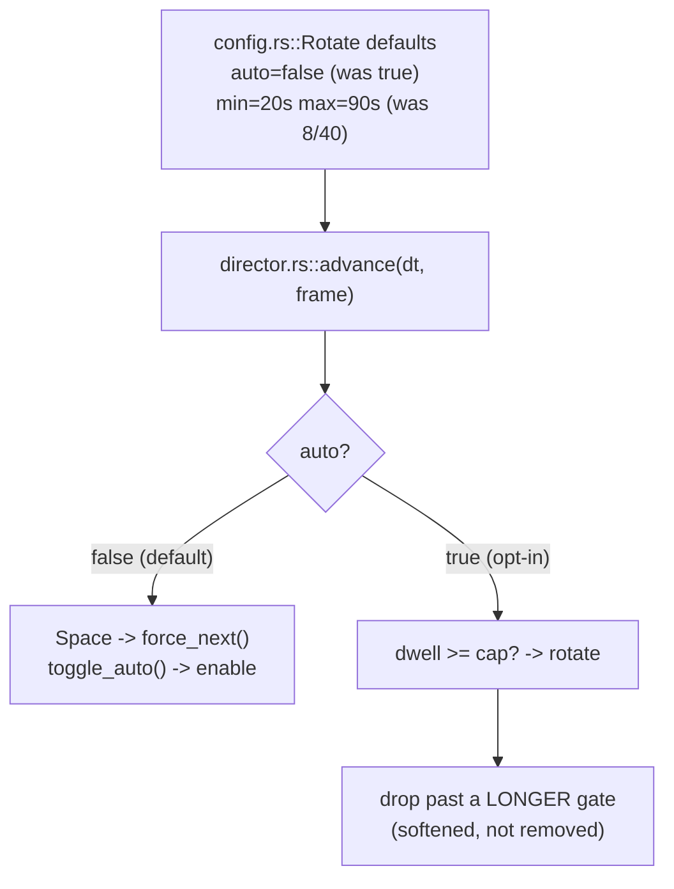

# 0026 — Calmer scene rotation: hold one scene by default, longer dwell, softened drop bias

> **Status:** in-progress
> **Created:** 2026-07-24
> **Owner skill(s):** dev
> **Related ADRs:** [0027-scene-rotation-constant-default-calmer-cadence](../adrs/0027-scene-rotation-constant-default-calmer-cadence.md); revises defaults from [Plan 0009](done/0009-live-performance-features.md)

## TL;DR

The standalone auto-rotate **Director** (Plan 0009) ships defaulting to `auto = true` with an 8 s min /
40 s max dwell and an energy-drop bias that fires a rotation at the *min* dwell — so in dynamic music
scenes change roughly every 8 s. The user wants the opposite default: **hold one scene** out of the
box, and, when rotation is turned on, a **calm, mostly-predictable** cadence rather than a frantic one.
This plan flips `auto` to `false`, lengthens the default dwell to **20 s / 90 s**, and **softens (does
not remove) the drop bias** so a drop can only rotate early well past the longer min dwell. Standalone
only — `director.rs` + `config.rs`; core, DSP, and the C ABI are untouched. First visible behavior:
launch with no config and the scene **stays** until you press `Space` or toggle auto (Phase 1).

## Context & problem

`standalone/src/director.rs` (Plan 0009) is a deterministic auto-rotate state machine — pure function
of injected `dt` + `AnalysisFrame` — with drop bias, novelty nudge, manual `Space` override, and a
`toggle_auto` hotkey. Its `config.rs::Rotate` defaults are `auto = true`, `min_dwell_secs = 8`,
`max_dwell_secs = 40`, `track_change = true`.

Those encode Plan 0009's "unattended lively stage show" stance. The user's actual need is the reverse:
a **constant scene by default**. And "too fast" is not only `min_dwell` — the drop bias resets the
dwell and rotates as soon as energy falls 35% below the smoothed baseline *past the min dwell*, and real
music dips constantly, so the effective cadence is ~8 s, not 40 s. The novelty nudge shortens it
further. ADR-0027 decides: hold-by-default, longer dwell, softened (not removed) drop bias.

Every `Rotate` field is `#[serde(default)]`, so an existing user's pinned `config.toml` keeps its
current behavior; only a fresh install picks up the new defaults.

## Decision

Per ADR-0027: flip the default state to manual-hold, lengthen the dwell, and gate the drop bias behind a
larger floor so it can no longer flip scenes every few seconds — keeping the director's mechanism
(deterministic clock, drop/novelty triggers, manual override) unchanged in shape. Standalone-only.

## Architecture diagram



## Implementation phases

Two code phases plus a docs pass. `dev` runs all in one session; the architect reviews once at the end.

### Phase 1 — Hold one scene by default (walking skeleton)
- **Owner skill:** dev
- **Area:** standalone
- **What:** Flip `config.rs::Rotate::default().auto` from `true` to `false`. Confirm manual `Space`
  (`force_next`) and the `toggle_auto` hotkey both still work with auto off (they already do — the
  director's `force_next`/`toggle_auto` are auto-independent; this phase verifies and locks it with a
  test). Update the `auto` field doc-comment to say the default is manual-hold.
- **Files touched:** `standalone/src/config.rs` (default), `standalone/src/director.rs` (a test that a
  from-default director never auto-rotates but `force_next`/`toggle_auto` still fire).
- **Done when:** launching with no `config.toml` holds a single scene indefinitely; `Space` advances and
  the auto-toggle hotkey enables rotation live; a director unit test asserts `from_config(default)` never
  returns an auto `Rotation` over a long run yet `force_next()` returns `Manual` and `toggle_auto()`
  enables it. Existing `director.rs` tests stay green (they construct explicit configs, unaffected).

### Phase 2 — Longer dwell + softened drop bias
- **Owner skill:** dev
- **Area:** standalone
- **What:** Raise the default dwell to `min_dwell_secs = 20`, `max_dwell_secs = 90`. Soften the drop
  trigger so it can only fire *well past* the longer min dwell — gate it behind a larger elapsed floor
  (e.g. the drop bias is only considered after a fraction of the min→max span, or a fixed longer guard),
  keeping the novelty nudge but on the same longer dwell. Tune the constants so a steady passage rotates
  at ~90 s and a genuine section drop lands a change but never every few seconds.
- **Files touched:** `standalone/src/config.rs` (dwell defaults), `standalone/src/director.rs` (drop-gate
  constant + the `advance` gate, plus tests).
- **Done when:** with auto on and the new defaults, a steady high-energy passage holds to the ~90 s cap;
  a single sharp drop past the (longer) gate still rotates early (a test asserts `AutoDrop`); but a
  drop shortly after a rotation is held (a test asserts the softened gate prevents rapid re-fire). The
  existing drop/novelty/min-dwell tests are updated to the new constants and pass.

### Phase 3 — Operator docs
- **Owner skill:** dev
- **Area:** standalone
- **What:** Document the new defaults where the operator config is described (the `config.rs` module doc
  and any operator-facing note that lists `[rotate]`): default is hold-one-scene; how to enable
  auto-rotate (hotkey or `auto = true`); the new 20/90 dwell and that drops still nudge early.
- **Files touched:** `standalone/src/config.rs` (module/field docs), any operator doc that enumerates
  `[rotate]` (cross-check before editing — do not invent a doc that isn't there).
- **Done when:** the `[rotate]` documentation states the hold-by-default behavior, the opt-in path, and
  the new cadence, cross-checked against `config.rs` defaults and `director.rs`.

## Data shapes

```rust
// illustrative — not the final interface

impl Default for Rotate {
    fn default() -> Self {
        Self {
            auto: false,          // was true — hold one scene by default (ADR-0027)
            min_dwell_secs: 20,   // was 8
            max_dwell_secs: 90,   // was 40
            track_change: true,   // novelty nudge stays, on the longer dwell
        }
    }
}

// director.rs: drop bias gated behind a longer elapsed floor so it can't rapid-fire.
//   let drop_ok = self.dwell >= DROP_GATE_SECS;   // new, > min_dwell fraction
//   if drop_ok && dropped { self.dwell = 0.0; return Some(Rotation::AutoDrop); }
```

## Risks & open questions

- **The 20/90 defaults and the drop gate are judgment calls.** Real calibration is on-device (same
  posture as Plan 0009's on-rig soak). Ship reasonable values; expect one tuning pass after live use.
- **Existing users vs new defaults.** `#[serde(default)]` means a user who already has a `config.toml`
  keeps their values — the new defaults only reach fresh installs. Intended, but worth a line in the
  docs so an existing user knows why their behavior didn't change.
- **Don't over-gate the drop.** If the softened gate is too aggressive, drops never fire and rotation is
  effectively timer-only (Alternative B, which ADR-0027 rejected). The Phase 2 tests must assert a real
  drop *does* still rotate early past the gate.

## What this plan does NOT do

- **No core / DSP / C ABI change.** The director is a standalone-shell policy; the engine is untouched.
- **No new rotation triggers or director redesign.** Same mechanism (drop bias, novelty nudge, manual
  override, deterministic `dt` clock) — only defaults and one gate constant move.
- **No settings UI.** Enabling auto-rotate stays the existing hotkey + `config.toml`; the full
  settings-persistence UX remains a separate roadmap item.
- **It does not remove the hands-off show.** Auto-rotate is one hotkey/config line away; only the default
  flips.

## Followups (after this lands)
- On-device tuning pass for the 20/90 dwell and the drop gate during the next live soak.
- If users want it, a scene **lock** indicator / on-screen state so it's clear whether rotation is on.
