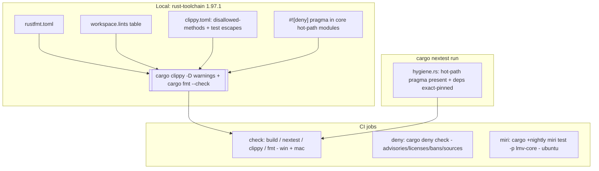

# Plan 0002 — Rust enforcement tooling

> **Status:** done (2026-07-21) — Phases 0-4 implemented and passed the Mode 4 review (no
> blockers). Verified locally: `cargo fmt --check`, `cargo clippy --all-targets -D warnings`,
> both `tests/hygiene.rs` guards, and `cargo deny check` all green; the panic pragma is present
> in all 7 core hot-path files with reasoned, provably-in-bounds `indexing_slicing` escapes, and
> no production hot-path `unwrap`/`expect`/`panic` exists (test-only unwraps sit under
> `#[cfg(test)]`). **Phase 5 (Miri CI job) is DEFERRED — NOT run in CI.** `lmv-core`'s lib pulls
> the whole wgpu/naga graph, making a full-crate Miri job impractical (>10 min); dev confirmed
> `cargo +nightly miri test -p lmv-core --lib` is UB-clean locally (all 5 ring tests incl. the
> cross-thread SPSC case, 95 s), so the unsafe ring is verified — only the CI automation is
> carried forward. Follow-up (architect-scoped): extract the lock-free ring into a wgpu-free
> module/crate Miri can check in isolation, then add the Miri job against it (weigh against the
> "every crate is a cost" rule). See the plans README. Note: the mermaid diagram below still
> shows the intended `miri` CI job — kept as the design of record; it was deferred, not shipped.
> **Created:** 2026-07-21
> **Owner skill(s):** dev
> **Related ADRs:** [ADR-0001](../../adrs/0001-rust-core-wgpu-cabi-foobar-shim.md) (the layering
> this tooling defends), [ADR-0002](../../adrs/0002-layered-preset-architecture.md) (the thin Scene
> trait these gates keep thin)

## TL;DR

Turn the project's written best-practice rules into automatic, CI-enforced gates so a violation
fails a build instead of waiting for a human reviewer to spot it. This lands the machinery —
format config, a workspace lints baseline, hot-path panic-denial, determinism bans, exact-pin +
hot-path guard tests, `cargo-deny` supply-chain checks, `nextest`, and a Miri UB job — before
Plan 0001's Phase 2 introduces the first `unsafe` (the lock-free ring) and the first real
dependencies. After this plan, "the audio callback never panics", "core has no wall-clock reads",
"direct deps are exact-pinned", and "unsafe is UB-checked" are checks, not conventions.

## Context & problem

Plan 0001 is mid-flight (Phases 0–1 landed: workspace scaffold + CI). CI today runs `cargo build`,
`cargo test`, `cargo clippy --all-targets -D warnings`, and `cargo fmt --all --check` — a solid
baseline, but it only enforces *default* clippy. Every rule that actually distinguishes this
codebase is invisible to it:

- Panic lints (`unwrap_used`, `expect_used`, `indexing_slicing`, `panic`) are allow-by-default —
  a per-frame `unwrap()` sails through CI.
- Nothing stops a wall-clock read or unseeded RNG landing in `core/`'s DSP (determinism rule).
- Nothing stops `winit`/`windows`/foobar deps or a caret version range entering `core/Cargo.toml`.
- Phase 2 (SPSC ring) and Phase 6 (C ABI) are about to introduce `unsafe` with no UB checker.

These rules live in `CLAUDE.md` ("Cross-cutting non-negotiables") and
`.claude/skills/architect/references/best-practices.md`, enforced only by the once-per-plan Mode 4
review. The problem is timing and reliability: the gates are cheapest to add *before* the unsafe
and dependency-heavy code they govern, and a green CI is a stronger contract than a reviewer's eye.

## Decision

Add mechanical enforcement in dependency order, each phase one commit, keeping every gate **strict
but rational** — deny what is genuinely a defect here, exempt tests and annotated shell-side
escapes so the gates don't fight legitimate code.

Choices settled during the interview, with the rejected alternative for each:

- **Panic lints are scoped to hot-path modules**, via a `#![deny(...)]` pragma at the top of
  `core/src/{dsp,audio,render,ffi}` files — *not* workspace-wide with per-site `#[allow]` escapes.
  Workspace-wide was rejected as too noisy on init/shell code; the residual risk (a new hot module
  forgetting the pragma) is closed by an automatic guard test (Phase 2), not left to memory.
- **Test hygiene is `nextest` + written conventions + review**, *not* a coverage-percentage gate.
  A `cargo-llvm-cov --fail-under` floor was rejected: a number invites gaming and maintenance
  churn without proving the assertions are behavioral. Tautological `assert!(true)` is already
  caught mechanically (`clippy::assertions_on_constants`, on by default under `-D warnings`); the
  rest is the architect's Mode 4 test-reading lens.
- **`cargo-deny` and Miri land now**, not in a later plan — because Phase 2's dependencies and
  `unsafe` are imminent and the gates should predate them.
- **Determinism is enforced by a global `disallowed-methods` list with annotated shell escapes**,
  because clippy config is per-run, not per-module: core reads no wall-clock, and the few
  legitimate reads in the shells carry a grep-able `#[allow(..., reason = "...")]`.

Classic architectural principles (layered/plugin architecture, Law of Demeter, SOLID) resist stock
lints and are enforced by review, not tooling — captured as a new **Mode 4 "Design integrity"
lens** in the architect skill (done alongside this plan, outside the phase list since it edits the
skill, not the codebase).

## Architecture diagram



## Implementation phases

Ordered so Phase 0 is a self-contained green gate (the walking skeleton), each later phase adds one
independent gate. Every gate must leave `cargo build / nextest / clippy -D warnings / fmt --check`
green on the current tree — these run before Plan 0001's DSP/ring code exists, so most gates are
"armed but quiet" until that code lands (by design: the enforcement predates what it governs).

### Phase 0 — Formatting config + workspace lints baseline
- **Owner skill:** dev
- **Area:** repo + core + standalone
- **What:** Add `rustfmt.toml` with **stable options only** (`newline_style = "Unix"` to match
  `.gitattributes` normalization, plus explicit `edition`/`max_width` if desired — no nightly-only
  keys like `imports_granularity`). Add a `[workspace.lints]` table to the root `Cargo.toml`:
  under `rust`, `unsafe_op_in_unsafe_fn = "deny"` and `rust_2018_idioms = "warn"`; under `clippy`,
  the universally-safe set `dbg_macro = "deny"`, `todo = "warn"`, `unimplemented = "warn"`. Add
  `lints.workspace = true` to `core/Cargo.toml` and `standalone/Cargo.toml`. Add
  `#![warn(missing_docs)]` to `core/src/lib.rs` (core is the public-API crate; `-D warnings` makes
  this binding, intentionally — the shared brain's API stays documented).
- **Files touched:** `rustfmt.toml`, `Cargo.toml` (workspace), `core/Cargo.toml`,
  `standalone/Cargo.toml`, `core/src/lib.rs`.
- **Done when:** `cargo fmt --all --check`, `cargo clippy --all-targets -- -D warnings`,
  `cargo build`, `cargo test` are all green; introducing a bare `dbg!(...)` anywhere makes clippy
  fail, proving the workspace table is honored (revert the probe before committing).

### Phase 1 — clippy.toml: determinism bans + test-ergonomics escapes
- **Owner skill:** dev
- **Area:** core + repo
- **What:** Add `clippy.toml` (workspace root) with `disallowed-methods` listing wall-clock and
  unseeded-RNG entry points — at minimum `std::time::Instant::now`, `std::time::Instant::elapsed`,
  `std::time::SystemTime::now`, and (once `rand` is a dep) `rand::random` / `rand::thread_rng`.
  Because clippy config is per-run (not per-crate), the ban is global: `core/` must not read the
  clock at all (DSP is pure; scenes receive time/seed from the caller), and the shells' legitimate
  frame-pacing reads carry an annotated `#[allow(clippy::disallowed_methods, reason = "...")]` so
  every clock read in the tree is grep-able. Also set `allow-unwrap-in-tests = true`,
  `allow-expect-in-tests = true`, `allow-panic-in-tests = true` so the Phase-2 hot-path pragma
  never fights `#[cfg(test)]` code.
- **Files touched:** `clippy.toml`.
- **Done when:** clippy is green on the current tree; a probe `std::time::Instant::now()` added
  inside `core/` triggers `clippy::disallowed_methods` (revert the probe before committing).

### Phase 2 — Convention guard tests (hot-path pragma + exact-pin manifests)
- **Owner skill:** dev
- **Area:** core (tests)
- **What:** Add `core/tests/hygiene.rs`, **std-only** (no new dependency — honor "lightweight is a
  feature"), with two checks. **(a) Hot-path pragma presence:** scan the *existing* files under a
  fixed hot-path set (`src/dsp/`, `src/render/`, `src/ffi.rs`, `src/audio.rs`) and assert each
  contains the panic-denial pragma sentinel (`clippy::indexing_slicing`, which co-occurs with
  `unwrap_used`/`expect_used`/`panic` in the required `#![deny(...)]` block). The set is vacuously
  satisfied today (none of those files exist yet) and starts biting the moment Plan 0001 Phase 2+
  creates them — closing the "new hot module forgets the pragma" gap automatically. Define the
  canonical pragma block in a comment at the top of the test so `dev` copies it verbatim. **(b)
  Exact-pin manifests:** parse each workspace member `Cargo.toml`'s `[dependencies]` /
  `[build-dependencies]` and assert every direct dependency that carries a version requirement uses
  an exact `=` pin (skip `path`/`workspace` deps that have no version string). Line-based parsing is
  sufficient — the manifests are simple and dev-controlled.
- **Files touched:** `core/tests/hygiene.rs`.
- **Done when:** `cargo nextest run` passes; dropping the `=` from any direct dep's version fails
  check (b); adding a stub `core/src/audio.rs` without the pragma fails check (a) (revert probes
  before committing).

### Phase 3 — cargo-deny supply-chain gate
- **Owner skill:** dev
- **Area:** repo
- **What:** Add `deny.toml` (v2 schema) and a `deny` CI job. Configure: **advisories** — RUSTSEC
  vulnerabilities `deny`, unmaintained `warn`, yanked `deny`; **licenses** — an explicit allowlist
  starting `["MIT", "Apache-2.0", "Apache-2.0 WITH LLVM-exception", "Unicode-3.0",
  "Unicode-DFS-2016", "BSD-2-Clause", "BSD-3-Clause", "ISC", "Zlib"]`, extended by `dev` as real
  deps appear (a copyleft/unknown license surfacing is a deliberate review moment, not a silent
  pass); **bans** — `wildcard-dependencies = "deny"`, `multiple-versions = "warn"`; **sources** —
  `unknown-registry = "deny"`, allowing only `crates.io`. The CI job installs `cargo-deny` (via
  `taiki-e/install-action@cargo-deny`) and runs `cargo deny check`.
- **Files touched:** `deny.toml`, `.github/workflows/ci.yml` (new `deny` job).
- **Done when:** `cargo deny check` is green locally and as a CI job; the license allowlist covers
  the current (near-empty) tree with no `unlicensed`/`rejected` findings.

### Phase 4 — nextest + doctests in CI
- **Owner skill:** dev
- **Area:** repo
- **What:** Replace `cargo test` in the `check` job with `cargo nextest run` (installed via
  `taiki-e/install-action@nextest`) for clearer output, parallelism, and per-test isolation, and
  add a separate `cargo test --doc` step (nextest does not run doctests). Keep the Windows + macOS
  matrix.
- **Files touched:** `.github/workflows/ci.yml`.
- **Done when:** CI runs `cargo nextest run` and `cargo test --doc` on both runners, green.

### Phase 5 — Miri UB job
- **Owner skill:** dev
- **Area:** repo
- **What:** Add a `miri` CI job on `ubuntu-latest` (Miri validates platform-independent `unsafe` —
  the ring buffer and DSP are pure Rust, so the cheapest runner is correct; the OS matrix is
  irrelevant here). Install nightly + the `miri` component (`rustup toolchain install nightly
  --component miri`) and run `cargo +nightly miri test -p lmv-core`. Scope to `lmv-core` only —
  Miri cannot execute the C smoke program (foreign functions), so the C ABI's *C side* is out of
  scope (covered by the Phase-6 smoke test in Plan 0001); Miri does cover the Rust side of the
  ring/FFI pointer handling. Today this runs core's (near-empty) test set fast; it becomes the
  primary defense the moment Plan 0001's lock-free ring lands. Note any Miri-incompatible core
  dependency as a follow-up if one appears.
- **Files touched:** `.github/workflows/ci.yml` (new `miri` job).
- **Done when:** the `miri` job is green in CI; `cargo +nightly miri test -p lmv-core` runs the
  core test suite under Miri with no UB reported.

## Data shapes

No runtime types. The one authored artifact worth pinning is the canonical hot-path pragma block
(Phase 2 embeds this verbatim as the sentinel `dev` copies into each new hot-path module):

```rust
// illustrative — the required header for core hot-path modules (dsp / audio / render / ffi)
#![deny(
    clippy::unwrap_used,
    clippy::expect_used,
    clippy::indexing_slicing,
    clippy::panic,
    clippy::unreachable,
)]
```

## Risks & open questions

- **Global determinism ban vs. legitimate shell clock reads.** `clippy.toml` is per-run, so the
  wall-clock ban hits `standalone/` too. Mitigation is the annotated `#[allow(..., reason)]` at
  each real read (Phase 1) — strict but visible. If the shells accumulate many such reads, revisit
  whether a wrapper module (one allow, one place) reads better than scattered site allows.
- **Hot-path guard is presence-only.** The Phase-2 test checks the pragma *string* is present, not
  that a module which *should* be hot-path is in the scanned set. A genuinely new hot-path
  directory (say `core/src/analysis/`) added by a future plan must be added to the test's set — a
  Mode 4 review item, called out in the new Design-integrity lens.
- **Miri coverage is partial.** It cannot cross the C FFI boundary and is slow; it guards the Rust
  side of `unsafe` only. The C-side ABI contract still needs the Plan 0001 Phase-6 smoke program
  (and, later, possibly an ASan build). Don't read a green Miri as "the ABI is UB-free".
- **missing_docs under `-D warnings` is binding, not advisory.** Intentional for `core`, but if it
  slows early API churn, dev may temporarily `#[allow(missing_docs)]` a module *with a TODO* rather
  than silently dropping the lint — surface it at review.
- **rustfmt stable-only constraint.** Import-grouping/granularity are nightly-only; this plan does
  not pin them. If consistent import ordering becomes worth enforcing, that is a nightly-rustfmt-
  in-CI decision (ADR-worthy), not a quiet `rustfmt.toml` edit.

## What this plan does NOT do

- **No coverage-percentage gate** (`cargo-llvm-cov --fail-under`) — rejected in the interview;
  hygiene is nextest + conventions + the Mode 4 test-reading lens.
- **No workspace-wide panic-lint denial** — scoped to hot-path modules by choice.
- **No `assert_no_alloc` / custom-allocator runtime guard** on the audio callback. The "no
  allocation in the callback" rule stays a review item for now; a runtime allocator guard is a
  real tradeoff (dev-build overhead, thread-scoping) worth its own ADR if we want it mechanical.
- **No nightly-rustfmt import ordering, no `cargo-machete`/unused-dep pruning, no ASan/TSan build,
  no MSRV job** — candidate follow-ups, not this plan.
- **No edits to production code behavior** — this plan only adds gates, config, and guard tests;
  the sole source touch is `#![warn(missing_docs)]` on `core/src/lib.rs`.
- **No dev-skill change.** The classic-principles enforcement is an architect Mode 4 lens only
  (interview decision); the dev skill is untouched.

## Followups (after this lands)

- Revisit an `assert_no_alloc`-style callback guard as its own ADR once the WASAPI callback exists.
- Add any new hot-path directory to the Phase-2 guard test's scanned set as later plans create them.
- Consider `cargo-machete` (unused deps) and an MSRV-pin job once the dependency tree is non-trivial.
