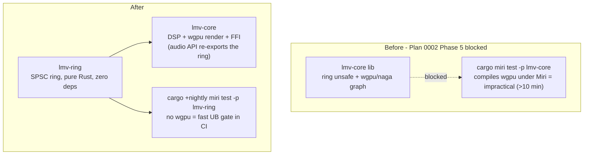

# 0005 — Extract the lock-free ring into a wgpu-free crate for Miri

> **Status:** done (2026-07-21) — landed in `de0fe24` (Phase 1 extraction) and `6af7865`
> (Phase 2 Miri CI job); passed Mode 4 review with no blockers and no majors. The SPSC ring
> now lives in the zero-dep `lmv-ring` crate, re-exported unchanged from `core::audio`, with a
> fast `cargo +nightly miri test -p lmv-ring` UB gate in CI. Behavior-preserving; build,
> nextest, both hygiene guards, clippy `-D warnings`, fmt, and cargo-deny all verified green.
> **Wording correction (from the review):** Phase 1's done-when said "the five ring tests" —
> only the **four** SPSC unit tests move to `lmv-ring`; `format_validation_rejects_out_of_range`
> tests `AudioFormat`, which correctly stays in `core::audio`. The "five" was loose wording
> carried from the 0002 close; the Phase-1 "What" (scoping the move to "their SPSC unit tests")
> is the accurate count.
> **Created:** 2026-07-21
> **Owner skill(s):** dev
> **Related:** [Plan 0002](done/0002-rust-enforcement-tooling.md) — implements its **deferred
> Phase 5** (the Miri UB job); [ADR-0001](../adrs/0001-rust-core-wgpu-cabi-foobar-shim.md) (the
> layering this preserves — `lmv-ring` stays source-agnostic and GPU-free, like the rest of core).

## TL;DR

Plan 0002 deferred its Miri CI job because `lmv-core`'s library pulls the whole wgpu/naga graph,
so `cargo miri test -p lmv-core` must compile that graph under Miri — impractically slow
(>10 min) and mostly irrelevant, since the only platform-independent `unsafe` in the project is
the SPSC ring buffer (today living inside `core/src/audio.rs`). Extract that ring into a small,
dependency-free `lmv-ring` crate, have `lmv-core` depend on it, and point the Miri job at
`lmv-ring` alone. Miri then runs fast against exactly the code it exists to check, and the ring's
UB-cleanliness becomes a CI gate instead of a manual local run.

## Context & problem

Plan 0002's Phase 5 (a `miri` CI job) was deferred, not implemented — recorded in the plan's
close ceremony and the plans README. The blocker is structural, not a scheduling slip:

- `lmv-core` is one crate holding **both** the pure-Rust `unsafe` (the lock-free SPSC ring) **and**
  the wgpu render engine. `cargo miri test -p lmv-core` compiles the entire dependency graph —
  including wgpu, naga, and their transitive weight — under the Miri interpreter, which is
  impractically slow (>10 min) and adds no value: wgpu is safe-abstraction code, not the `unsafe`
  Miri is meant to police.
- Two of core's tests are Miri-incompatible for non-UB reasons anyway: `tests/hygiene.rs` does
  file I/O, and the DSP perf test is timing-based.
- `dev` did confirm locally that `cargo +nightly miri test -p lmv-core --lib` is UB-clean — all
  five ring unit tests, including the cross-thread SPSC test, pass under Miri (~95 s). So **the
  ring is already verified clean**; what is missing is an automated, fast CI gate that stays green
  as the ring (or any future pure-Rust `unsafe`) evolves.

The ring is the one piece of `unsafe` whose correctness genuinely rides on Miri's checking:
manual `head`/`tail` index masking, `UnsafeCell` slot writes, and the acquire/release ordering
that makes the single-producer/single-consumer contract sound. Leaving it behind a
practically-un-runnable Miri command means a future edit to that ordering could introduce UB with
no gate to catch it.

## Decision

**Extract the SPSC ring into a dedicated, dependency-free `lmv-ring` crate**, make `lmv-core`
depend on it (path dependency, re-exported so the public `audio` API is unchanged), and run the
Miri job as `cargo +nightly miri test -p lmv-ring`. `lmv-ring` pulls in no wgpu, so Miri compiles
and runs it in seconds — a real CI gate on exactly the code that needs it.

**Rejected alternative — feature-gate wgpu inside `lmv-core`** so that
`cargo miri test -p lmv-core --no-default-features` skips the render module. Rejected because the
render engine is not feature-gated today; making it optional is invasive (every `use` of the
render/FFI path becomes conditional) and fragile (a stray non-optional `use wgpu` silently drags
the graph back into the Miri build). A crate boundary is a *permanent, structural* guarantee that
Miri never compiles wgpu — the same reason Plan 0003 moved scenes under `render/` rather than
hand-maintaining a guard list. It also gives the ring a clean home for any future pure-Rust
`unsafe` real-time primitive.

Scope note: only the ring moves now — it is the only pure-Rust `unsafe` in the tree. The Rust
side of the C ABI (`core/src/ffi.rs`) also contains `unsafe`, but it is coupled to the renderer
and window handle, so it stays in `lmv-core` and out of this Miri job (its C side is covered by
Plan 0001's Phase-6 smoke program, per ADR-0003). Don't read a green `lmv-ring` Miri run as
"the whole project is UB-free" — it gates the ring, which is what it is scoped to do.

This is an internal workspace refactor for test isolation, not a new external dependency or a C
ABI change, so it does not need its own ADR — the rejected alternative is recorded here. Promote
to an ADR only if `lmv-ring` later grows into a broader real-time-primitives module (a rename +
scope expansion is the ADR-worthy moment).

## Architecture diagram

## Implementation phases

Two phases, one commit each. Phase 1 is the extraction (green tree, behavior-preserving); Phase 2
adds the CI gate the extraction makes practical.

### Phase 1 — Extract `lmv-ring` (behavior-preserving move)

- **Owner skill:** dev
- **Area:** repo + core
- **What:** Create a new workspace member `lmv-ring` (`crate-type` default rlib, **zero
  dependencies**, `publish = false`, `lints.workspace = true`). Move the SPSC ring types out of
  `core/src/audio.rs` — `RingShared`, `SampleProducer`, `SampleConsumer`, and their SPSC unit
  tests — into `lmv-ring`, carrying the canonical panic-denial pragma and the existing reasoned
  `#[allow(clippy::indexing_slicing, reason = "…")]` escapes verbatim. `lmv-core` depends on
  `lmv-ring` by path and **re-exports the moved types from `core::audio`** so the public API and
  the standalone/FFI call sites are unchanged (`audio.rs` keeps `AudioFormat`, boundary
  validation, and the `intake()` constructor — only the ring internals leave). Extend the
  convention guards: add `lmv-ring/Cargo.toml` to `hygiene.rs`'s exact-pin check and add
  `lmv-ring/src` to its hot-path pragma scan (the ring is now the guarded hot-path code in that
  crate). Add `lmv-ring` to the root `Cargo.toml` `members`.
- **Files touched:** `Cargo.toml` (workspace `members`), `lmv-ring/Cargo.toml` (new),
  `lmv-ring/src/lib.rs` (new — the moved ring), `core/Cargo.toml` (path dep on `lmv-ring`),
  `core/src/audio.rs` (ring types removed, re-exported), `core/tests/hygiene.rs` (guard scope).
- **Done when:** `cargo build`, `cargo nextest run`, `cargo clippy --all-targets -- -D warnings`,
  and `cargo fmt --all --check` are all green; the five ring tests now run under `lmv-ring`;
  `cargo test --test hygiene` passes with `lmv-ring` in both guard checks; the standalone and the
  C ABI build unchanged (no call-site edits beyond the re-export). `cargo deny check` stays green
  (the new intra-workspace path dep is accepted under `publish = false` / `allow-wildcard-paths`).

### Phase 2 — Miri UB job against `lmv-ring` (Plan 0002 Phase 5, unblocked)

- **Owner skill:** dev
- **Area:** repo
- **What:** Add the `miri` CI job on `ubuntu-latest` that Plan 0002 deferred: install nightly +
  the `miri` component (`rustup toolchain install nightly --component miri`) and run
  `cargo +nightly miri test -p lmv-ring`. Because `lmv-ring` has no dependencies, this compiles
  and runs in seconds — the fast, always-on UB gate the extraction was for. Update the Plan 0002
  architecture diagram's `miri` node reference is *not* required (0002 is closed); instead this
  plan's close ceremony records that Phase 5's intent is now satisfied here.
- **Files touched:** `.github/workflows/ci.yml` (new `miri` job).
- **Done when:** the `miri` job is green in CI and `cargo +nightly miri test -p lmv-ring` runs the
  ring suite (including the cross-thread SPSC test) under Miri with no UB reported; introducing a
  deliberate aliasing/ordering bug in the ring makes the job fail (revert the probe before
  committing) — proving the gate actually bites.

## Risks & open questions

- **Re-export vs. call-site churn.** If re-exporting the ring from `core::audio` proves awkward
  (e.g. trait or visibility friction), the fallback is to update the handful of call sites in
  `audio.rs`/`ffi.rs`/standalone to `use lmv_ring::…` directly. Either keeps the ring in one
  place; the re-export is preferred only to keep the public surface identical.
- **Cross-crate hygiene guard.** `core/tests/hygiene.rs` already reaches sibling manifests for the
  exact-pin check, so scanning `lmv-ring/src` for the pragma is consistent — but if reaching
  across crates from a core test reads poorly, the alternative is a tiny `lmv-ring/tests/` pragma
  check local to that crate. Decide during implementation; keep exactly one guard per concern.
- **Naming.** `lmv-ring` names what it holds today. If later pure-Rust `unsafe` primitives join
  it, a rename to something like `lmv-rt` (real-time primitives) is the moment to write an ADR —
  not now (avoid speculative generality; "lightweight is a feature").
- **Miri still can't cross the C FFI boundary.** This job gates the ring only. The Rust side of
  `ffi.rs` stays wgpu-coupled and out of scope; its C-side contract remains the Plan 0001 Phase-6
  smoke program's job. A green `lmv-ring` Miri run is not a whole-project UB clearance.

## What this plan does NOT do

- **No feature-gating of wgpu in `lmv-core`** — the rejected alternative; the crate boundary is
  the chosen isolation.
- **No move of the FFI `unsafe`** — it is renderer/window-coupled and stays in `lmv-core`.
- **No ASan/TSan build, no MSRV job** — still the candidate follow-ups Plan 0002 named.
- **No behavior change** — the ring's logic, ordering, and public API are preserved; this is a
  relocation plus a CI gate.

## Followups (after this lands)

- If more pure-Rust `unsafe` real-time primitives appear, consider consolidating them in this
  crate (and rename via ADR if the scope broadens beyond "the ring").
- Revisit an `assert_no_alloc`-style audio-callback guard (Plan 0002's standing follow-up) once
  the WASAPI callback wiring is exercised end-to-end.
