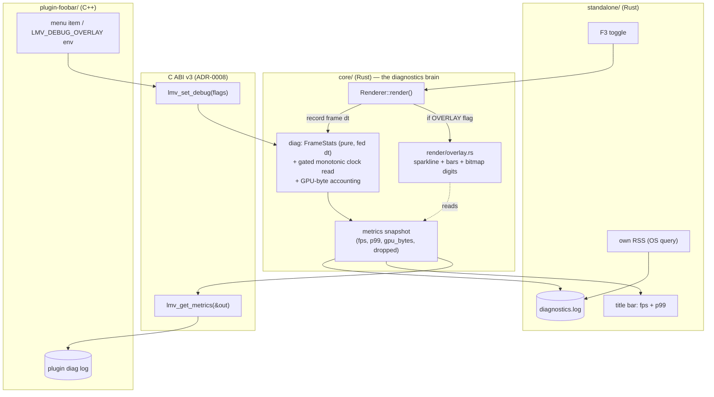

# 0011 — Diagnostics harness + quick-win memory/perf trim

> **Status:** done
> **Created:** 2026-07-22
> **Closed:** 2026-07-22 — passed Mode 4 review (no blockers, no majors; two nits noted below).
> **Owner skill(s):** dev, human
> **Related ADRs:** [0008](../adrs/0008-c-abi-v3-diagnostics.md) (C ABI v3: diagnostics query + overlay toggle) — **accepted** at close.

## Close summary (2026-07-22)

Seven phase commits landed (`7ad00df`, `166043f`, `5a9f67b`, `1ace817`, `82c7134`, `d266c08`,
plus two post-review fixes `10a4796` + `894a2fc`). Phase 7 is a `human` carry-forward.

- **Phase 1** (`7ad00df`): `core/src/diag/mod.rs` — pure `FrameStats` (fps / avg / p99 / total /
  dropped from a fixed 240-sample ring, no clock, unit-tested) + `Diag` wrapping the single gated
  `Instant::now()` read (quarantined behind `collecting`, the only wall-clock read in `core` —
  verified). `Renderer::enable_diagnostics`/`metrics`; standalone title shows core-sourced fps + p99.
- **Phase 2** (`166043f`): `render/overlay.rs` + `overlay_font.rs` — a skippable final pass drawing a
  frame-time sparkline, GPU bar, and a dependency-free 5x7 bitmap-digit readout as instanced quads.
- **Phase 3** (`5a9f67b`): standalone F3 toggle, dependency-free per-OS RSS (`rss.rs`), and a 1 Hz
  rotating `diagnostics.log` (`diaglog.rs`) on the render thread — no new crate, audio path untouched.
- **Phase 4** (`1ace817`): C ABI **v3** — `lmv_set_debug` + `lmv_get_metrics` + `#[repr(C)] LmvMetrics`
  (size-guarded, caller-allocated), `LMV_DEBUG_OVERLAY` env seed, header in lockstep with a
  `static_assert(sizeof == 56)`, and the first v3 FFI test (create → set_debug → get_metrics).
- **Phase 5** (`82c7134`): foobar shim surfaces the overlay (env default + right-click toggle) and a
  1 Hz `plugin-diagnostics.log`; handshake relaxed to `core >= built` (v3 forward-compat).
- **Phase 6** (`d266c08`): wgpu gated to the per-OS backend only (DX12 / Metal, default-features off)
  and an explicit `desired_maximum_frame_latency = 2` — the NFR §12 levers.

**Verified at close:** `cargo test -p lmv-core` 21/21 green (incl. 4 diag + 4 FFI tests);
`cargo clippy --workspace --all-targets -D warnings` exits 0; `diag/` is under the hot-path panic
pragma and the `hygiene.rs` scan set; the sole `core` clock read is quarantined in `diag`.

**Nits (non-blocking):** (a) `LmvMetrics.draw_calls` counts render *passes* (scene + overlay), not GPU
draw calls — the name reads slightly wider than the value; a one-word doc tweak would remove the
ambiguity. (b) `foo_lmv.cpp` adds a third hardcoded `\light-music-visualizer` app-dir literal — the
same shared-path-convention minor already carried forward from Plan 0007, not new debt.

**Carry-forward (human):** Phase 7 — before/after RSS + fps on the older Windows iGPU box (NFR §9),
confirming the footprint drop toward the §12 "well under ~100 MB" target with no §1 perf-floor
regression. Plus the standing on-device checks: the live foobar overlay toggle + log writing (like
Plan 0004's done-whens) and macOS RSS (`rss.rs`, unvalidated pending a Mac — Plan 0001 carry-forward).

## TL;DR

Build a runtime diagnostics harness in the **core** — rolling frame-time stats, core-tracked GPU
resource bytes, an on-screen overlay (frame-time sparkline + memory/GPU bars + a minimal numeric
readout), and structured per-shell log files — then use it to land the cheap NFR §12 memory wins
(compile wgpu with only the per-OS backend; trim the swapchain). Full parity across all three
frontends: the core paints the overlay and computes the numbers, the standalone reaches it through
the native Rust API, and the foobar plugin reaches it through a new **C ABI v3** ([ADR-0008](../adrs/0008-c-abi-v3-diagnostics.md)).
First user-visible behavior: the standalone title bar shows fps **and** p99 frame time sourced from
the core's diagnostics, replacing the shell's ad-hoc fps counter.

## Context & problem

"Lightweight is a feature" is a project pillar, but the project has no way to *measure* the two
things that pillar is about at runtime. The Plan 0001 close review measured the standalone's working
set at **~200 MB** by hand and flagged it (NFR §12); there is no instrument that states frame time,
p99, dropped frames, GPU footprint, or RSS on demand — so the roadmap's memory-trim work (item 3) has
no before/after measuring stick, and the live-show soak (Plan 0009) has no trend to watch over four
hours. The user asked to "address and log potential memory issues and performance."

Two forces frame the shape:

- **Determinism (NFR §6).** DSP outputs are pure functions of the input window — no wall-clock reads.
  Frame-time measurement inherently needs a clock. The clock read must be quarantined to a diagnostics
  path that never feeds analysis or visual output, so the determinism guarantee the tests defend stays
  intact.
- **The C ABI is a contract (ADR-0003).** Plugin parity means diagnostics cross the frozen ABI, which
  is an ADR-worthy bump — hence ADR-0008 (v2 → v3), scoped to two functions + one struct.

Interview decisions (2026-07-22): scope = **instrument + quick-win fixes** (defer the adaptive-quality
tier system); output = **structured log file + on-screen overlay**; frontends = **all three**; approach
= **full parity via C ABI v3 + ADR**; overlay = **graphs plus a minimal numeric readout**.

## Decision

Put the diagnostics brain in the **core** so both frontends surface identical numbers from one
implementation. A pure `FrameStats` accumulator (fed explicit frame deltas — unit-testable, no clock
inside) plus a gated clock read at the `Renderer::render` call site produce the rolling stats; a new
`render/overlay.rs` composites a graph-plus-digits debug layer as a final pass when enabled; each shell
reads its own process RSS via a dependency-free OS call and writes its own structured log. The plugin
reaches all of it over C ABI v3 (`lmv_set_debug`, `lmv_get_metrics`, `LmvMetrics`; overlay default via
the `LMV_DEBUG_OVERLAY` env var). With the harness in hand, land the two cheap NFR §12 levers — gate
wgpu to DX12-on-Windows / Metal-on-macOS and trim the swapchain — and measure the result on the iGPU
baseline box.

We rejected an **env-var-only** design (no live toggle; would fork metrics into a second C++
implementation) and a **combined `lmv_debug` multiplexer** (an untyped command enum is a wider real
surface than two typed functions) — both recorded in ADR-0008. We are **not** building the
adaptive-quality tier system or frame-time governor (the rest of roadmap item 3); this plan is the
measurement + cheap trims that front-run it.

## Architecture diagram



## Implementation phases

Each phase ships as its own commit; `dev` runs all phases in one session (no review between phases).
Phase 1 is a walking skeleton — real end-to-end value (core-sourced fps + p99 in the title), not
plumbing.

### Phase 1 — Core `diag` module: pure frame stats + gated clock + native API
- **Owner skill:** dev
- **Area:** core, standalone
- **What:** New `core/src/diag/mod.rs` with a pure `FrameStats` accumulator (rolling ring of recent
  frame durations → `fps`, `frame_ms_avg`, `frame_ms_p99`, `frames_total`, `frames_dropped`) and a
  thin gated clock helper that reads a monotonic instant only when diagnostics are enabled and feeds
  `FrameStats::record(dt)`. `Renderer` gains `enable_diagnostics(bool)` / `metrics()` native methods
  and records each frame's dt (and counts `acquire` skips as dropped). The standalone reads
  `renderer.metrics()` and shows `fps` + `p99` in the title, retiring its own `count_frame` fps math.
- **Files touched:** `core/src/diag/mod.rs` (new), `core/src/render/mod.rs`, `core/src/lib.rs`,
  `standalone/src/main.rs`, `core/tests/hygiene.rs` (add `diag/` to the hot-path pragma + pin scan set).
- **Done when:** a unit test feeds `FrameStats` a known sequence of frame durations and asserts `fps`,
  `frame_ms_avg`, and `frame_ms_p99` equal the hand-computed values for that sequence (pure, no clock
  in the test); `cargo run -p standalone` shows fps + p99 in the title bar, both non-zero and moving,
  sourced from `renderer.metrics()`. The clock read carries an `#[allow(clippy::disallowed_methods,
  reason = …)]` naming the diagnostics carve-out, and `diag/` is under the panic-pragma guard.

### Phase 2 — Core overlay: graphs + minimal numeric readout
- **Owner skill:** dev
- **Area:** core
- **What:** New `core/src/render/overlay.rs` that, when the overlay flag is set, composites a final
  pass over the scene: a frame-time sparkline and memory/GPU bars drawn with instanced quads (reuse the
  existing quad pipeline pattern), plus a small embedded bitmap-font pass rendering `fps / frame-ms /
  MB` digits. Off by default. `Renderer::render` invokes it after the scene submit when enabled, reading
  the Phase 1 snapshot. The bitmap font is a deliberately-scoped debug primitive (fixed ASCII glyph
  atlas) with **no new dependency** — deliberately *not* the glyphon renderer of the concurrent Plan
  0008 / [ADR-0009](../adrs/0009-glyphon-text-rendering.md), which is feature-gated and standalone-scoped;
  the core overlay must paint in the plugin too (all-three parity) and stay dependency-light (NFR §4),
  so it owns its digits.
- **Files touched:** `core/src/render/overlay.rs` (new — carries the panic pragma; `render/` is already
  in the guard scan), `core/src/render/mod.rs`, an embedded glyph atlas asset under `core/src/render/`.
- **Done when:** running the standalone with the overlay enabled shows a live frame-time graph + a
  numeric fps/frame-ms/MB readout over the scene; disabling it restores the clean scene with no residue;
  the overlay adds no measurable frame-time cost when disabled (it is skipped, not drawn transparent).

### Phase 3 — Standalone: F3 toggle + RSS + structured log file
- **Owner skill:** dev
- **Area:** standalone
- **What:** F3 (or another free key) toggles the overlay via `renderer.enable_diagnostics`. A
  dependency-free per-OS RSS read (Windows `GetProcessMemoryInfo`, macOS `task_info`, else
  `/proc/self/statm`) supplies the standalone's own working set. A low-cadence (~1 Hz) structured
  logger on the render thread appends samples — timestamp, fps, frame_ms_avg/p99, frames_dropped,
  gpu_bytes, rss_bytes — to a rotating `diagnostics.log` under the per-user app dir. File I/O stays on
  the render thread, **never** the capture/audio thread.
- **Files touched:** `standalone/src/main.rs`, a small `standalone/src/rss.rs` + `standalone/src/diaglog.rs`
  (new), `Cargo.toml` (only if a pinned OS-metrics crate is unavoidable — prefer raw syscalls, NFR §4).
- **Done when:** running the standalone writes `diagnostics.log` with ~1 Hz samples whose `rss_bytes`
  column tracks the real Task-Manager working set; F3 toggles the overlay live; no new crate is added
  without a justification comment; the audio callback path is untouched.

### Phase 4 — C ABI v3: `lmv_set_debug` + `lmv_get_metrics` (ADR-0008)
- **Owner skill:** dev
- **Area:** core (FFI)
- **What:** Add `lmv_set_debug(handle, flags)` and `lmv_get_metrics(handle, *LmvMetrics)` to `ffi.rs`,
  add the `#[repr(C)]` `LmvMetrics` struct and the `LMV_DEBUG_*` flag constants, and bump
  `LMV_ABI_VERSION` to `3`. Read `LMV_DEBUG_OVERLAY` from the environment once in `lmv_create` to seed
  the default flags (boundary read). Mirror everything in `core/include/lmv_core.h` with a
  `static_assert`-able struct and updated doc comments. Both new entry points catch unwinds → error
  codes, like the rest of the surface.
- **Files touched:** `core/src/ffi.rs`, `core/include/lmv_core.h`, `core/tests/` (new FFI test).
- **Done when:** `lmv_abi_version()` returns `3`; header and `ffi.rs` are in lockstep (same signatures,
  same struct layout, same constants); an in-crate FFI test does `create → set_debug(OVERLAY) →
  get_metrics(&out)` and asserts `out.abi_version == 3`, `out.struct_size == size_of::<LmvMetrics>()`,
  and the timing fields are populated after a few `lmv_render` calls; `cargo test` + clippy green.

### Phase 5 — foobar plugin: surface overlay + metrics
- **Owner skill:** dev
- **Area:** plugin
- **What:** In `foo_lmv.cpp`, seed the overlay default from `LMV_DEBUG_OVERLAY`, add a right-click
  menu item that calls `lmv_set_debug` to toggle it live, and periodically call `lmv_get_metrics` and
  append the returned scalars to a plugin-side log file. Keep the existing `lmv_abi_version` handshake
  (now expecting `>= 3`).
- **Files touched:** `plugin-foobar/foo_lmv.cpp` (and the vendored header copy if the plugin builds
  against its own copy of `lmv_core.h`).
- **Done when:** the plugin builds against the v3 header; the overlay toggles in a foobar panel via the
  menu item; the plugin writes its diagnostics log with core metrics. **Carry-forward:** the live-foobar
  behavior is a runtime check on-device (like Plan 0004's done-whens) — the code implements each;
  confirmation is pending a real foobar2000 v2 run.

### Phase 6 — Quick-win memory/perf trim: wgpu per-OS backend + swapchain
- **Owner skill:** dev
- **Area:** core, standalone
- **What:** Gate the wgpu dependency features so only the shipped backend compiles — DX12 on Windows,
  Metal on macOS — dropping the Vulkan/GL paths that are dead weight on the shipped target (NFR §12
  primary lever). Set an explicit swapchain frame-latency / buffer count in `RenderContext` (secondary
  lever). Record before/after standalone RSS using the Phase 1–3 harness in the commit message.
- **Files touched:** `Cargo.toml` (wgpu feature set, per-OS via `[target.'cfg(...)'.dependencies]`),
  `core/src/render/context.rs`.
- **Done when:** wgpu compiles only the per-OS backend (verified by build features / binary inspection);
  the swapchain configures an explicit buffer count; the standalone's steady-state RSS is measured
  before and after and stated in the commit, showing a meaningful reduction from the ~200 MB baseline;
  CI stays green on both runners.

### Phase 7 — Validate footprint + perf floor on baseline hardware
- **Owner skill:** human
- **Area:** standalone (runtime)
- **What:** On the older Windows iGPU test PC (NFR §9), run the standalone before and after the Phase 6
  trim, capture `diagnostics.log` for each, and confirm (a) the working set dropped meaningfully toward
  the NFR §12 "well under ~100 MB" target and (b) the NFR §1 floor (≥ 60 fps @ 1080p, reduced tier) did
  **not** regress. Report the before/after RSS and fps; route any regression back to `dev`.
- **Done when:** the user reports before/after RSS and fps from the iGPU box confirming the reduction
  and no perf-floor regression (or files a follow-up for `dev` if either fails).

## Data shapes

```rust
// illustrative — not the final interface

// core/src/diag/mod.rs — pure, no clock inside; fed explicit deltas so it is unit-testable.
pub struct FrameStats {
    ring: [f32; 240],   // recent frame durations (secs), fixed capacity — no per-frame alloc
    head: usize,
    len: usize,
    frames_total: u64,
    frames_dropped: u64,
}
impl FrameStats {
    pub fn record(&mut self, dt_secs: f32) { /* push into ring, bump total */ }
    pub fn record_dropped(&mut self) { /* bump dropped */ }
    pub fn fps(&self) -> f32 { /* len / sum(ring) */ }
    pub fn frame_ms_avg(&self) -> f32 { /* mean(ring) * 1000 */ }
    pub fn frame_ms_p99(&self) -> f32 { /* 99th pct of ring * 1000 */ }
}
```

```c
/* core/include/lmv_core.h — C ABI v3 additions (ADR-0008). RSS is NOT here (host-process-owned). */
#define LMV_ABI_VERSION 3u
#define LMV_DEBUG_OFF      0u
#define LMV_DEBUG_OVERLAY (1u << 0)   /* draw the on-screen overlay */

typedef struct LmvMetrics {
    uint32_t struct_size;    /* caller sets sizeof; core stamps what it wrote (fwd-compat) */
    uint32_t abi_version;    /* == lmv_abi_version() */
    float    fps;
    float    frame_ms_avg;
    float    frame_ms_p99;
    uint64_t frames_total;
    uint64_t frames_dropped;
    uint64_t gpu_bytes;      /* core-tracked GPU resource bytes (approx; wgpu exposes no device mem) */
    uint32_t draw_calls;     /* last frame */
    uint32_t reserved;
} LmvMetrics;

int32_t lmv_set_debug(LmvHandle *handle, uint32_t flags);
int32_t lmv_get_metrics(LmvHandle *handle, LmvMetrics *out);  /* out caller-allocated; no alloc crosses */
```

## Risks & open questions

- **Clock read in `core` vs determinism (NFR §6).** The monotonic read is quarantined to `diag`, gated
  behind the diagnostics-enabled flag, and never feeds DSP or `SCENE_DT` (visual output stays a pure
  function of the input window + fixed step). The pure `FrameStats` is fed explicit deltas so its tests
  carry no clock. Mitigation: the read site carries an `#[allow(clippy::disallowed_methods, reason=…)]`,
  matching the standalone's existing convention, and the plan's Phase 1 done-when makes the pure/gated
  split explicit. If review judges the carve-out unacceptable, fall back to passing `dt` in from each
  shell (a small ABI widening on the render path) — noted, not chosen.
- **`gpu_bytes` accuracy.** wgpu does not report driver device memory, so this is the sum of resources
  the core allocates — an approximation, documented as such in the header. The authoritative footprint
  number is the standalone's process RSS (Phase 3); `gpu_bytes` is a trend indicator.
- **Bitmap-font overlap with the glyphon renderer (ADR-0009).** The debug glyph atlas is intentionally
  minimal, dependency-free, and self-contained. The concurrent Plan 0008 adopts glyphon (ADR-0009) for
  standalone on-canvas text, feature-gated; it is *not* a drop-in here because the overlay is core-drawn
  and must paint in the plugin too (all-three parity) without a new dependency (NFR §4). Accepted
  throwaway risk (the user chose graphs + minimal numeric readout knowing this). Keep the debug font
  self-contained so a later migration — only if glyphon ever becomes available in core/plugin builds —
  is a single-file swap. **Render-pass coordination:** both this plan's diagnostics overlay
  (`render/overlay.rs`) and Plan 0008's `text` pass add a conditionally-skipped final pass to
  `Renderer::render`; whichever lands second appends its pass (ordered, diagnostics on top) rather
  than replacing the other's. Plan 0008's glyphon feature is named `text`, not `overlay`, so it does
  not read as gating this always-compiled diagnostics overlay.
- **`#[repr(C)]` struct drift.** A layout mismatch between the C++ `LmvMetrics` and the Rust struct is a
  silent memory bug, not a compile error (no cbindgen, per ADR-0003). Mitigation: the Phase 4 FFI test
  asserts `struct_size`/`abi_version`, and the header gets a `static_assert` on `sizeof(LmvMetrics)`.
- **Dropping the Vulkan/GL fallback (Phase 6).** NFR §2 already fixes DX12 as the Windows baseline, so
  there is no supported machine that loses rendering — hence no ADR. Risk is a driver edge case where
  DX12 init fails but Vulkan would have worked; if that surfaces on real hardware, it becomes a
  follow-up (re-add a gated fallback), not a v1 blocker.
- **Log file I/O placement.** The logger must live on the render/UI thread at ~1 Hz, never on the
  capture/audio thread (the audio callback is sacred). Phase 3's done-when names this explicitly.

## What this plan does NOT do

- **No adaptive-quality tiers or frame-time governor.** The rest of roadmap item 3 (quality tiers that
  the governor picks to hold refresh on any hardware, NFR §1) stays a separate follow-up. This plan
  builds the *measurement* the governor will need and lands only the cheap footprint trims.
- **No preset-addressing or richer selection over the ABI.** Untouched (ADR-0006 scope).
- **No macOS on-device validation.** Phase 7 targets the Windows iGPU box; the Mac path is validated
  when a Mac is available (the standing Plan 0001 carry-forward).
- **No time-series/metrics export beyond a local log file.** No network, no dashboard — a rotating
  local log is the whole surface.

## Followups (after this lands)
- Adaptive-quality tiers + frame-time governor (the remainder of roadmap item 3).
- Feed `diagnostics.log` into the Plan 0009 4-hour soak as its trend record (the soak's stability
  done-when can assert no RSS growth / no fps decay over the session).
- Reconcile the debug bitmap font with the glyphon renderer (Plan 0008 / ADR-0009) *if* glyphon ever
  becomes available in core + plugin builds — delete the debug font once a cross-frontend text path can
  render the readout.
