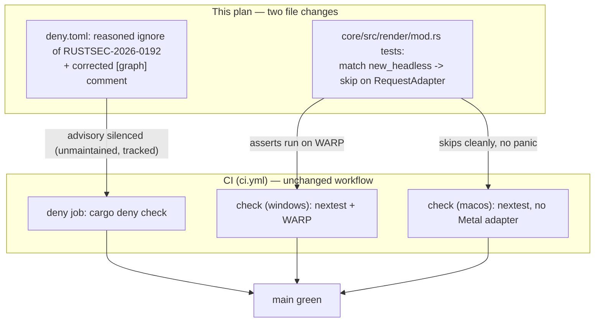

# 0017 — Green CI: reasoned ttf-parser advisory ignore + adapter-skip for headless GPU tests

> **Status:** done — Phase 1 (advisory, `95bf510`) + Phase 2 (GPU-test skip, `134d4e3`),
> both `dev`; passed Mode 4 review 2026-07-23 (no blockers, no majors, no minors; two
> non-actionable nits). Verified: `cargo deny check` exits 0 (`advisories ok, bans ok,
> licenses ok, sources ok`) with exactly one reasoned `RUSTSEC-2026-0192` ignore and the
> corrected `[graph]` comment; all three headless-capture tests route through the shared
> `headless_or_skip` helper (skip keyed strictly to `RenderError::RequestAdapter`, panic on
> any other error) and run full assertions green on Windows WARP under nextest; clippy
> `-D warnings --all-targets` clean with the production hot-path `#![deny(clippy::panic)]`
> intact (the `clippy::panic` allow is scoped to the test module only). C ABI untouched
> (still v3); config + `#[cfg(test)]`-only, no hot-path surface. [ADR-0016](../adrs/0016-gpu-tests-opt-in-ci-scope.md)
> now **accepted**. Followup owns removing the ignore when the text stack no longer pins
> ttf-parser. See the review notes in the close conversation.
> **Created:** 2026-07-23
> **Owner skill(s):** dev
> **Related ADRs:** [0016](../adrs/0016-gpu-tests-opt-in-ci-scope.md) (GPU-capture tests skip when no adapter); [0009](../adrs/0009-glyphon-text-rendering.md) (the text stack ttf-parser is load-bearing for)

## TL;DR

CI on `main` went red (run 29985131075) for two **environmental** reasons, not a code
regression: (1) `cargo deny check` now fails on `RUSTSEC-2026-0192` — `ttf-parser` was flagged
**unmaintained** (not vulnerable) — and it's a load-bearing, upstream-pinned transitive dep of
our glyphon text stack that we cannot drop today; (2) two headless GPU-capture tests panic on
`macos-latest` because the runner image stopped exposing a Metal adapter and Metal has no
software fallback. This plan greens `main` with a **reasoned, tracked `advisories.ignore`
entry** (plus correcting a now-false `deny.toml` comment) and a **runtime adapter-skip** in the
headless tests (per ADR-0016), keeping their full assertions running on Windows WARP.

## Context & problem

Both failures are new since the previous green push (`docs: close plan 0012`); the release
commit's content did not cause either.

**Advisory.** `cargo deny check` reads `Cargo.lock` and now errors:

```
error[unmaintained]: `ttf-parser` is unmaintained  (RUSTSEC-2026-0192)
advisories FAILED, bans ok, licenses ok, sources ok
```

`cargo tree -i ttf-parser` shows it enters via the text-rendering stack on **every shipped
target** (Windows and macOS):

```
ttf-parser 0.25.1 → fontdb → cosmic-text 0.19.0 → glyphon 0.12.0 → lmv-core → standalone
```

`standalone` unconditionally enables the core `text` feature (ADR-0009 — the browse overlay and
HUD). `ttf-parser 0.25.1` and `cosmic-text 0.19.0` are both the latest releases and cosmic-text
pins ttf-parser, so there is **no update or clean drop** available without reversing ADR-0009 or
patching upstream. The advisory is *unmaintained*, not a security/unsound finding — the exact
case `deny.toml`'s own comment reserves the `advisories.ignore` escape hatch for ("a new ignore
entry is a deliberate, reasoned exception (id + reason)"). Separately, the `deny.toml` `[graph]`
comment (lines 13-15) claims the shipped-target pruning removes `ttf-parser` via the winit Linux
Wayland path — that is now **factually wrong** (it enters via glyphon on Win+macOS) and must be
corrected so the next reader isn't misled.

**GPU tests.** `ci.yml` states GPU rendering is out of CI scope, yet Plan 0013's headless tests
build a real `Renderer` and assert on pixels. They pass on Windows via WARP (guaranteed software
DX12) but depend on a real adapter on macOS, which the runner image no longer provides:

```
render::tests::headless_captures_a_non_black_frame            FAILED  (mod.rs:792/819)
render::tests::capture_preset_is_deterministic_and_animates   FAILED  (mod.rs:820/847)
panicked: RequestAdapter(NotFound { supported_backends: METAL, ... })
```

`RenderError` already has a `RequestAdapter(RequestAdapterError)` variant, so a missing adapter
is cleanly distinguishable from a genuine build/device failure. ADR-0016 decides these tests
skip on `RequestAdapter`, not fail.

## Decision

Green `main` with the two smallest changes that hold our stated contracts:

1. **Advisory:** add a single reasoned `advisories.ignore = ["RUSTSEC-2026-0192"]` entry
   (id + reason + revisit trigger) to `deny.toml`, and rewrite the stale `[graph]` pruning
   comment to state the real entry path (glyphon text stack, all shipped targets). This is a
   stopgap, not an acceptance of the dep forever — the Followups section tracks getting off it.
2. **GPU tests:** per ADR-0016, change the three headless-capture tests to match the
   constructor result and **skip (return, with a stderr notice) on `Err(RenderError::RequestAdapter(_))`**,
   panic on any other error, and run the full assertions when an adapter is present. No CI
   workflow change; the tests keep running for real on Windows WARP.

We rejected **dropping/replacing ttf-parser now** (reverses ADR-0009 or blocks on upstream —
neither greens `main` this week; see the interview) and, for the tests, `#[ignore]` +
Windows-only opt-in and outright deletion (ADR-0016, Alternatives A/B).

## Architecture diagram



## Implementation phases

Two independent phases; either order works, but advisory first gives the fastest visible signal
on the `deny` job. Each ships as its own commit.

### Phase 1 — Reasoned advisory ignore + corrected deny.toml comment
- **Owner skill:** dev
- **Area:** repo config (`deny.toml`)
- **What:** Silence `RUSTSEC-2026-0192` with a documented, tracked exception and fix the false
  `[graph]` pruning comment.
- **Files touched:** `deny.toml`.
- **Details:**
  - Set `advisories.ignore = ["RUSTSEC-2026-0192"]` (replacing the empty list) with an inline
    comment carrying: the advisory id, that it is **unmaintained not a vulnerability**, that
    ttf-parser is load-bearing via `glyphon → cosmic-text → fontdb` on all shipped targets and
    upstream-pins it (no update/drop without reversing ADR-0009), and the **revisit trigger** —
    re-check and remove the ignore when a glyphon/cosmic-text bump no longer pins ttf-parser (see
    Plan 0017 Followups). Keep the existing "a new ignore entry is a deliberate, reasoned
    exception" framing intact.
  - Rewrite the `[graph]` comment (currently claiming ttf-parser is pruned via winit's Linux
    Wayland `sctk-adwaita → ab_glyph → ttf-parser` path) to state the real path: `ttf-parser`
    enters via the glyphon text stack on Windows and macOS and is **not** pruned by the
    shipped-target list. Keep the accurate part of the rationale (targets still prune genuinely
    Linux-only crates).
- **Done when:** `cargo deny check` exits 0 locally (advisories, licenses, bans, sources all
  ok); the `deny.toml` diff shows exactly one ignored advisory with a reason and a revisit
  trigger, and no `[graph]` comment still claims ttf-parser is pruned.

### Phase 2 — Headless GPU tests skip on a missing adapter
- **Owner skill:** dev
- **Area:** core (`core/src/render/mod.rs`, test module)
- **What:** Make the three headless-capture tests treat "no GPU adapter" as skip, not panic
  (ADR-0016), while still asserting fully where an adapter exists.
- **Files touched:** `core/src/render/mod.rs` (the `#[cfg(test)] mod tests` block — the three
  tests calling `Renderer::new_headless`: `headless_captures_a_non_black_frame`,
  `capture_preset_is_deterministic_and_animates`, and the third at ~mod.rs:885).
- **Details:**
  - Replace each `Renderer::new_headless(...).expect(...)` with a `match` (or a small shared
    test helper) that: on `Ok(r)` proceeds; on `Err(RenderError::RequestAdapter(_))` prints a
    single `eprintln!("skipped: no GPU adapter on this runner")`-style notice and `return`s;
    on any other `Err(e)` panics with the failure (`panic!("headless build failed: {e}")`).
  - A shared helper inside the test module (e.g. `fn headless_or_skip(opts) -> Option<Renderer>`
    returning `None` to signal skip) is preferred over three copies — dev's call on shape, but
    keep the skip keyed strictly to the `RequestAdapter` variant so real device/pipeline/capture
    failures still fail loudly.
  - Do not touch production `new_headless`/`capture_frame` code, the C ABI, or `ci.yml`.
- **Done when:** On Windows (WARP present) all three tests run their full assertions and pass
  (`cargo nextest run -p lmv-core`); on a runner with no adapter they print the skip notice and
  pass instead of panicking; a non-`RequestAdapter` error still panics. Behavioral claim the
  tests defend is unchanged where an adapter exists — a captured frame is non-black and
  `capture_preset` is deterministic and animates; only adapter-absence now short-circuits to a
  logged skip.

## Data shapes

No new structs, no C ABI change. Phase 2 relies only on the existing enum variant:

```rust
// illustrative — already exists in core/src/render/context.rs
pub enum RenderError {
    CreateSurface(CreateSurfaceError),
    RequestAdapter(RequestAdapterError), // <- the skip keys off this variant only
    RequestDevice(RequestDeviceError),
    UnsupportedSurface,
    // ...
}
```

## Risks & open questions

- **Silent no-op if WARP ever also vanishes.** If a future Windows runner image drops WARP too,
  both runners skip and the capture path is unverified in CI with only a stderr line. Accepted
  per ADR-0016 (WARP is a stable guarantee; the notice is visible; on-device QA is manual). No
  action now beyond the printed notice.
- **Ignore drift.** The `advisories.ignore` entry could outlive its justification and quietly
  mask a *different* future ttf-parser advisory that upgrades to a real vulnerability — but
  cargo-deny only silences the exact id `RUSTSEC-2026-0192`; a new advisory id on ttf-parser
  would still fail. The revisit trigger (Followups) is the guard against staleness.
- **Test-only change, no hot-path risk.** Phase 2 is confined to `#[cfg(test)]` code; no
  per-frame, audio-callback, or ABI surface is touched, so the real-time non-negotiables are not
  in play.

## What this plan does NOT do

- **Does not drop or replace `ttf-parser`/glyphon/cosmic-text.** That would reverse ADR-0009 or
  wait on upstream; it is explicitly out of scope and tracked as a followup, not a phase.
- **Does not change `ci.yml`.** No new job, no per-OS step, no `--run-ignored` — the fix lives
  entirely in `deny.toml` and the test module (this is the ADR-0016 choice over the `#[ignore]`
  alternative).
- **Does not touch the C ABI, production render code, or the `text` feature wiring.**
- **Does not address the pre-existing Node.js-20-deprecation warnings** on `actions/checkout@v4`
  (a non-failing annotation) — separate housekeeping, not part of greening `main`.

## Followups (after this lands)

- **Get off `ttf-parser` when upstream allows.** On each glyphon/wgpu/cosmic-text bump, re-check
  whether the text stack still pins the unmaintained `ttf-parser`; when it no longer does (or a
  maintained successor is adoptable without a source-trust exception), **remove the
  `advisories.ignore` entry**. If instead the project ever decides the on-canvas text feature
  isn't worth an unmaintained dep, that is a deliberate ADR superseding ADR-0009, not a silent
  drop. This followup is the standing owner of the ignore entry's lifespan.
