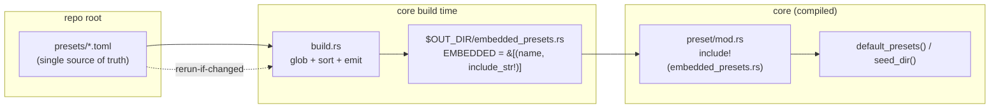

# 0021 — Decouple preset content from code: build-time embedding + single-source system names

> **Status:** done
> **Created:** 2026-07-23
> **Closed:** 2026-07-23
> **Owner skill(s):** dev
> **Related ADRs:** [0022](../adrs/0022-build-time-preset-embedding.md) (accepted)
>
> **Close summary (Mode 4 review — no blockers, no majors, no minors, no nits):** Both phases
> landed exactly as planned across three commits — `e1e4f1f` (Phase 1: `core/build.rs` generates
> `EMBEDDED` from `presets/*.toml`), `11798c3` (rustfmt of `build.rs`), `0241b7d` (Phase 2:
> single-source `SystemKind` name↔kind mapping). Verified: the generated `EMBEDDED` reproduces
> the prior embedded set **exactly** — 22 filename-sorted entries, byte-for-byte the same file set
> as the old hand-written array (diff of old array names vs `presets/*.toml` = identical;
> `README.md` correctly excluded by the `toml` extension filter). `build.rs` is **zero-dependency**
> (std `read_dir` + sort + string emit), resolves `presets/` from `CARGO_MANIFEST_DIR` (not CWD),
> emits absolute `include_str!` paths (escaped, Windows-safe), and registers both the directory and
> each file for `rerun-if-changed` (covers add/remove **and** edit). The count test is now
> **structural** — every embedded preset parses, `default_presets().len() == EMBEDDED.len()`, and a
> `>= 8` floor — no hardcoded number to bump. Phase 2 is a behavior-preserving refactor: `from_name`
> made `pub` + new `as_str`, `shot.rs` deletes its two duplicate matches and keeps only its friendly
> error text. ADR-0022's constraints hold: **no new dependency, C ABI frozen** (no ffi/abi/header
> file touched). Gates: `cargo test -p lmv-core --test preset` 10/10 green (incl.
> `embedded_default_presets_all_parse`); `clippy -p lmv-core -p standalone --all-targets -D warnings`
> clean. Two documented followups remain (below): the user-gated `preset-author` skill-note update,
> and the `docs/presets.md` rewrite owned by Plan 0019. Version **minor 0.6.0 → 0.7.0** at close.

## TL;DR

Stop making a preset a code change. A zero-dependency `core/build.rs` generates the `EMBEDDED` preset
list by scanning `presets/*.toml` at build time, so dropping a `.toml` in `presets/` ships it with no
Rust edit and no count to bump. Then remove a related duplication: the `SystemKind` name↔kind mapping,
currently written three times, collapses to one source in `core` that the `shot` CLI reuses. First
user-visible behavior: add a preset file, `cargo build`, and it appears in `default_presets()` and the
seeded library automatically.

## Context & problem

Adding a preset — pure content — currently forces three code edits across two files: a
`(name, include_str!(…))` tuple in `core/src/preset/mod.rs`, the array length `[(&str,&str); 18]`, and
a hardcoded `assert_eq!(presets.len(), 18, …)` in `core/tests/preset.rs`. The parallel
reaction-diffusion work just paid this tax (both numbers went 17→18). The `preset-author` lane even
documents the ritual. The embedding itself is required (the C-ABI/foobar path renders without a preset
dir, ADR-0006), but the **hand-maintained list** is accidental — `include_str!` can't glob, so a build
script is the standard fix. A smaller sibling: the `SystemKind` name mapping is duplicated in
`schema.rs::from_name`, `shot.rs::parse_system`, and `shot.rs::system_name`. See
[ADR-0022](../adrs/0022-build-time-preset-embedding.md) for the decision and rejected alternatives.

## Decision

Generate `EMBEDDED` from `presets/*.toml` via `core/build.rs` (zero-dep, `rerun-if-changed`), and make
the count test structural (all-parse + floor, not an exact number). Separately, expose one public
name↔kind mapping on `SystemKind` in `core` and have `shot` call it instead of its own two match
statements. We rejected the `include_dir` crate (new dependency), a slice-only tweak (still hand-writes
each tuple), load-only (breaks the no-filesystem guarantee), and an in-repo proc-macro (more machinery)
— all recorded in ADR-0022.

## Architecture diagram



## Implementation phases

Phase 1 is the whole decoupling (a walking skeleton that already delivers the win); Phase 2 is the
independent DRY cleanup. `dev` runs both in one session.

### Phase 1 — Generate `EMBEDDED` from `presets/` at build time
- **Owner skill:** dev
- **Area:** core
- **What:** Add `core/build.rs` that reads `../presets` (relative to `CARGO_MANIFEST_DIR`), collects
  `*.toml` filenames, sorts them, and writes `$OUT_DIR/embedded_presets.rs` defining
  `pub static EMBEDDED: &[(&str, &str)] = &[ ("<file>", include_str!("<abs>/<file>")), … ];` — bytes
  still embedded by rustc via `include_str!`. Emit `cargo:rerun-if-changed=<abs presets dir>`. Replace
  the hand-written array in `core/src/preset/mod.rs` with `include!(concat!(env!("OUT_DIR"),
  "/embedded_presets.rs"))` and a pointer comment; leave `default_presets`/`seed_dir` untouched (they
  iterate `EMBEDDED` already). Change `core/tests/preset.rs` to assert every embedded preset parses and
  `EMBEDDED.len() >= 8`, dropping the exact `18`.
- **Files touched:** `core/build.rs` (new), `core/src/preset/mod.rs`, `core/tests/preset.rs`.
- **Done when:** deleting or adding a `presets/*.toml` and running `cargo build -p lmv-core` changes
  the set returned by `default_presets()` with **no edit to any `.rs`**; `cargo test -p lmv-core` is
  green with the count assert now structural (all-parse + floor); touching a preset file alone
  retriggers the build (rerun-if-changed verified); `cargo clippy -p lmv-core -D warnings` clean. The
  generated set equals today's 18 (no accidental drop/add) — a one-time diff check at implementation.
- **Note:** `build.rs` stays zero-dependency and simple (glob + sort + string emit); no `walkdir`/glob
  crate — a `read_dir` filter on the `toml` extension is enough.

### Phase 2 — Single-source the `SystemKind` name mapping
- **Owner skill:** dev
- **Area:** core, standalone
- **What:** Make `SystemKind::from_name` public and add `SystemKind::as_str(&self) -> &'static str`
  (the canonical name) in `core/src/preset/schema.rs` — one place defining both directions. Replace
  `shot.rs::parse_system` with a call to `SystemKind::from_name` (keeping its friendly error text) and
  `shot.rs::system_name` with `as_str`, deleting the duplicated match arms.
- **Files touched:** `core/src/preset/schema.rs`, `standalone/examples/shot.rs`.
- **Done when:** the name↔kind mapping exists in exactly one place (`schema.rs`); `shot.rs` has no
  independent `SystemKind` match; `shot --report family=<each>` and `--all` still work over all systems
  (incl. `reaction_diffusion` if that scene has landed); `cargo test`/`clippy -D warnings` green across
  `lmv-core` + `standalone`.

## Data shapes

```rust
// illustrative — the generated file, not written by hand
pub static EMBEDDED: &[(&str, &str)] = &[
    ("fragment_aurora.toml", include_str!("/abs/repo/presets/fragment_aurora.toml")),
    // … one per presets/*.toml, sorted …
];

// schema.rs — the single source both core and shot use
impl SystemKind {
    pub fn from_name(name: &str) -> Option<Self> { /* existing match, now pub */ }
    pub fn as_str(&self) -> &'static str { /* the reverse, canonical name */ }
}
```

## Risks & open questions

- **Path correctness across build environments.** `build.rs` must resolve `presets/` from
  `CARGO_MANIFEST_DIR` (`core/..`), not the process CWD, so it works under `cargo build` from anywhere,
  CI, and rust-analyzer. The emitted `include_str!` paths must be absolute (built from
  `CARGO_MANIFEST_DIR`) so rustc resolves them regardless of the generated file's location in `OUT_DIR`.
- **Determinism.** Sort filenames before emitting so the embedded order (and thus the default cycle
  order) is stable build-to-build.
- **No accidental set change.** The first build must reproduce exactly today's 18 embedded presets —
  verify with a diff of `default_presets()` names before/after (a `presets/README.md` or other non-
  `.toml` must not be picked up; filter on the `toml` extension).
- **Empty/edge glob.** If `presets/` is somehow empty at build, emit an empty slice (compiles);
  `default_presets()` returning empty is already tolerated by callers (degrade path), so no panic.

## What this plan does NOT do

- **Does not change what is embedded** — same files, same content, just derived instead of listed.
- **Does not touch the C ABI, the render path, or any scene** — build + preset-load + a CLI helper only.
- **Does not add a dependency** (no `include_dir`, no glob crate) — ADR-0022's core constraint.
- **Does not rewrite `docs/presets.md`** — Plan 0019 owns that; this plan coordinates a one-line note,
  not a rewrite.
- **Does not edit the `.claude/skills/**` notes** (the `preset-author` curation ritual) — skill files
  are user-gated; that update is a followup for the user.

## Followups (after this lands)

- Update the `preset-author` skill's curation handoff (`references/api-feedback.md`) and ADR-0017's note
  so they stop instructing an `EMBEDDED` array + count-bump edit — embedding is now "commit the `.toml`".
  (User-gated: `.claude/skills/**` edits are blocked for the assistant.)
- When `docs/presets.md` is rewritten (Plan 0019), describe the generated embedding instead of the
  hand-maintained array (the current diagram at `docs/presets.md` shows `EMBEDDED = include_str!(...)`).
