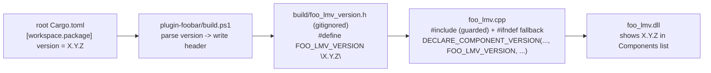

# 0024 — Single-source the foobar component version + refresh stale plugin descriptions

> **Status:** done
> **Created:** 2026-07-23
> **Closed:** 2026-07-23
> **Owner skill(s):** dev
> **Related ADRs:** [0025-foobar-component-version-single-sourced](../adrs/0025-foobar-component-version-single-sourced.md); supplements [ADR-0005](../adrs/0005-versioning-and-release-cadence.md); revises the "plugin version remains independent" note from [Plan 0006](done/0006-versioning-wiring.md)

## Close summary (2026-07-23)

Landed in two `dev` commits — `08df308` (Phase 1: `build.ps1` reads `[workspace.package].version`
from root `Cargo.toml` and generates `build/foo_lmv_version.h`; `foo_lmv.cpp` includes it guarded
with a `0.0.0-dev` fallback and feeds `FOO_LMV_VERSION` to `DECLARE_COMPONENT_VERSION`) and
`a8effb9` (Phase 2: refreshed both stale scene-description strings). Passed Mode 4 review cold —
**no blockers, no majors, no minors** (one nit below). Verified: the `Cargo.toml` regex
`\[workspace\.package\][^\[]*?\bversion\s*=\s*"([^"]+)"` is anchored to the `[workspace.package]`
section (the `[^\[]` class can't cross a section header, so a member/profile `version` can never
match; the intervening `version.workspace = true` comment can't match either — no `= ` follows
`version` there) and `throw`s on a miss; `/I "$build"` is on the `cl` line (build.ps1:79) so the
generated header resolves; the header is gitignored (`git check-ignore` confirms) and untracked
(`git ls-files plugin-foobar/build/` empty); **no `0.1.0` literal remains** and neither the
`DECLARE_COMPONENT_VERSION` blurb nor `lmv_ui_element::get_description` mentions
spectrum/pulse/starfield (grep clean) — both now name the current families (fragment fields,
particle swarm, line geometry, reaction-diffusion, attractors). ADR-0025 honored: component
version = workspace version, `LMV_ABI_VERSION` untouched (no ffi/header change in either commit).
On-device confirmation that foobar's Components list shows the current version is a user check
(the plugin can't run headlessly) — surfaced, not gated. **Nit:** `Set-Content -Encoding ascii`
for the header is correct for the ASCII SemVer strings we emit. Version bumped **patch
0.7.0 → 0.7.1** at close (a build-wiring + doc-string fix, no core feature) — which, by the
single-sourcing this plan shipped, is exactly the number the plugin's Components list will now
display on its next `build.ps1` run.

## TL;DR

foobar's Components list shows the plugin as `0.1.0` — a hardcoded literal in
`DECLARE_COMPONENT_VERSION` (`plugin-foobar/foo_lmv.cpp`) never bumped since Plan 0001, while the app is
at `0.7.0`. Make the component version **track the workspace version** via a **generated header**:
`build.ps1` reads `[workspace.package].version` from root `Cargo.toml` and writes
`plugin-foobar/build/foo_lmv_version.h` (`#define FOO_LMV_VERSION "X.Y.Z"`), which `foo_lmv.cpp`
includes and hands to `DECLARE_COMPONENT_VERSION`. Then refresh the two stale description strings that
still name the culled spectrum/pulse/starfield scenes. **Plugin + build-script + docs only; no core, no
C ABI change** ([ADR-0025](../adrs/0025-foobar-component-version-single-sourced.md)).

## Context & problem

The component version is a compile-time string literal (`"0.1.0"`) that has gone stale — see
[ADR-0025](../adrs/0025-foobar-component-version-single-sourced.md) for the full reasoning and the
rejected alternatives (a `/D` cl define; a committed `version.h`; a hand-bumped independent version).
Two facts fix the mechanism:

- `DECLARE_COMPONENT_VERSION` needs a **string literal**, and the plugin builds **only** via
  `plugin-foobar/build.ps1` (MSVC), never `cargo` — so the injection point is that script.
- `plugin-foobar/build/` is **already gitignored**, so a generated header there adds no tracked file.

Separately, the `DECLARE_COMPONENT_VERSION` blurb and the `ui_element::get_description` string both
still advertise "Spectrum, pulse and starfield" scenes — all three were **culled in Plan 0012**. The
current families are fragment fields, particle swarm, line-geometry (parametric curves / L-systems /
star patterns), reaction-diffusion, and the compute-particle attractor.

## Decision

Single-source the component version from the workspace version through a build-time generated header
(ADR-0025), and refresh the stale scene descriptions. Two phases, two commits.

## Architecture diagram



## Implementation phases

### Phase 1 — Single-source the component version through a generated header
**Owner skill:** dev
**Area:** plugin

In `plugin-foobar/build.ps1`: after `$repo`/`$build` are known and the `$build` dir exists, read the
workspace version from `Join-Path $repo 'Cargo.toml'` and write
`Join-Path $build 'foo_lmv_version.h'` with `#define FOO_LMV_VERSION "X.Y.Z"`. Parse with a regex
anchored to the `[workspace.package]` section (so it can never match a member-crate `version`); `throw`
a clear error if the version can't be found. Add `/I "$build"` to the `cl` include flags so the header
resolves.

In `plugin-foobar/foo_lmv.cpp`: near the top (after the existing includes), add a guarded include +
fallback, then feed the macro to the version macro:

```cpp
// illustrative (~10 lines) — dev writes the real thing
#if __has_include("foo_lmv_version.h")
#  include "foo_lmv_version.h"   // generated by build.ps1 from the workspace Cargo version
#endif
#ifndef FOO_LMV_VERSION
#  define FOO_LMV_VERSION "0.0.0-dev"  // built outside build.ps1
#endif
...
DECLARE_COMPONENT_VERSION("Light Music Visualizer", FOO_LMV_VERSION, /* description */);
```

**Done when:** `.\plugin-foobar\build.ps1` writes `plugin-foobar/build/foo_lmv_version.h` containing
`#define FOO_LMV_VERSION "0.7.0"` (matching root `Cargo.toml` at build time); the built `foo_lmv.dll`
links clean; `grep` finds **no** remaining `"0.1.0"` literal in `foo_lmv.cpp`; and a compile that does
*not* generate the header still builds via the `0.0.0-dev` fallback (confirm the `#if __has_include`
guard, e.g. by a dry compile or by reasoning it through — it must not hard-error on a missing header).
The **on-device confirmation** that foobar's Components list shows `0.7.0` is a user check (the plugin
can't run headlessly) — surface it, don't gate the phase on it.

### Phase 2 — Refresh the stale plugin descriptions
**Owner skill:** dev
**Area:** plugin

Update both strings in `plugin-foobar/foo_lmv.cpp` that name the removed scenes:
- the `DECLARE_COMPONENT_VERSION` description blurb, and
- `lmv_ui_element::get_description`.

Name the **current** families instead — fragment fields, particle swarm, line-geometry (curves /
L-systems / star patterns), reaction-diffusion, and attractor scenes — kept concise. Do not restate
the full list verbatim in both; a short accurate phrasing is enough. Leave the "Space cycles scenes"
guidance.

**Done when:** neither string mentions "spectrum", "pulse", or "starfield" (grep); both name current
scene families; the plugin builds clean via `build.ps1`.

## Risks & open questions

- **Cargo.toml parse robustness.** The regex must anchor to `[workspace.package]`; a naive
  `version = "..."` match could grab the wrong stanza if the file grows member/profile version keys.
  Root `Cargo.toml` currently has exactly one `version` line, but write it defensively.
- **`DECLARE_COMPONENT_VERSION` and a macro.** It takes the version as a string; `FOO_LMV_VERSION`
  expands to a string literal, which the SDK macro accepts. If the SDK macro turns out to require a
  raw literal token (it doesn't, per its use as a plain string), that's a plan-wrong escalation — stop
  and surface, don't hack around it.
- **On-device verification only.** "Shows 0.7.0 in the Components list" needs a real foobar2000; it's a
  user confirmation carry-forward, not a `human` phase (nothing for the user to *build*).

## What this plan does NOT do

- **Does not touch `LMV_ABI_VERSION`** — the C ABI version stays a fully independent axis (ADR-0003).
- **Does not change the workspace-version bump cadence** — `cargo-release` at the architect plan close
  (ADR-0005) is unchanged; this only changes how the *component* version is *derived* from it.
- **Does not give the plugin an independent bump lever** — that's the point of the reversal; a
  plugin-only fix surfaces in the version at the next workspace bump.
- **No core, Rust, or C ABI change; no new tracked file** (the generated header is gitignored).
